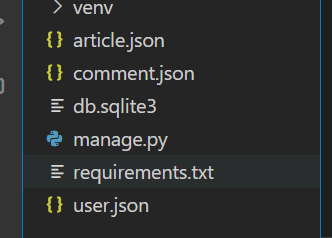
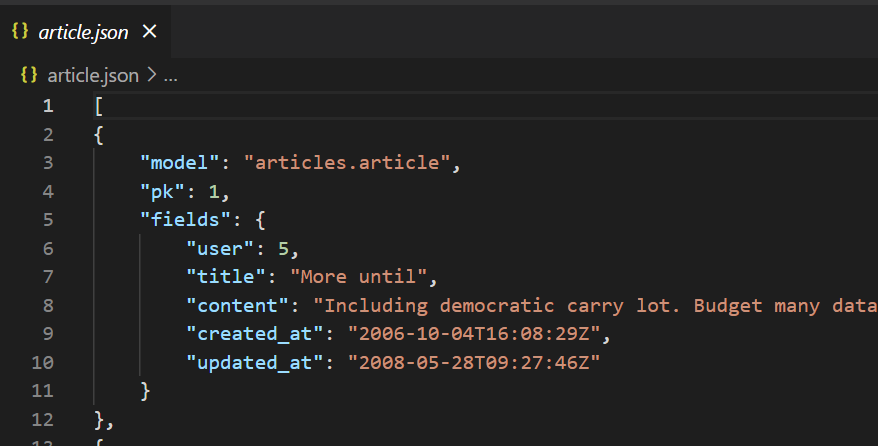
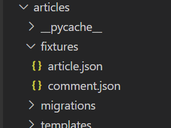
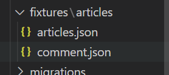

## Fixturs

#### Gow to provide initial data for models

- 앱을 처음 설정할 때 미리 준비된 데이터로 데이터베이스를 미리 채우는 것이 필요한 상황이 있음
- 마이그레이션 또는 fixtures와 함께 초기 데이터를 제공
- 협업 시 원격 저장소에 DB를 푸시하지 않는데, 이 때 fixurs data를 이용하여 데이터를 공유할 수 있다.

#### 개념

- 데이터베이스의 serialized 된 내용을 포함하는 파일 모음
- django가 fixtures 파일을 찾는 경로
  - app/fixures/

#### dumpdata

- 데이터를 추출한다
- 응용 프로그램과 관련된 데이터베이스의 모든 데이터를 표준 출력으로 출력

```shell
$python manage.py dumpdata [app_label[.ModelName] [app_label[.Model]]]
```


#### fixures 연습

- seed 만들기

```shell
python manage.py seed articles --number=10
```

- 각 모델 별 dumpdata 실행
  - indent는 간격 

```shell
$ python manage.py dumpdata --indent 4 articles.article > article.json
$ python manage.py dumpdata --indent 4 accounts.user > user.json
$ python manage.py dumpdata --indent 4 accounts.user > user.json
```

- utf-8로 인코딩 하는 방법

```shell
python -Xutf8 manage.py dumpdata --indent 4 movies.movie > movie.json
```


- 생성 데이터 확인





- 각 모델 별로 fixtures 폴더를 만들고, json 파일 옮기기



- 연습을 위해 DB 삭제 

#### loaddata

- fixturse의 내용을 검색하여 데이터베이스로 로드 

```shell
$ python manage.py migrate
$ python manage.py loaddata article.json comment.json user.json
```

- 이름 겹치는거 막기 위해 경로 재설정



```shell
$ python manage.py loaddata articles/article.json articles/comment.json accounts/user.json
```


#### fixtures는 직접 생성하는 것이 아닌 dumpdata를 통해 생성하는 것이니 직접 작성하려 하지 말 것 
