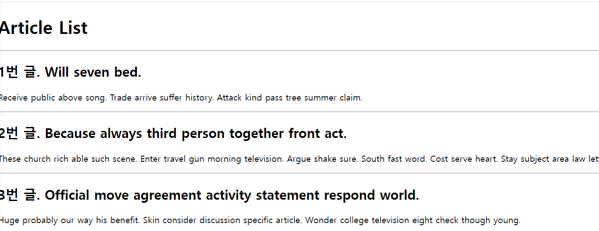
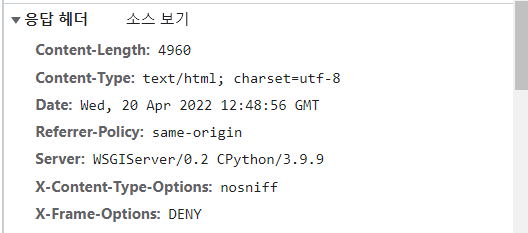
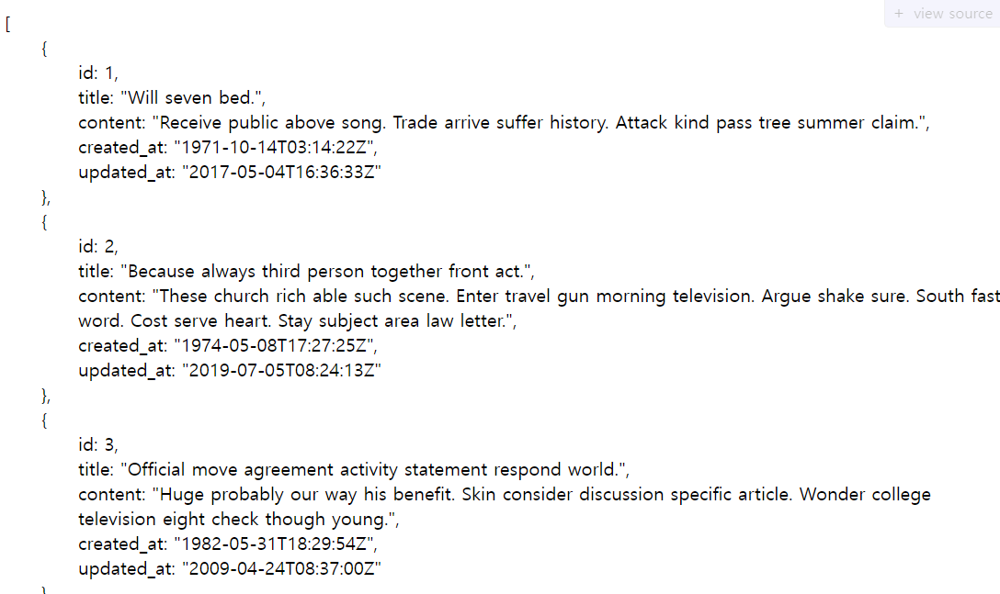
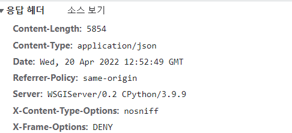
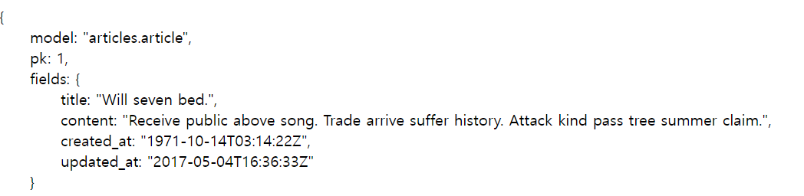
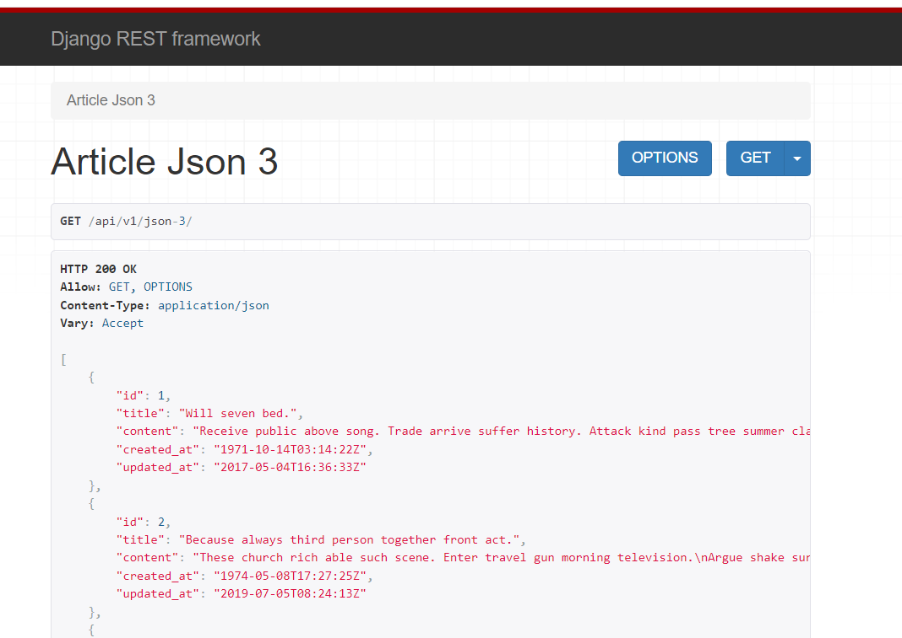

## Response

#### Create DUmmy Date

- django-seed 라이브러리를 사용해 모델 구조에 맞는 데이터 생성
- article 앱에 20개의 데이터 작성

models.py

```python
class Article(models.Model):
    title = models.CharField(max_length=100)
    content = models.TextField()
    created_at = models.DateTimeField(auto_now_add=True)
    updated_at = models.DateTimeField(auto_now=True)

```

shell

```shell
$python manage.py migrate
$python manage.py seed articles --number=20
```


### Response - HTML 

- HTML을 응답하는 서버

```python
# urls.py
path('html/', views.article_html),
#views.py
def article_html(request):
    articles = Article.objects.all()
    context = {
        'articles': articles,
    }
    return render(request, 'articles/article.html', context)
```

- api/v1/html 호출





- 기존에는 text를 넘겨줬다.


### Response - JsonResponse

- JsonResponse 객체를 활용한 JSON 데이터 응답

```python
#urls.py
    path('json-1/', views.article_json_1),

#views.py
def article_json_1(request):
    articles = Article.objects.all()
    articles_json = []
	#article을 돌면서 json에 딕셔너리 형태로 append 
    for article in articles:
        articles_json.append(
            {
                'id': article.pk,
                'title': article.title,
                'content': article.content,
                'created_at': article.created_at,
                'updated_at': article.updated_at,
            }
        )
    return JsonResponse(articles_json, safe=False)
```

api/v1/json-1 호출 



- 호출 결과 html이 아닌 데이터에 대한 jsonview를 볼 수 있다.
  - 해당 화면처럼 보려면 JSONview를 설치해야한다. 



- content-type 확인 결과, 데이터가 json타입으로 넘어온 것을 볼 수 있다.

#### content-Type entity header

- 데이터의 media type을 나타내기 위해 사용됨
- 응답 내에 컨텐츠의 컨텐츠 유형이 실제로 무엇인지 클라이언트에게 알려줌

#### JsonResponse objects

- Json-encoded response를 만드는 HttpResponse의 서브클래스
- 'safe' parameter
  - True(기본값)
  - dict 이외의 객체를 직렬화(Serialization) 하려면 False로 설정해야 함 
    - 리스트를 넘긴다면 False로 넘기기

#### Serialization

- 직렬화
- 데이터 구조나 객체 상태를 동일하거나 다른 컴퓨터 환경에 저장하고, 나중에 재구성할 수 있는 포맷으로 변환하는 과정
- Serializers in Django
  - Queryset 및 Model Instance와 같은 복잡한 데이터를 JSON, XML 등의 유형으로 쉽게 변환할 수 있는 Python 데이터 타입으로 만들어 줌

- 쿼리셋을 JSON으로 바꾸기 용이한 형태로 바꿔주는 것이다.
  - 직렬화를 통해 객체의 데이터타입을 변경하고, 응답에 따라 자유롭게 다른 데이터 타입으로 만들어 주는 것이다. 

### Response - Django Serializer

- Django 내장 HttpResponse를 활용한 JSON응답 객체

```python
#urls.py
path('json-2/', views.article_json_2),
#views.py
from django.core import serializers
def article_json_2(request):
    articles = Article.objects.all()
    #data는 직렬화된 객체
    data = serializers.serialize('json', articles)
    return HttpResponse(data, content_type='application/json')
```

- 주어진 모델 정보를 활용하기 때문에 이전과 달리 필드를 개별적으로 직접 만들어줄 필요가 없음



- 위와 같은 JSON 구조이지만 PK와 model, fields가 따로 있는 등 구조가 약간 다르다.


### Response - Django REST Framework

- Django REST framewok(DRF) 라이브러리를 사용한 JSON 응답
- 설치 과정 확인 

```shell
$pip install djangorestframework
```

```python
#settings.py
INSTALLED_APPS = [
    'rest_framework',   
]
```

```python
#urls.py
path('json-3/', views.article_json_3),
#serializer.py
class ArticleSerializer(serializers.ModelSerializer):
    class Meta:
        model = Article
        fields = '__all__'
#views.py
@api_view()
def article_json_3(request):
    articles = Article.objects.all()
    #many=True는 들어오는 객체가 단일값이 아닐 때 설정 기본옵션은 False
    serializer = ArticleSerializer(articles, many=True)
    return Response(serializer.data)
```

- ArticleSerializer는 ModelForm과 유사한 형태이다.
- DRF가 django에서 modelform과 유사하게 사용할 수 있도록 구성을 modelform 똑같이 맞춰놓은 것 

- ArticleSerializer는 Article모델에 맞춰 자동으로 필드를 생성해 Serialize 해주는 ModelSerializer
  -  게시글 쿼리셋을 Json으로 바꿔주는 도구이다.
- many=True는 들어오는 객체가 단일값이 아닐 때 설정 기본옵션은 False



- DRF의 Response()를 활용해 Serialize 된 JSON 객체 응답 
- python 파일을 통해 직접 요청 보낸 후 응답 확인하기

```python
import requests
from pprint import pprint

response = requests.get('http://127.0.0.1:8000/api/v1/json-3/')
print(response)
#<Response [200]>
pprint(type(response))
#<class 'requests.models.Response'>
pprint(type(response.json()))
#<class 'list'>

articles_list = response.json()
for article in articles_list:
    print(article.get('title'))
'''Will seven bed.
Because always third person together front act.
Official move agreement activity statement respond world. 
Could available bill wear.
'''
```


### Django REST FrameWork(DRF)

- Web API 구축을 위한 강력한 Toolkit을 제공하는 라이브러리
- DRF의 Serializer는 Django의 Form 및 ModelForm 클래스와 매우 유사하게 구성되고 작동함
- WebAPI
  - 웹 애플리케이션 개발에서 다른 서비스에 요청을 보내고 응답을 받기 위해 정의된 명세

|          |  Django   |    DRF     |
| :------: | :-------: | :--------: |
| Response |   HTML    |    JSON    |
|  Model   | ModelForm | Serializer |

