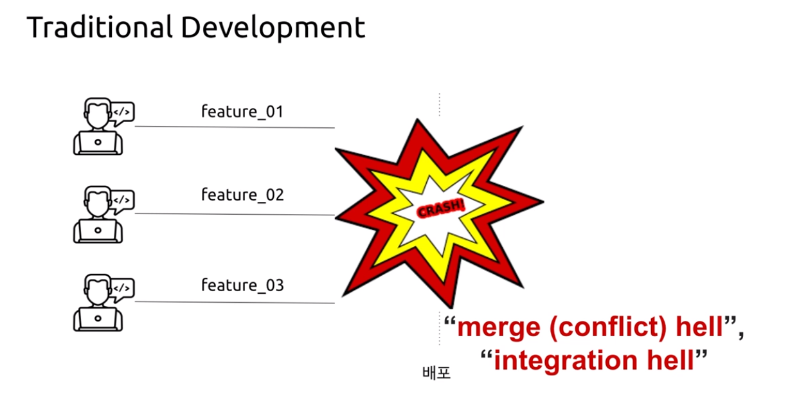
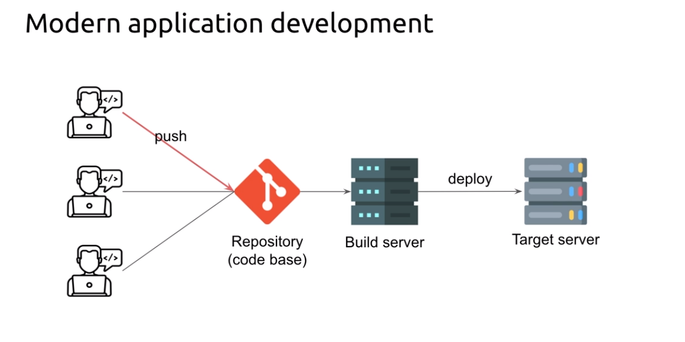
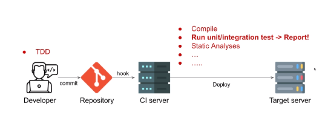
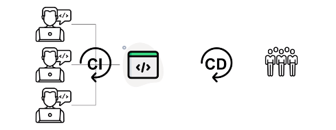
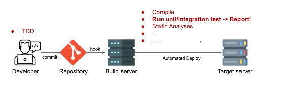

# CI/CD

## 배경

### Today's IT Service

- 현재 IT 서비스들은 고객의 니즈를 빠르게 파악하고, 이 니즈를 충족시킬 수 있는 서비스를 빠르게 개발해서 배포하고 있다.
- 이를 위해 MSA로 독립적으로 개발하고 배포하고 있다. 
- 이에 따라 devops SRE라는 포지션이 나오게 되고, CI/CD 란 개념, CR이라는 개념이 나왔다.

### Tranditional Development

- 납기일을 정하고 납기일에 맞춰서 개발자들이 코드를 합쳤다.

- 로봇을 예로 들면, 개발자 1은 팔, 개발자 2는 다리, 개발자 3은 몸통 ..

- 많은 공수가 들고 개발이 잘못된 부분이 있으면 전체적으로 갈아 엎어야했다.

    

### Modern application development

- 하루에도 여러번 각자의 코드를 push하고 pull을 한다.
- 이 과정에서 conflict가 날 수 있지만, 작은 단위를 개발하고 합치다 보니 보수가 전통적 방식보다 용이하다.

## CI/CD Concept

#### CI (Continuous Intergration) - 지속적 통합

- 자주 개발자들의 소스코드를 합치고

#### CD (Continous Delivery or Continuous Deployment) - 지속적 전달 / 배포

- 자주 고객에게 전달하는 것 

CI/CD는 피드백 루프를 단축하고 반복적인 작업을 자동화함으로써 소프트웨어를 출시하는 과정을 가속화하고자 하는 관행이다. 이러한 관행은 사용자에게 가치 있고 작동하는 소프트웨어를 자주 제공하는 민첩한 원칙을 실현하는 데 핵심적인 역할을 한다.

## CI

### 개념 

- 하루에 여러번 개발자들이 각자 개발한 소스코드를 자주 메인라인에 병합하는 것 
- 머지 지옥과, 통합 지옥을 방지하기 위해 수행함 

### Workflows

- 개발자가 로컬에서 소스를 개발하고, 테스트 후 메인 라인인 Repository에 Push하게 된다
- 그 이벤트를 받아서 CI Server는 소스코드를 Compile 하고, unit test/ Intergration test/정적 분석 등 다양한 로직을 진행한다.
- 타겟 서버에 배포한다. 

### CI common practice

- 코드 레포지토리 유지 보수 
    - 특정 개발자가 최초의 소스코드를 클론하고, 별도의 빌드 업 없이 코드를 유지할 수 있는가? 
- 빌드 자동화, 빠른 빌드 유지 
- base라인에 모든 사람이 commit을 하고, 이것이 빌드 가능한가? 
- 버그 픽스 커밋이 테스트 케이스를 거쳐서 나가는가? (모든 커밋은 테스트를 거쳐야한다.)
- 비슷한 환경에서 클론해서 테스트를 진행하는지 

## CD

### 개념 

- 지속적인 배포는 자동 배포를 통해 소프트웨어 기능이 자주 제공되는 소프트웨어 엔지니어링 접근 방식

- 소프트웨어를 빠르고 자동화된 개념으로 배포하는 것 

### Difference between concept (Deployment vs Delivery)

#### Continuous deployment (09.02 by Timothy fitz)

- 빌드 서버 앞단은 CI라는 철학이 성립됨. 
- 그 이후에 배포에 관련된 CD 철학이 생겼고, 자동화된 배포 철학을 담고 있음 
- 매 빌드마다 자동으로 고객에게 배포가 됨 
- 문제
    - 임베디드 산출물은 ? 
    - 종속성이 있는 프로젝트는? 
    - 마케팅적으로 특정 시점에 특정 기능을 내보내야하면 어떡하지? 
    - 보완하기 위해 delivery가 탄생

#### Continuous delivery (10.08 by zez humble)

- CI 가 끝난 이후에는 반드시 배포가 가능한 상태를 유지하고, 개발자나 배포 담당자의 의해 배포가 진행되는 방식
- 마케팅이나 순차 배포 등 비즈니스 용어 

## CI/CD Puropose

- 고객의 니즈를 빠르게 해소하기 위해 빠르게 배포하고, 신뢰성 있는 배포를 하는 것 

- 더 높은 품질의 소프트웨어를 더 빠르게 배송
- 통합 지옥 방지
- 대기열에 배치되지 않고 더 빠르게 구현
- 작은 단위의 작업을 여러번 전달(하루에 여러 번)
- 버그를 신속하게 찾아 해결합니다.
- 구축 프로세스의 생산성 향상