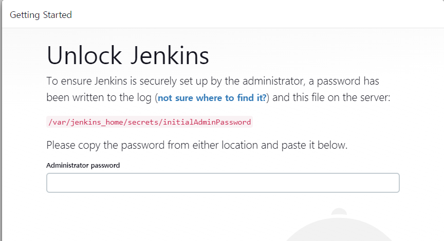

# AWS IaaS 를 활용한 CI/Cd

## Jenkins

### Jenkins 개념 

- 젠킨스는 오픈소스 자동화 서버이다. 
    - 레퍼런스와 문서들이 많다. 
- 소프트웨어 개발에 관련된 빌드/테스트/배포 등 일련의 작업들을 자동화한다.

- 젠킨스 자체로 완벽한 기능을 하는 것이 아니라, 젠킨스의 다양한 플러그인을 통해 기능을 확장할 수 있다.
    - Pipeline
        - job을 동기/비동기 적으로 실행
    - Authentication / Authorization
        - 사내 연결 
    - Git
        - Oauth 연동 
        - 버전 관리 시스템을 통해 자동화 가능 
    - Docker 
        - workload를 docker image로 빌드하거나, 저장소에 푸쉬 
- 하나의 서버에서만 구성하는 것이 아니라, 클러스터링, 3rd-party 솔루션과 연동해서 확장 가능 


### Jenkins installation by docker 

- docker-compose.yml

```yaml
version: "3.9"
services: 
  jenkins:
    image: jenkins/jenkins:latest
    container_name: jenkins
    environment: 
      - "TZ=Asia/Seoul"
    ports:
      - "8080:8080"
    volumes:
      - "./data:/var/jenkins_home"
```

- Jenkins 빌드 

    ```
    docker-compose up -d 
    ```

#### 컨테이너 빌드 실패 시 확인 항목 

1. Port 개방 여부 

    - EC2 보안그룹에서 포트를 8080 포트가 개방되었는지 확인

2. Container log로 문제 확인 

    - volume으로 폴더를 공유할 때 권한이 없는 문제가 발생할 수 있음

        ```
        $ docker logs jenkins 
        touch: cannot touch '/var/jenkins_home/copy_reference_file.log': Permission denied
        Can not write to /var/jenkins_home/copy_reference_file.log. Wrong volume permissions?
        touch: cannot touch '/var/jenkins_home/copy_reference_file.log': Permission denied
        Can not write to /var/jenkins_home/copy_reference_file.log. Wrong volume permissions?
        touch: cannot touch '/var/jenkins_home/copy_reference_file.log': Permission denied
        Can not write to /var/jenkins_home/copy_reference_file.log. Wrong volume permissions?
        ```

    - 권한 부여 

        ```
        $ chown -R 1000:1000 data
        $ mkdir data 
        ```

        

### Jenkins 시작 

#### Unlock Jenkins 



- 컨테이너에 접속해 비밀번호 확인

    ```
    $ docker exec -it jenkins /bin/bash
    $ jenkins@8043b41290df:/$ cat /var/jenkins_home/secrets/initialAdminPassword 
    # 출력된 패스워드 입력 
    ```


#### Jenkins 관리


- 시스템 설정을 통해 Jenkins 전체를 다룰 수 있다.
  - URL 관리
  - github 설정
  - mail 설정 등 
- 플러그인 관리
  - 설치가능 탭에서 원하는 플러그인을 검색하고 설치할 수 있다.
  - 이미 설치된 플러그인을 확인할 수 있고, 제거할 수 있다.

- Credential 관리
  - Jenkins scope의 username, password, ssh key, secret 등 설정 가능 

### 새로운 Item

##### Freestyle project 

- github project, build history 관리, 소스코드 관리, 빌드 유발, 빌드 환경 설정 등 

- Build periodically

  

  

  - 분마다 실행을 확인한다. 

- Build step

  

  - 빌드가 실행될 때, 빌드가 실행되고 있다고 메시지 

##### Pipeline Job

- pipeline이 어떻게 실행되는지 명세 

  