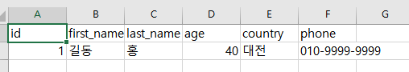
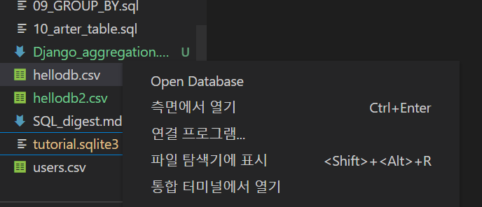
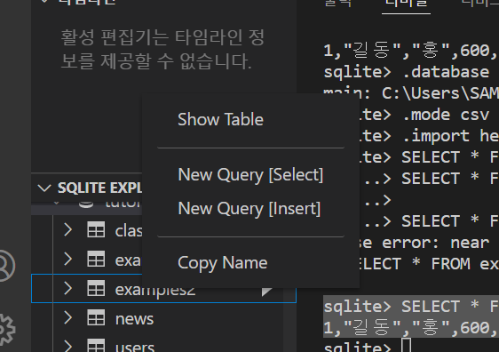
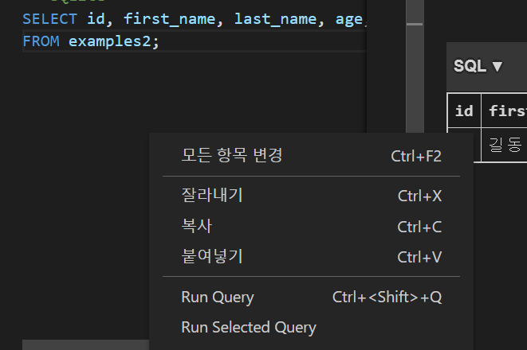
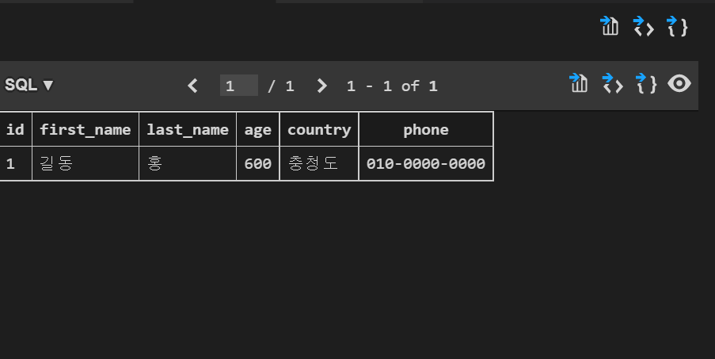

## Database

### 데이터베이스(DB)

- 데이터베이스는 체계화된 데이터의 모임 

- 여러 사람이 공유하고 사용할 목적으로 통합 관리되는 정보의 집합
- 논리적으로 연관된 (하나 이상의) 자료의 모음으로 그 내용을 고도로 구조화 함으로서 검색과 갱신의 효율화를 꾀한 것
- 즉, **몇 개의 자료 파일을 조직적으로 통합하여 자료 항목의 중복을 없애고, 자료를 구조화하여 기억시켜놓은 자료의 집합체**

- 데이터와 자료들이 조직적으로 구조화 되어있다.

#### 데이터베이스의 장점

- 데이터 중복 최소화
- 데이터 무결성 (정확한 정보를 보장)
- 데이터 일관성
- 데이터 독립성 (물리적/논리적)
- 데이터 표준화
- 데이터 보안 유지 


### RDB

- Realational Database
- 키와 값들의 간단한 관계를 표형태로 정리한 데이터베이스
- 관계형 모델에 기반 

| 고유번호 |  이름  | 주소 | 나이 |
| :------: | :----: | :--: | :--: |
|    1     | 홍길동 | 제주 |  20  |
|    2     | 김길동 | 서울 |  30  |
|    3     | 박길동 | 독도 |  40  |


#### 관계형 데이터베이스 용어

##### 스키마 : 데이터베이스에서 자료의 구조, 표현방법, 관계등 전반적인 명세를 기술한 것

| Column  | datatype |
| :-----: | :------: |
|   id    |   INT    |
|  name   |   TEXT   |
| address |   TEXT   |
|   age   |   INT    |

##### 테이블 :  열(컬럼/필드)과 행(레코드/값)의 모델을 사용해 조직된 데이터 요소들의 집합 

- 스키마를 형식에 따라 테이블을 만든다. 

##### 열 : 각 열에는 고유한 데이터 형식이 지정됨 (열,컬럼,필드 등의 이름으로 불림 )

- 아래의 예시에서는 name이란 필드에 고객의 이름(TEXT) 정보가 저장됨 

|  name  |
| :----: |
| 홍길동 |
| 김길동 |
| 박길동 |

##### 행 : 실제 데이터가 저장되는 행텨 (행,로우,레코드 등의 이름으로 불림)

- 아래 예시가 하나의 행을 의미

|  1   | 홍길동 | 제주 |  20  |
| :--: | :----: | :--: | :--: |

##### 기본키(Primary Key) : 각 행의 고유 값

- 반드시 설정해야 하며, 데이터베이스 관리 및 관계 설정 시 주요하게 활용 됨 


### RDMBS

- Relational Database Management System
- 관계형 모델을 기반으로 하는 데이터베이스 관리 시스템을 의미
  - MySQL, SQLite, PostgreSQL, ORACLE, MSSQL

#### SQLite

- 서버 형태가 아닌 파일 형식으로 응용 프로그램에 넣어서 사용하는 비교적 가벼운 데이터베이스
- 구글 안드로이드 운영체제에 기본적으로 탐재된 데이터베이스이며, 임베디드 소프트웨어에서도 많이 활용됨
- 로컬에서 간단한 DB 구성을 할 수 있으며, 오픈소스 프로젝트이기 때문에 자유롭게 사용가능


#### SQLite Data Type

1. NULL
   - 파이썬의 None처럼 데이터가 없음을 표현 
2. INTEGER
   - 크기에 따라 0,1,2,3,4,6 또는 8바이트에 저장된 부호 있는 정수
3. REAL
   - 8바이트 부동 소수점 숫자로 저장된 부동 소수점 값
4. TEXT
5. BLOB
   - 입력된 그대로 정확히 저장된 데이터(별다른 타입 없이 그대로 저장)

#### SQLite Type Affinity

- SQLite는 동적 데이터 타입을 가짐 
- Type Affinity
  - 특정 컬럼에 저장하도록 권장하는 데이터 타입
- INTEGER
  - INT, INTEGER, TINYINT, SMALLINT...
- TEXT
  - CHARACTER, VARCHAR, VARYING CHARACTER ....
- BLOB
  - BLOB
- REAL
  - REAL, DOUBLE, FLOAT
- NUMERIC
  - NUMERIC, DECIMAL, BOOLEAN, DATE, DATETIME

### SQL

- 관계형 데이터베이스 관리시스템의 데이터 관리를 위해 설계된 특수 목적 프로그래밍 언어
- 데이터베이스 스키마 생성 및 수정
- 자료의 검색 및 관리
- 데이터베이스 객체 접근 조정 관리

#### SQL 분류

| 분류                   | 개념                                                         | 예시                                        |
| ---------------------- | ------------------------------------------------------------ | ------------------------------------------- |
| DDL - 데이터 정의 언어 | 관계형 데이터베이스 구조(테이블, 스키마)를 정의하기 위한 명령어 | CREATE<br />DROP<br />ALTER                 |
| DML - 데이터 조작 언어 | 데이터를 저장, 조회, 수정, 삭제 등을 하기 위한 명령어        | INSERT<br />SELECT<br />UPDATE<br />DELETE  |
| DCL - 데이터 제어 언어 | 데이터베이스 사용자의 권한 제어를 위해 사용하는 명령어       | GRANT<br />REVOKE<br />COMMIT<br />ROLLBACK |

#### SQL Keywords(DML)

- INSERT : 새로운 데이터 삽입(추가)
- SELECT : 저장되어있는 데이터 조회
- UPDATE : 저장되어있는 데이터 갱신
- DELETE : 저장되어있는 데이터 삭제 


### 테이블 생성 및 삭제

- 임의의 csv파일 만들기



- 데이터베이스 생성하기

```shell
$sqlite3 tutorial.sqlite3
#'.'은 sqlite 프로그램을 실행 
sqlite> .database
```

- csv 파일을 table로 만들기

```shell
sqlite> .mode csv
sqlite> .import hellodb.csv examples2
sqlite> .tables
examples
```

- SELECT 확인하기

```shell
sqlite> SELECT * FROM examples2;
1,"길동","홍",600,"충청도",010-0000-0000
```

#### SQLITE사용하기

1. 생성한 tutorial.sqlite3 오른쪽 마우스 클릭 후 OpenDatabase



2. 탭 아래의 SQLITE EXPLORER에서 example2 우클릭 후 NEW QUERY(SELECT) 실행 



3. SQLITE가 VSCODE상에서 생성되면 확인후 우클릭-> RUN Query



4. 모든 테이블이 조회되는 것을 알 수 있음 

- 기본 명령어가 전체 데이터 조회이기 때문

```sql
-- SQLite
SELECT id, first_name, last_name, age, country, phone
FROM examples2;
```




### CRUD

#### 테이블 생성 및 삭제

- CREATE TABLE
  - 데이터베이스에서 테이블 생성

```sql
CREATE TABLE classmates (id INTEGER PRIMARY KEY, name TEXT);
```

- DROP TABLE
  - 데이터베이스에서 테이블 제거 

```sql
DROP TABLE classmates;
```

### 테이블 생성 실습해보기

- 다음과 같은 스키마를 가지고 있는 classmates 테이블을 만들고 스키마를 확인해보세요.

| column  | datatype |
| :-----: | :------: |
|  name   |   TEXT   |
|   age   |   INT    |
| address |   TEXT   |

```sql
-- PK 작성시에는 무조건 integer로 해야함 . 
CREATE TABLE classmates (
  id INTEGER PRIMARY KEY,
  name TEXT NOT NULL,
  age INT NOT NULL, 
  adress TEXT
);
```

#### INSERT

- 테이블에 단일 행 삽입
  - 모든 열에 데이터가 있는 경우 column을 명시하지 않아도됨 
  - SQLite는 따로 PRIMARY KEY 속성의 컬럼을 작성하지 않으면 값이 자동으로 증가하는 PK 옵션을 가진 rowid 컬럼을 정의 

```sql
#각 value에 맞는 column들을 명시적으로 작성 
INSERT INTO classmates (
name,age,adress)
values ('홍길동', 30, '서울');
#모든 벨류 작성
INSERT INTO classmates 
VALUES 
('홍길동',30,'서울');
```

- 여러개 행 삽입

```sqlite
INSERT INTO classmates 
VALUES 
('홍길동',30,'서울'),
('김철수', 30, '대전'),
('이라라', 26, '광주'),
('박대박', 29, '구미'),
('최고다', 28, '부산');
```

#### SELECT statement

- SELECT
  - "query data from a table"
  - 테이블에서 데이터를 조회 
  - SELECT 문은 SQLite에서 가장 복잡한 문이면 다양한 절(clause)와 함께 사용 
    - ORDER BY, DISTINCT, WHERE, LIMIT, GROUP BY ... 

#### SELECT와 함께 사용하는 clause

##### LIMIT

- "constrain the number of rows returned by a query"
- 쿼리에서 반환되는 행 수를 제한
- 특정 행부터 시작해서 조회하기 위해 OFFSET 

##### WHERE

- "specify the search condition for rows returned by the query"
- 쿼리에서 반환된 행에 대한 특정 검색 조건을 지정 

##### SELECT DISTINCT 

- "remove duplicate rows in the result set"
- 조회 경과에서 중복 행을 제거
- DISTINCT 절은 SELECT 키워드 바로 뒤에 작성해야 함 
- 나이를 중복 없이 조회 

```sqlite
 select DISTINCT age from classmates ;
```

- ID와 컬럼만 조회 

```sql
SELECT rowid, name FROM
 classmate;
```

- ID와 컬럼 1개만 조회 

```sqlite
SELECT rowid, name FROM
 classmate LIMIT 1 ;
```

- 특정 부분에서 원하는 수 만큼 데이터 조회하기(5개 컬럼 중 3번째 조회하기)

```sqlite
 SELECT rowid, name FROM
 classmates LIMIT 1 OFFSET 2;
```

##### OFFSET

- 동일 오브젝트 안에서 오브젝트 처음부터 주어진 요소나 지점까지의 변위차(위치 변화량)을 나타내는 정수형
- 예시
  - 문자열 'abcdef'에서 문자 'c'는 시작점 'a'에서 2의 OFFSET을 지님

- 6번째 행부터 10개 행을 조회  

```sqlite
SELECT * FROM MY_TABLE LIMIT 10 OFFSET 5;
```

##### WHERE

- 특정 데이터(조건) 조회하기 

```sqlite
 SELECT rowid,name FROM classmates 
 WHERE address = '서울' ;
```

### DELETE statement

- "remove rows from a table"
- 테이블에서 행을 제거 

- 조건을 통해 특정 레코드 삭제하기
  - 어떤 기준으로 데이터를 삭제하면 좋을까?
  - 중복 불가능(UNIQUE)값인 rowid를 기준으로 삭제 ! 
- id가 5인 레코드를 삭제해보기

```sqlite
DELETE FROM classmates WHERE rowid=5;
```

#### AUTOINCREMENT 

- Column attribute
- SQLite가 사용되지 않은 값이나 이전에 삭제된 행의 값을 재사용하는 것을 방지

```sqlite
CREATE TABLE 테이블이름 (
id INTEGER PRIMARY KEY AUTOINCREMENT,
...
)
```

#### UPDATE

- "update data of existing rows in the table"
- 기존 행의 데이터를 수정
- SET clause에서 테이블의 각 열에 대해 새로운 값을 설정

- classmates 테이블에 id가 5인 레코드를 수정하기. 이름을 홍길동으로, 주소를 제주도로 바꿔주세요! 

```sqlite
UPDATE classmates 
set name = '홍길동',
address = '제주도'
WHERE rowid = 5;
```

### CRUD 정리하기

|      |  구문  |                             예시                             |
| :--: | :----: | :----------------------------------------------------------: |
|  C   | INSERT | INSERT INTO 테이블이름 (컬럼1, 컬럼2, ...) VALUES (값1, 값2); |
|  R   | SELECT |             SELECT * FROM 테이블이름 WHERE 조건;             |
|  U   | UPDATE |    UPDATE 테이블이름 SET 컬럼1=값1, 컬럼2=값2 WHERE 조건;    |
|  D   | DELETE |              DELETE FROM 테이블이름 WHERE 조건;              |


## SQLite Aggregate Functions

- 집계함수
- 값 집합에 대한 계산을 수행하고 단일 값을 반환
  - 여러 행으로부터 하나의 결과값을 반환하는 함수
- SELECT 구문에서만 사용됨
- 예시
  - 테이블 전체 행 수를 구하는 COUNT(*)
  - age 컬럼 전체 평균 값을 구하는 AVG(age)

#### Overview of SQLite aggregate functions

- COUNT 
  - 그룹의 항목 수를 가져옴 

```sqlite
SELECT COUNT(*) FROM users;
```

- AVG
  - 모든 값의 평균을 계산

- MAX
  - 그룹에 있는 모든 값의 최대값을 가져옴
- MIN
  - 그룹에 있는 모든 값의 최소값을 가져옴 

- SUM 
  - 모든 값의 합을 계산

```sqlite
SELECT AVG(컬럼) FROM 테이블이름;
SELECT SUM(컬럼) FROM 테이블이름;
SELECT MIN(컬럼) FROM 테이블이름;
SELECT MAX(컬럼) FROM 테이블이름;
```

위 함수들은 기본적으로 해당 컬럼이 숫자(INTEGER)일 때만 사용 가능 

- 30살 이상인 사람들의 평균 나이는?

```sqlite
SELECT AVG(age) FROM users WHERE age>=30;
```

- 계좌 잔액이 가장 높은 사람과 그 액수를 조회하려면? 

```sqlite
SELECT first_name, MAX(balance) FROM users;
```

- 나이가 30이상인 사람의 계좌 평균 잔액을 조회하려면?

```sqlite
SELECT AVG(balance) FROM users WHERE age>=30;
```


### LIKE

- "query data based on pattern matching"
- 패턴 일치를 기반으로 데이터를 조회하는 방법
- SQLite는 패턴 구성을 위한 2개의 wildcards를 제공
  - %(percentsign)
    - 0개 이상의 문자 
  - _(underscore)
    - 임의의 단일 문자 

#### wildcard character

- 파일을 지정할 때, 구체적인 이름 대신에 여러 파일을 동시에 지정할 목적으로 사용하는 특수 기호
  - *, ? 등 
- 주로 특정한 패턴이 있는 문자열 혹은 파일을 찾거나, 긴 이름을 생략할 때 쓰임
- 텍스트 값에서 알 수 없는 문자를 사용할 수 있는 특수 문자로, 유사하지만 동일한 데이터가 아닌 여러 항목을 찾기에 매우 편리한 문자
- 지정된 패턴 일치를 기반으로 데이터를 수집하는데도 도움이 될 수 있음

```sqlite
SELECT * FROM 테이블 WHERE 컬럼 LIKE '와일드카드패턴';
```

- %
  - 이 자리에 문자열이 있을 수도, 없을 수도 있다.
- _
  - 반드시 이 자리에 한개의 문자가 존재해야 한다.

#### 사용예시

| 와일드카드패턴   | 의미                                          |
| ---------------- | --------------------------------------------- |
| 2%               | 2로 시작하는 값                               |
| %2               | 2로 끝나는 값                                 |
| %2%              | 2가 들어가는 값                               |
| _2%              | 아무 값이 하나 있고 두 번째가 2로 시작하는 값 |
| 1____            | 1로 시작하고 총 4자리인 값                    |
| `2_%_%` /` 2__%` | 2로 시작하고 적어도 3자리인 값                |

- users 테이블에서 나이가 20대인 사람만 조회

```sqlite
SELECT * FROM users WHERE age LIKE '2_'
```

- users 테이블에서 지역 번호가 02인 사람만 조회

```sqlite
SELECT * FROM users WHERE phone LIKE '02-%'
```

- users 테이블에서 이름이 '준'으로 끝나는 사람만 조회

```sqlite
SELECT * FROM users WHERE first_name LIKE '%준';
```

- users 테이블에서 중간 번호가 5114인 사람과 조회한다면?

```sqlite
SELECT * FROM users WHERE phone LIKE '%-5114-%'
```


### ORDER BY 

- "sort a result set of a query"
- 조회 결과 집합을 정렬
- SELECT 문에 추가하여 사용
- 정렬 순서를 위한 2개의 keyword 제공
  - ASC - 오름차순(default)
  - DESC - 내림차순

- users에서 나이 순으로 오름차순 정렬하여 상위 10개만 조회하기

```sqlite
SELECT * FROM users ORDER BY age ASC LIMIT 10;
```

- users에서 나이 순, 성순으로 오름차순 정렬하여 상위 10개만 조회하기

```sqlite
SELECT * FROM users ORDER BY age,last_name ASC LIMIT 10;
```


### GROUP BY

- "make a set of summary rows from a set of rows"
- 행 집합에서 요약 행 집합을 만듬
- SELECT 문의 optional 절
- 선택된 행 그룹을 하나 이상의 열 값으로 요약 행으로 만듬
- 문장에 WHERE 절이 포함된 경우 반드시 WHERE 절 뒤에 작성해야함 

- 지정된 기준에 따라 행 세트를 그룹으로 결합
- 데이터를 요약하는 상황에 주로 사용

```sqlite
SELECT 컬럼1, aggregate_function(컬럼2) FROM 테이블 GROUP BY 컬럼1, 컬럼2; 
```

- users에서 각 성씨가 몇 명씩 있는지 조회한다면?

```sqlite
SELECT last_name, COUNT(*) FROM users GROUP BY last_nmae;
```

- AS를 활용해서 COUNT에 해당하는 컬럼 명을 바꿔서 조회할 수 있음 

```sqlite
SELECT last_name, COUNT(*) AS name_count FROM users GROUP BY last_name;
```


### ALTERTABLE

#### ARTER TABLE의 3가지 기능

- table 이름 변경

  - ```sqlite
    ALTER TABLE 기존테이블이름 RENAME TO 새로운테이블이름;
    ```

- 테이블에 새로운 column 추가

  - ```sqlite
    ALTER TABLE 테이블이름 ADD COLUMN 컬럼이름 데이터타입설정;
    ```

  - ```sqlite
    ALTER TABLE news ADD COLUMN created_at TEXT NOT NULL;
    ```

- [참고] column 이름 수정 (new in sqlite 3.25.0)

  - ```sqlite
     ALTER TABLE table_name RENAME COLUMN current_name TO new_name;
    ```

##### 주의

- ALTER TABLE에 새로 컬럼을 추가할 때 기존에 데이터들이 있기 때문에 에러가 발생
- 해결방법
  - NOT NULL 설정 없이 추가하기
  - 기본값 설정하기 
