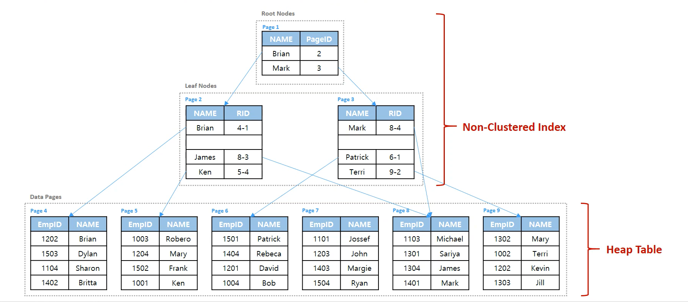

# INDEX

## INDEX

### 인덱스 종류

#### Non-Clustered Index

- B-tree 구조를 가지는 일반적인 인덱스

- 힙 테이블(클러스터드 인덱스가 없는 테이블)과 독립적으로 생성
- 테이블 당 여러 개 생성 가능(최대 999개)
- 리프 노드에서 해당 키가 위치하는 row에 대한 포인터(RID)를 통해 테이블 엑세스
- Root는 PageID를 가지고, LeafNodes RID를 가진다.
  - RID는 유니크한 값으로 힙 테이블의 실질적 데이터의 위치를 저장 
- 즉 LeafNode는 RID 값으로 힙 테이블에 엑세스한다. 
- INDEX 페이지는 별도의 BTREE 구조로 Name이 pageID와 함께 생성되어 정렬되지만, 힙 테이블에는 영향이 없어 Name이 정렬되지 않는 형태로 존재한다.
- LEAF Node에서 Heap table로는 RIP 값으로 매칭만 하기 때문에 별도의 정렬을 하지 않고 참조한다.
- 패트릭을 선택하면 Page1에서 Mark -> Page 3에서 Patrick - > Page6에서 Patric을 선택하게 된다.



```sql
CREATE NONCLUSTERED INDEX IX_Name
ON EMP (Name) ; 
```


#### Clustered Index

#### Non-Clustered + Clustered Index

### 인덱스 탐색방식

#### Table Scan

#### Clustered Index (Scan)

#### Clustered Index (Seek)

#### Non-Clustered Index (Scan)

#### Non-Clustered Index (Seek)

## STATISTICS

## ISOLATION

## JOIN

## HINT

