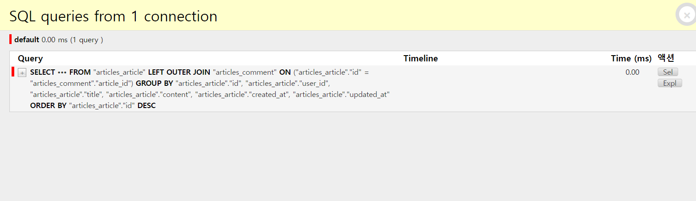

# 최적화

## 필요하지 않은 것을 검색하지 않기 

- 필요하지 않은 것들을 검색하지 않고 필요한 부분들만 검색하자!! 

#### Don't retrieve things you don't need

- .count()
  - 카운트만 원하는 경우
  - len(queryset) 대신 QuerySet.count() 사용하기
- .exists()
  - 최소한 하나의 결과가 존재하는지 확인하려는 경우
  - if queryset 대신 QuerySet.exists()를 사용하는 것이 더 효과적이다. 


### 좋아요 코드 예시

- if 때문에 퀴레섯이 '평가' 되고, 이에 따라 쿼리셋 캐시에도 전체 레코드가 저장

```python
like_set = article.like_users.filter(pk=request.user.pk)
# if 문은 쿼리셋을 평가한다 -> 캐시가 생김 
if like_set :
    #쿼리셋은 전체 결과가 필요하지 않은 상황임에도 불구하고 ORM은 전체 결과를 가져온다. 
    #이럴때는 exist가 훨씬 효과적이다. 
    article.like_users.remove(request.user)
```

- exists()는 쿼리셋 캐시를 만들지 않으면서 특정 레코드가 존재하는지 검사
- 결과 전체가 필요하지 않은 경우 유용

```python
like_set = article.like_users.filter(pk = request.user.pk)
#exists() 는 쿼리셋 캐시를 만들지 않으면서 레코드가 존재하는지 검사
if like_set.exists() :
    #DB에서 가져온 레코드가 하나도 없다면
    #트래픽과 메모리를 절약할 수 있다.
    article.like_users.remove(request.user)
```

- if문 안에 반복이 있다면, 순회할 때는 if문에서 캐시된 쿼리셋이 사용됨

```python
like_set article.like_users.filter(pk=request.user.pk)

#if문에서 캐시됨 
if like_set : 
    #해당 캐시를 사용 
    for user in like_set :
        print(user.username)
```

- 여기서 쿼리셋이 엄청 크다면 쿼리셋 캐시 자체가 문제가 될 수 있음 

#### iterator() 

- iterator는 객체가 많을 때 쿼리셋의 캐싱 동작으로 인해 많은 양의 메모리가 사용될 때 사용
- 몇 천개 단위의 레코드를 다뤄야 할 경우, 이 데이터를 한 번에 가져와 메모리에 올리는 행위는 매우 비효율적이기 때문
- 데이터를 작은 덩어리로 쪼개어 가져오고, 이미 사용한 레코드는 메모리에서 지움

```python
like_set = article.like_users.filter(pk=request.user.pk)

if like_set :
    for user in like_set.iterator() :
        print(user.username)
```

- 그런데 쿼리셋이 엄청 큰 경우 if문도 문제가 될 수 있다.

```python
like_set = article.like_users.filter(pk = request.user.pk)
#첫 번째 쿼리로, 쿼리셋에 레코드가 존재하는지 확인
if like_set.exist() : 
    # 또다른 쿼리로 레코드를 조금씩 가져옴
    for user in like_set.iterator() :
        print(user.username)
```


#### 안일한 최적화 주의

- exitst()와 iterator() 메서드를 사용하면 메모리 사용을 최적화 할 수 있지만, 쿼리셋 캐시는 생성되지 않기 때문에, **DB 쿼리가 중복될 수 있음** 


## Annotate

[참고링크](https://github.com/holawan/SQL/tree/master/Improve_query)

```shell
$ python manage.py migrate
$ python manage.py loaddata users.json articles.json comments.json
```

#### Django Debug Toolbar

- 현재 요청/응답에 대한 다양한 디버그 정보를 표시하고 다양한 패널에서 자세한 정보를 표시


### practice1

- 단순히 SQL로 계산해 하나의 테이블의 필드를 추가하여 붙여 올 수 있는 경우

#### '게시글 별로 댓글 수를 출력해보기 '

````python
#articles/views.py
def index_1(request):
    articles = Article.objects.order_by('-pk')
    context = {
        'articles': articles,
    }
    return render(request, 'articles/index_1.html', context)
````

```django

  <h1>Articles</h1>
  
    <p>제목 : {{ article.title }}</p>
    <p>댓글개수 : {{ article.comment_set.count }}</p>
    <hr>
  


```

##### 현재 article.comment_set.count가 11번 유사하게 반복되고 있음 

#### why?

- django_html에서 댓글 개수를 출력하는 `article.comment_set.count`에서의 평가가 매 반복마다 (article의 번호마다) 이루어지고 있는 문제가 있음
- 따라서 반복을 줄일 필요가 있음
- 여기서 원하는 것은 게시글의 댓글 개수이기 때문에, 처음에 조회할 때 한 번에 받아오면 된다. 


##### view함수 개선 (annotate 사용)

```python
#views.py
def index_1(request):
    # articles = Article.objects.order_by('-pk')
    #article을 가져올 때 결과에 댓글의 개수를 같이 가져옴 
    articles = Article.objects.annotate(Count('comment')).order_by('-pk')
    context = {
        'articles': articles,
    }
    return render(request, 'articles/index_1.html', context)
```

```django

  <h1>Articles</h1>
  
    <p>제목 : {{ article.title }}</p>
    <p>댓글개수 : {{ article.comment__count }}</p>
    <hr>
  

```



- 11개의 쿼리가 1개로 바뀌었음을 알 수 있음

### JOIN

- 두 개 이상의 테이블들을 연결 또는 결합하여 데이터를 출력하는 것을 JOIN이라고 함
- 관계형 데이터베이스의 가장 큰 장점이자 핵심적인 기능
- 일반적으로 PK나 FK 값의 연관에 의해 JOIN이 성립
- SQL JOIN에 대해서는 다양한 Visualization  사이트 참고
  - https://sql-joins.leopard.in.ua/
  - https://joins.spathon.com/

### 

## 한번에 모든 것을 검색하기 

### INTRO

- 위 과정까지는 중복을 제거하지 않고 단순히 쿼리 개수만 날린 것 
- 이것보다 더 큰 문제는 반복문을 도는 상황에서의 1:N, M:N 호출 상황 
- 여러번 호출 하지 말고 한 번에 모든 것을 검색해버리자 ! 

### Retriece everythin at once if you know you will need it 

1. select_related()
   - 1:1 또는 1:N 참조 관계에서 사용
   - DB에서 INNER JOIN을 황용
2. prefetch_related() 
   - M:N 또는 1:N 역참조 관계에서 사용
   - DB가 아닌 Python을 통한 join

### Select-_related()

- SQL의 INNER JOIN을 실행하여 테이블의 일부를 가져오고, SELECT FROM에서 관련된 필드들을 가져옴
- 단, single-valued relationships 관계 (foreign key and one-to-one)에서만 사용 가능

#### '게시글의 사용자 이름까지 출력해보기'

```python
#views.py
def index_2(request):
    articles = Article.objects.order_by('-pk')
    context = {
        'articles': articles,
    }
    return render(request, 'articles/index_2.html', context)
#templates/index_2.html

  <h1>Articles</h1>
  
    <h3>작성자 : {{ article.user.username }}</h3>
    <p>제목 : {{ article.title }}</p>
    <hr>
  

```


##### view 함수 개선(select_related 사용)

```python
def index_2(request):
    #article을 가져올 때 user까지 결과에 추가한다. 
    articles = Article.objects.select_related('user').order_by('-pk')
    context = {
        'articles': articles,
    }
    return render(request, 'articles/index_2.html', context)
```


### Prefetch_related()

- selected_related와 달리 SQL의 JOIN을 실행하지 않고, python에서 joining을 실행
- select_leated가 지원하는 single-valued relationships 관계에 더해, selec_related를 사용하여 수행할 수 없는 **M:N and 1:N 역참조 관계**에서 사용 가능

#### 댓글 목록을 모두 출력하기

```python
#views.py
def index_3(request):
    articles = Article.objects.order_by('-pk')
    context = {
        'articles': articles,
    }
    return render(request, 'articles/index_3.html', context)
#templates/index_3.html

  <h1>Articles</h1>
  
    <p>제목 : {{ article.title }}</p>
    <p>댓글 목록</p>
    
      <p>{{ comment.content }}</p>
    
    <hr>
  

```


##### view함수 개선(prefetch_related 사용)

```python
def index_3(request):
    # articles = Article.objects.order_by('-pk')
    #article을 조회할 때 comment_set 역참조를 동시에 진행 
    articles= Article.objects.prefetch_related('comment_set')
    context = {
        'articles': articles,
    }
    return render(request, 'articles/index_3.html', context)
```


### 복합활용

#### 댓글에 더해서 해당 댓글을 작성한 사용자 이름까지 출력 해보기

- 1:N의 역참조와 M:참조가 동시에 진행됨

```python
#views.py
def index_4(request):
    articles = Article.objects.order_by('-pk')
    context = {
        'articles': articles,
    }
    return render(request, 'articles/index_4.html', context)
#templates/index_4.html

  <h1>Articles</h1>
  
    <p>제목 : {{ article.title }}</p>
    <p>댓글 목록</p>
    
      <p>{{ comment.user.username }} : {{ comment.content }}</p>
    
    <hr>
  

```


##### view함수 개선

```python
def index_4(request):
    #처음에 comment_set 참조하고, user역참조 같이진행 
    articles = Article.objects.prefetch_related(Prefetch('comment_set',
    queryset=Comment.objects.select_related('user'))).order_by('-pk')
    context = {
        'articles': articles,
    }
    return render(request, 'articles/index_4.html', context)
```


### 섣부른 최적화

> '작은 효율성에 대해서는, 말하자면 97%정도에 대해서는, 잊어버려라. 섣부른 최적화는 모든 악의 근원이다.'
>
> Donald E. knuth
