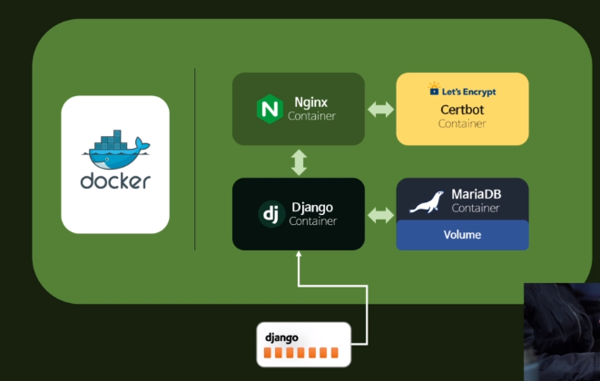
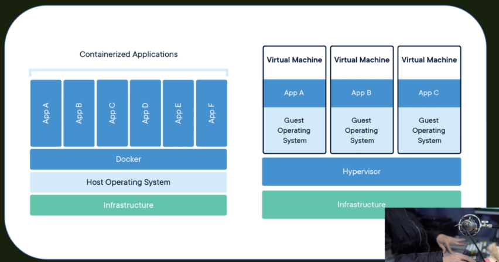
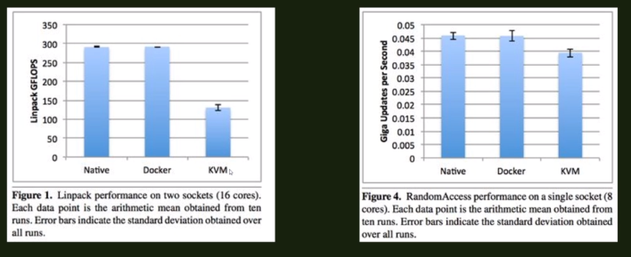
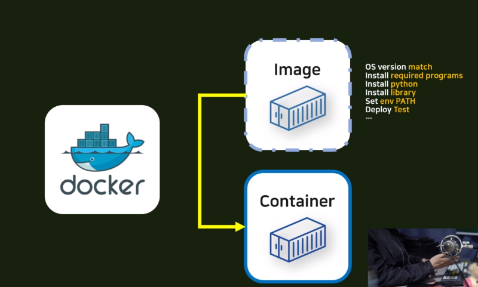

# Docker Intro

## Intro

#### 현재 Django 앱

- account,article,comment,profile,project,subscribe

- 추가로 Docker 시스템을 VULTR라는 가상 서비스에 빌려서 서버에 올릴 것이다.

이걸 만든 이유는 Docker 시스템 안에 Django 컨테이너를 넣기 위해 ! 

### Docker Intro

- 현재 소프트웨어 개발 및 배포(DevOps)에 있어 도커의 입지는 점점 커지고 있고, 어느 곳에서나 많이 이용하고 있다. 
- 그렇다면 왜 도커를 쓰는가?

**Docker is Everywhere**

- 개발자는 어디에 가던지 Docker를 잘 이용할 수 있다면 능력과 가치를 높일 수 있을 것이다.

**Docker is FAST**

- How FAST? 

## Why Docker?

### Virtualization

- Docker는 가상화에 기반이 되어있다. 실제 개발 환경에서는 우리는 쉽게 접할 수 있는 OS(Window, Mac, Linux)만 이용하는 것이 아니라 이 OS 위에 다른 시스템을 얹어서 가상화를 할 수 있다.
- 가상화를 할 때 기존의 방법과 달리 Docker는 매우 빨라진다. 
- 기존 OS를 사용하는것과 다를바 없을 정도로 높은 성능을 자랑한다.

#### Docker 방식과 기존 방식

- 오른쪽이 기존에 쓰던 방식으로 Virtual Machine이라는 것을 우리가 사용하는 OS 위에 새로운 OS를 통채로 여러개 만들고 가상화를 진행했었다.
- Docker가 이용되면서 Container라는 개념이 들어왔다. Docker 시스템 위에 Container를 만들면서 Host OS 를 이용하여 기존 OS를 사용하는 것과 성능 차이가 없을정도로 빠른  가상화가 진행됏다.
- OS가 여러개 있을 때 이 위에 Docker를 사용하면 Linux Container를 똑같은 환경에서 실행하는 것처럼 격리된 시스템을 만들 수 있다. 
  - Linux나, Windows container도 이미지만 가져온다면 언제 어느곳에서 어떤 OS를 사용하던가에 규격화되고 표준화된 컨테이너를 사용할 수 있다. 

##### 퍼포먼스

- 왼쪽부터 일반 OS(Native 환경), Docker, Kernal Virtual Machine을 사용할 때의 퍼포먼스이다. 실제로 Docker를 사용할 때 성능 하락 정도가 거의 없다는 것을 보여준다.

- 이렇게 Docker는 개발, 배포, 빌드, 유지보수 하는 면에서 빠른 성능을 자랑하는 소프트웨어이다.

#### Docker vs KVM(Kernal Virtual Machine)

- 실제로 Docker가 없이 서버에 배포를 하려면, 서버를 빌리고, 개발환경과 배포하려는 OS와 호환성을 확인하고, 의존성 있는 프로그램을 설치하고(Python, library), 환경변수를 설정해야하고, 테스트가 어떻게 되는지 확인해야한다.

- 하지만 Docker를 도입하면 이 과정을 매우 간단히 할 수 있다.

  - Image라는 형태로 설치 과정을 저장하고 이미지를 원할 때마다 실제 서버 구축 할 때 컨테이너 형태로 구축할 수 잇다.

  - 실제로 배포를 할 때 서버가 다운되거나, 서버를 다른데로 옮기고 유지보수를 하는 예외 상황들이 발생하는데 이 때 구축해놓은 이미지를 이용해서 컨테이너를 복제할 수 있다.

  - 이미지와 컨테이너는 Class와 Instance의 관계와 유사하다. 

    - 실제로 이미지를 상속받아서 새로운 이미지를 만들수도 있고, 이미지를 상속받아서 새로운 객체를 만들수도 있다.
    - 이를 OS 전체에서 실행할 수 있다.

    - OS와 더불어 우리가 설정한 모든 것을 원할 때 마다 가져올 수 있다. 

  

## Docker 5분요약

- Docker는 모든 개발자들이 사용할 필요는 없지만, 모든 개발자들이 이해할 필요가 있다.
- Docker는 특정한 문제를 해결해주기 때문! 

### Docker가 해결하는 문제

##### environment disparity(환경 격차)

- 예를 들면, 개발을 하고 있고 서버에 그걸 올리면 되는 상황이 있다.
- 하지만 서버에 올렸더니 코드가 작동하지 않는다면 그것은 아마 서버는 Linux 환경이고 컴퓨터는 Window 환경이기 때문일 것이다. 
- 이것이 환경 격차이다.

#### Docker의 해결 방식

- Docker는 다른 머신에서도 같은 환경을 구현할 수 있다.

1. Docker를 윈도우와 서버에 모두 설치한다.
2. Docker 파일을 생성한다 (Dockerfile)
3.  구현하고 싶은 환경을 설정한다.
   - Python, Ubuntu, Git...
4. 파일을 서버와 컴퓨터에 둘다 주고, docker는 그파일을 읽고 필요한 것을 다운받고, 해당 설정한 환경과 같은 버츄얼 컨테이너를 컴퓨터에 만든다.
   - 서버에도 필요한 것을 다운 받는다.

5. 컴퓨터에서 서버로 코드를 업로드 할 때 (Docker 파일과 함께) 잘 작동하게 될 것이다.

### Container

- Docker 컨테이너들은 각기 분리되어 있고, 독립적이다. 
- 이러한 특징 덕분에 한 개의 서버에 각기 다른 수많은 컨테이너를 가지고 관리할 수 있다.
  - Python container, Django container, nodejs... 
- 앱의 트래픽이 많으면 그냥 컨테이너 갯수를 많이 늘리고 트래픽이 줄어들면 컨테이너를 제거하면 된다.
- 즉, Docker 덕분에 매번 새로운 서비스를 만들 때마다 새로운 서버를 사고 설정할 필요가 없다.
- 원할때마다 새로운 환경을 생성할 수 있다.
- 그냥 생성하고 복제하면된다. 

### 요약 

Docker로 인해 하나의 같은 서버에서 각기 다른 환경의 컨테이너를 설정할 수 있고, 게다가 이 컨테이너들은 분리되어있으며 독립되어있으니 더욱 유용하다.

#### 작동 로직

1. 원하는 개발 환경을 파일에 저장하면, docker는 이를 사용자가 원하는 어떤 머신에든  해당 환경을 시뮬레이션 해준다.
2. 이러한 환경들은 각기 독립적으로 존재하기 때문에, 원하는 무슨 환경이든 모듈식으로 관리가 가능하다.
   - 파이썬 서버, 자바 서버, 데이터베이스 서버 등을 지속적으로 추가할 필요없이 모든 독립적 운용을 Docker로 해결할 수 있다.
