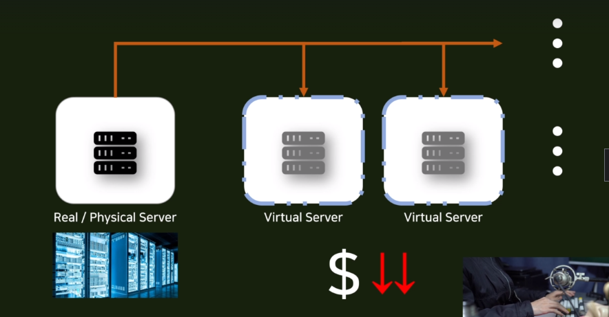
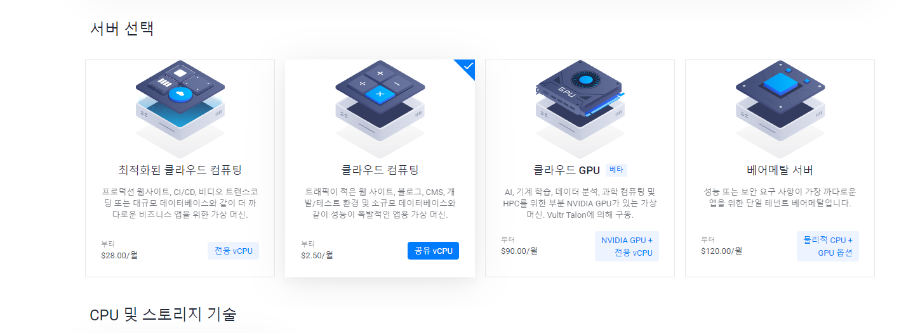
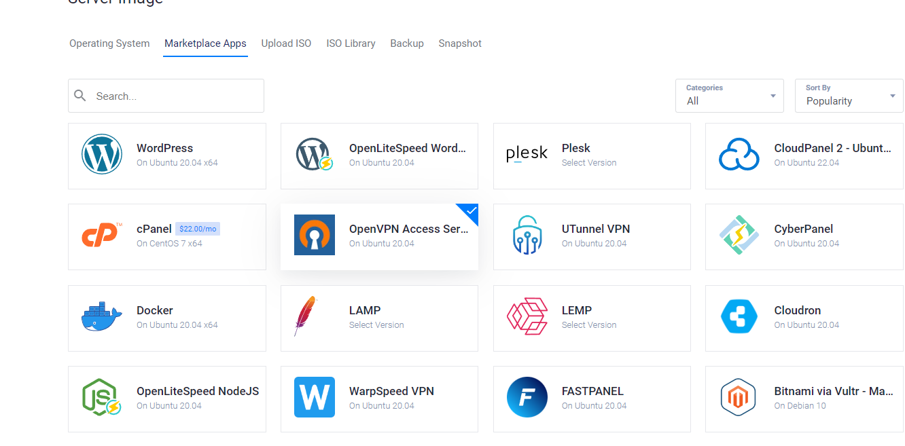
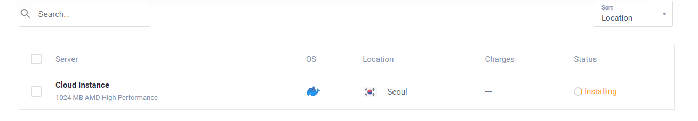
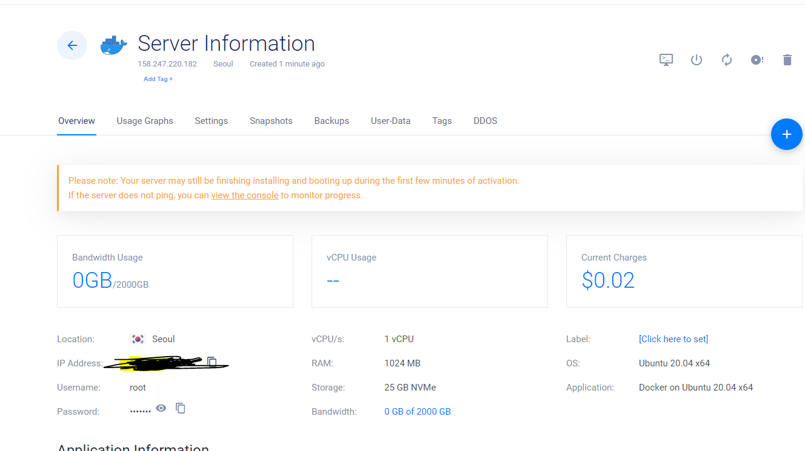
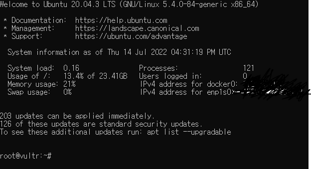
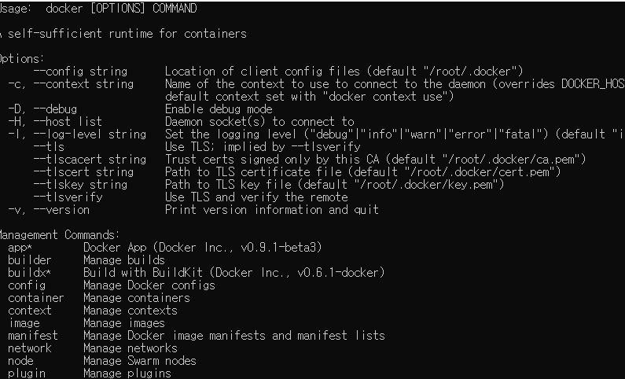

## Renting VPS

- Docker를 배포하려면 실제 서버를 빌려야한다. 
- 실제 서버를 빌리려면?
  - AWS, VULTR, Digital Ocean 등 Linux 환경을 구축할 수 있어야 하는 곳이다.

### VPS(Virtual Private Server)

가상의 독자적인 서버를 빌려주는 것이다. 

#### VPS 쓰는 이유 

- 실제 서버는 데이터 센터에 있는 커다란 렉에 컴퓨터들이 물리적인 서버를 구성한다.
  - Real/Physical Server
- 이러한 서버들을 통채로 빌리게 되면 테스트를 해보는 목적이라도 너무나 많은 비용을 지불해야한다. 
- 이러한 문제를 해결하기 위해 물리적 서버의 일정 자원을 분배시켜 놓은 가상 서버를 이용자가 빌리게 되는데, 이것이 **VPS**이다. 
- 그렇다면 물리적 서버를 빌리는 것 보다 싼 가격을 이용할 수 있다.




### VPS 가입과 서버 만들기 

1. 회원가입 (https://www.vultr.com/register/)

- 최초 가입시 50달러의 크레딧을 준다고는 하는데, 주는건지 잘 모르겠다..
- 과금에 대한 걱정이 되는데, 인스턴스 삭제하면 돈 안나가겠지...?
  - 금액은 사용한 시간에 따라서 한 달이 차면 결제된다고 한다..? 
  - 서버가 필요없으면 서버를 지웠다가 다시 켜고 필요할 때만 과금이 되도록 할 수 있다고 한다! 

2. 서버 설정

- 연습용이기 때문에 클라우드 컴퓨팅 선택 



3. 서버 이미지

- 도커-ubuut를 사용하면 해당 우분투 버전에 도커가 설치된 상태로 서버를 대여받게 된다.



4. 추가적인 설정 없이 일단 deploy를 진행한다! 



5. 서버 정보 

- 서버에 를 클릭하면 Information이 나온다! 


### VPS 서버 켜기 

#### Open SSH 설치

- cmd에서 원격 환경을 이용하려면 SSH를 이용하는데, 이를 보다 다양히 사용하려면 open ssh를 설치할 필요가 있다.
- https://www.openssh.com/
  - 설치 방법 : https://docs.microsoft.com/ko-kr/windows-server/administration/openssh/openssh_install_firstuse#install-openssh-using-windows-settings

#### 원격 접속

- server Information에서 본 root, password, IP Addres를 이용해 접속할 수 있다.

1. 원격 연결 시도

```
ssh root@[IP주소]
```

- 처음 연결시에는 연결을 정말 할건지 물어보는데 YES를 하면된다.
- 이후 password를 복사해서 붙여넣으면 연결이 된다.

2.  연결 결과



#### 도커 설치 유무 확인

- docker라고 타이핑한다.

```
root@vultr:~# docker
```



- Docker container 유무 확인

```
root@vultr:~# docker container ls
CONTAINER ID   IMAGE     COMMAND   CREATED   STATUS    PORTS     NAMES
```

