# Docker Container,Image

## Docker GUI : Portainer

### Image와 Container

- Image에서 container를 만들 수 있고, 이는 Class와 Instance 관계와 유사하다.

- 그렇다면 Image를 어디에서 가져오는가?

  - **Docker Hub**
  - 전세계의 Docker 이미지를 업로드하고 다운로드 받는 곳 
  - Docker hub안에 어떠한 이미지든지 올리고 인터넷만 연결되어있다면, 인터넷을 연결해서 환경을 구축하는데 도움을 주는 Hub이다.
  - 우리가 올리는 Image 뿐 아니라, 여러 Software의 Image가 올라와있다.

  

- 따라서 우리는 Docker hub에서 Image를 받아서 Container를 만드는데 사용할 수 있는 것이다! 

### portainer Image

- Docker를 GUI로 바꿔주는 Software 

#### GUI vs CLI

- GUI(Graphic User Interface)

  - 그래픽적으로 작업하는 환경

  - 마우스로 조작하면서 작업한다.
  - CLI로 작업하기 어려운 초심자들에게 좋다! 

- CLI(Command Line Interface)
  - gitbash, terminal, cmd

### Portainer 설치

1. Docker Hub 접속 (https://hub.docker.com/)

2. Portainer 검색

3. portainer-ce 사용(https://hub.docker.com/r/portainer/portainer-ce)

   - portainer/portainer가 가장 위에 나오는데, 이는 사용하지 않는 버젼이고, portainer-ce라는 커뮤니티 에디션을 사용한다. 

4. Deploy Portainer 선택(https://docs.portainer.io/v/ce-2.9/start/install)

5. Docs에 요구되는 내용 넣어주기

   ```cmd
   docker volume create portainer_data
   ```

   ```
   docker run -d -p 9000:9000 --name=portainer --restart=always -v /var/run/docker.sock:/var/run/docker.sock -v portainer_data:/data portainer/portainer-ce
   ```

   - 첫 설치라면 해당 문구가 발견됨

     ```
     Unable to find image 'portainer/portainer-ce:latest' locally
     latest: Pulling from portainer/portainer-ce
     ```

     - 가상 서버 내에 있는 Docker 시스템에서 image를 찾지 못했기 때문에, Docker hub에서 image를 가져옴 

6. 설치 확인 

   ```
   root@vultr:~# docker container ls
   CONTAINER ID   IMAGE                    COMMAND        CREATED              STATUS              PORTS                                                           NAMES
   c9be01d36478   portainer/portainer-ce   "/portainer"   About a minute ago   Up About a minute   8000/tcp, 9443/tcp, 0.0.0.0:9000->9000/tcp, :::9000->9000/tcp   portainer
   ```

   - run 한 번만 했는데, 모든 시스템이 구축됐다..? 

### Portainer 실행 

1. 빌린 IP에 port를 추가해서 접속 

   - URL 창에 [IP]:9000

   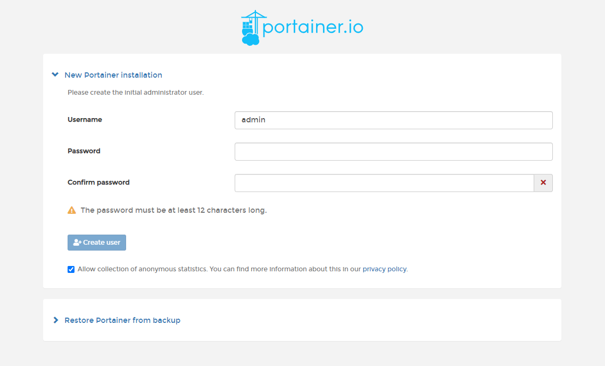

2. Username과 Password 설정 후 CreateUser 설정

   - 만약 timeout이 나온다면 

     ```
     docker restart portainer
     ```

3. Docker 사용 선택

4. 가상서버 내 Docker 시스템에 어떤 일이 벌어지는지 GUI로 확인 가능 

   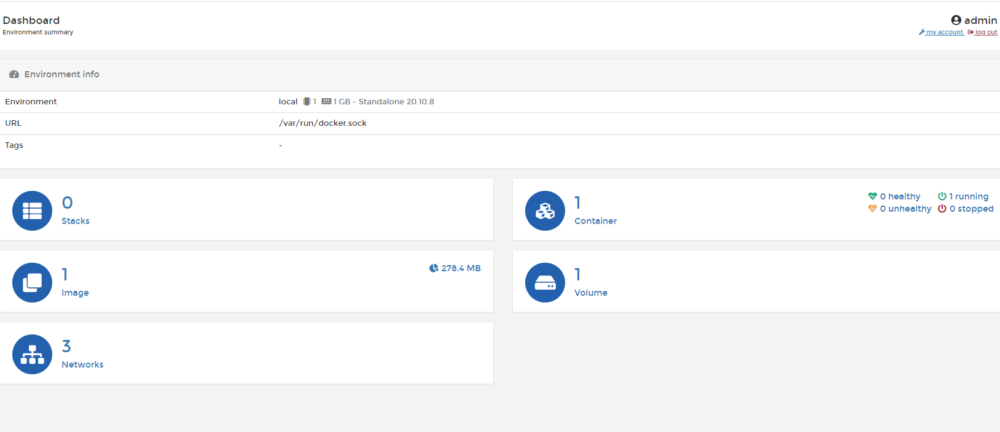

5. Container 확인해보기

   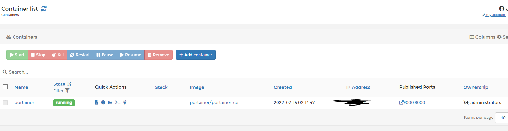

   Portainer Image가 실행되고 있는 것을 확인할 수 있음

   - 즉, 아까 실행시킨 컨테이너로 portainer를 구동시킨 것이다. 

## Nginx container / What is Port?

### Port

- 서버와 통신할 때 사용하는 것 
- 컴퓨터와 다른 외부의 것과 통신할 때 사용하는것
- 서버는 1번부터 N까지 포트가 있다.
- 우리는 서버에서 특정 포트를 지정하고 해당 포트에 요청을 보내서 응답을 받는다.
- ex
  - python manage.py runserver 127.0.0.1:8000 에서 8000을 의미 

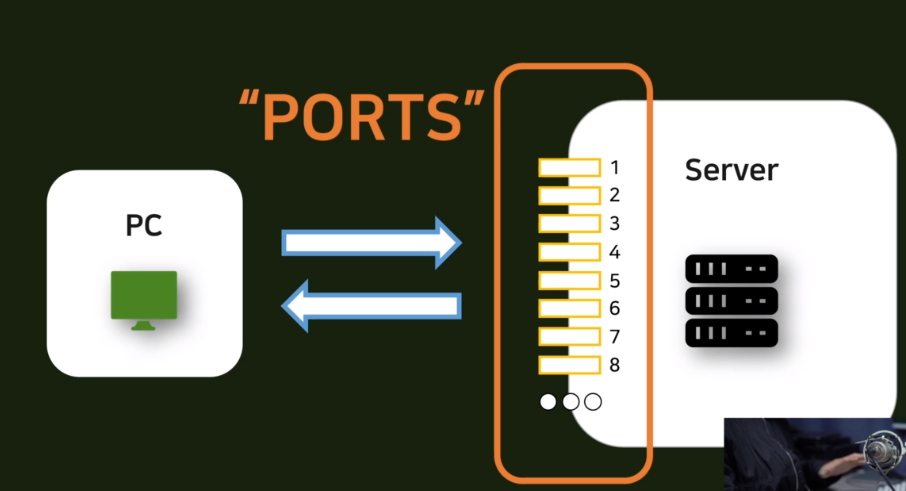

#### Docker 안의 Port

우리는 VULTR라는 가상 서버를 대여해서 이 안에 Docker라는 시스템을 구축해놓은 상태이다. VULTR라는 곳에서 빌린 서버 자체도 PORT가 존재하는 컴퓨터이지만, 이 안에 있는 Container 하나도 시스템이라고 볼 수 있다.

- 따라서 이 안에도 Port가 존재한다.
- 실제로 Portainer와 Browser 간 접속을 위해서는 가상서버의 Port와 Portainer의 Port를 연결시켜줘야한다. 
- Portainer를 설치할 때 9000:9000을 설치한 것도 일치를 위함! 

##### 잘 알려진 Port 

- HTTP protocol Port **80**
  - 아무런 Port 번호를 붙이지 않고 요청을 보내면 항상 80번 port로 연결이된다. 

### NGINX

- Portainer를 설치했기 때문에, 보다 쉽게 Image를 불러올 수 있다.

#### NGINX 설치 과정

1. Portainer의 Containers로 접속

2. Create container

   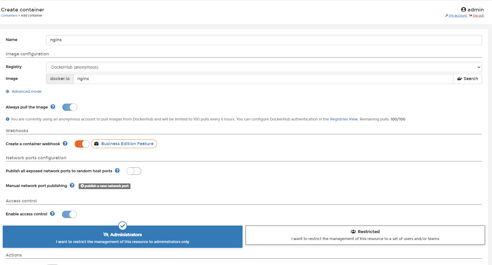

3. 가상 서버의 port와 container port 연결

   - **Manual network port publishing**  클릭

   - Nginx는 웹 서버의 port로 기본적으로 사용하는 port가 80

   - 80-80으로 테스트 

     

 4. Deployment in Progress 선택 

 5. 설치 완료

    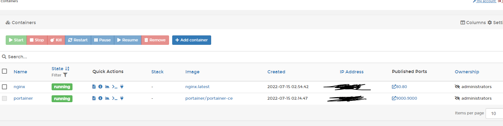

6. IP로 접속 확인

   - 80 port이기 때문에 기본 IP만 입력

   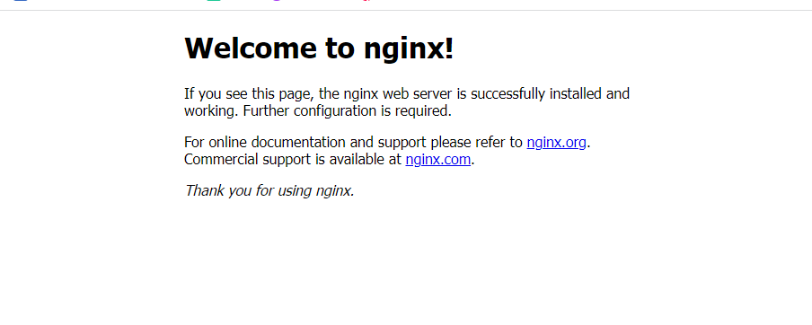

## Django Image Container

### Dockerfile syntax

#### Docker File 

- Docker에 Django Container를 만드는 것은, 이미 Docker hub에 있는게 아닌 직접 만든 소스이므로, 배포가 다소 까다로울 수 있다.

-  이러한 Docker Image를 만드는 일종의 설계서가 Dockerfile이다. 
- How to make an image

Image를 가져와서 실제 컨테이너를 만들기 위해 필요한 과정들을 Dockerfile을 통해서 만들어준다. 

- How did we set our environment? 
  - 우리가 어떻게 환경설정을 했는지 Docker file에 적어줘야 한다. 

#### Dockerfile Commend 

- FROM
  - `Select Base Image`
  - **가장 시작이 되는 이미지를 어떤 것으로 할 것인지 하는 명령어가 FROM이다. **
  - 이미지에서 컨테이너를 가져오는데, 그것은 클래스와 인스턴스를 가져오는 것과 같다.
  - 클래스는 상속이 가능하다. 
  - 이미지도 이미지를 가져와서 새로운 이미지를 가져오는 것이 가능하다.
  - 이 새로운 이미지로 새로운 컨테이너를 만드는 것도 가능하다.
- RUN
  - `Run Command `
    - pip list
    - pip install
    - git clone 
    - git ...
    - cd ..
  - 다양한 명령어를 사용해서 실제 서버에서 Linux 명령어를 사용하는 것 처럼 이용할 수 있다.
- WORKDIR
  - `cd ...` 와 유사하다 
  - Change Directory 
  - 어떤 폴더로 옮겨갈 것인지 명령하는 Command
  - **`cd ...` 는 상대경로가 적용되지만 WORKDIR는 절대 경로 기반으로 명령해야한다!  **
    - 즉, 모든 경로를 정확하게 입력해줘야함 
- EXPOSE
  - Django container에서 Port를 사용할 수 있도록 노출시켜, 외부의 가상서버와 연결시킬 수 있도록 노출시켜주는 커맨드이다. 
    - Django에서 8000번 port를 사용하겠다 하면, 실제 8000번 port를 사용할 수 있다.
- CMD
  - Docker container에 Django container를 넣으려 할 때 넣고 끝나는게 아니라 안에서 서버가 돌아가야 하는데, 그 사전 작업을 기본 커맨드로 설정한 것이다. 
  - Django Container를 실행하려면 command를 넣어주고 Start Command를 해야한다. 
    - python manage.py runserver 0.0.0.0:8000

###  1. Upload Source to Github 

- 가상환경에서 설치한 package들을 requirements.txt에 담는다.

  ```
  pip freeze >> requiremetns.txt
  ```

- ignore에 없는 파일들을 git에 업로드한다. 

#### 

### 2. Writing Dockerfile

1. IDE에 Dockerfile을 생성해준다.

2. BaseImage를 설정해준다.

   - Python이 설치되어 있는 환경을 Base Image로 사용한다.
   - Dockerhub에서 나의 python version과 맞는 이미지를 가져온다.

   ```dockerfile
   FROM python:3.9.13
   ```

3. WORKDIR를 설정해준다.

   ```dockerfile
   WORKDIR /home/
   ```

4. Github를 클론한다.

   ```
   RUN git clone [repository]
   ```

5. HOME에서 git clone을 사용했기 때문에, HOME에 레포 폴더가 생성된다.

   - 따라서 해당 경로로 이동한다.

   ```dockerfile
   WORKDIR /home/Pinterest
   ```

6. 라이러리를 설치한다.

   ```dockerfile
   RUN pip install -r requirements.txt
   ```

7. migrate를 진행한다.

   ```dockerfile
   RUN python manage.py migrate
   ```

8. Port를 노출시킨다.

   ```docker
   EXPOSE 8000
   ```

9. Runserver를 list 형태로 진행한다.

   ```dockerfile
   CMD ["python", "manage.py", "runserver", "0.0.0.0:8000"]
   ```

10. git ignore에 적어둔 secretkey 및 보안 정보를 입력해준다. (일단 임시적으로, 나중에 해결 방법을 강의에서 다룬다고 한다.)

    - secretkey를 공개한채로 git에 올리면 절대 안됨!! 

    ```
    RUN echo "SECRET_KEY=[yoursecretkey]" > .env
    ```

### 3. Building Image

1. Portainer.io에 접속 > Images > Buiild a New Image

2. 이름 설정
   - tag를 붙일 수 있는데 뒤에 태그로 version을 설정할 수 있음
     - django_test_image:1

3. Dockerfile 업로드
4. Build the Image 클릭! 
   - 첫 이미지 빌드는 약간 느릴 수 있지만 그 이후에는 빨라진다! 

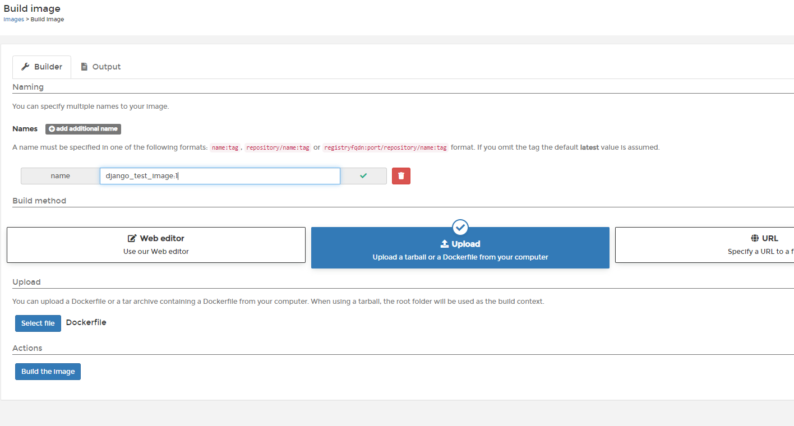

5. Build 성공

   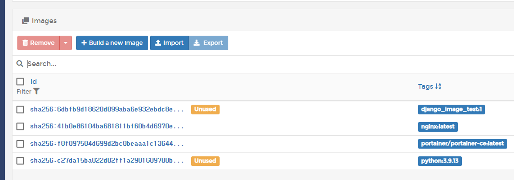

6. Container추가

   - Containers > add container

   - 이름은 django_container, Image는 이전에 생성한 이미지로 적용
   - publising port를 host: 8000, container:8000으로 설정 
   - deploy

##### 배포 후 console로 작업을 할 때 

- 원하는 container로 이동 후 Exec console을 클릭

  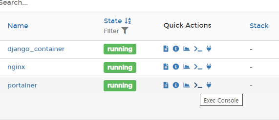

- ex) superuser 만들기

  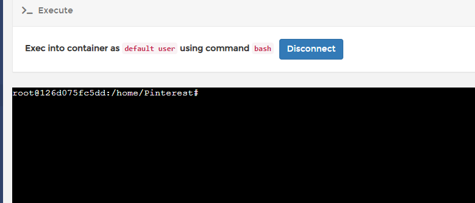

- console에 python manage.py createsuperuser 입력
- id, email 등 입력
- 생성 완료 !

##### Error 발생 후기

- 현재 배포는 강의를 따라서 진행하는데, 4번 과정에서 environmetn error가 발생했다.
- 해당 에러는 과거에도, 많이 보았던 에러이기 때문에, library의 버전 문제나 강좌와 다른 python 버젼을 써서 발생할 수 있을 것이라는 생각에 이것저것 검색을 해봤다.
- 강의를 따라가다보니 과거에 내가 에러가 나서 임의로 .env파일을 root 폴더에서 앱 내부로 옮겼던 것을 잊었다.
- 따라서, dockerfile에서 .env를 생성할 때 폴더 이동을 한 차례 더 했어야 했는데, 처음에 강의를 따라가다보니 그러지 못했다.
- 그래서, 계속 SECRET_KEY를 찾을 수 없다는 enviornment 에러가 떴고, 여러번 빌드 테스트를 진행한 후, 내가 예전에 env 파일을 옮겼다는 것을 깨달았다. 
- 따라서, 서버에서 env 파일을 생성하는 위치를 변경한 후 빌드를 해서 성공할 수 있었다.