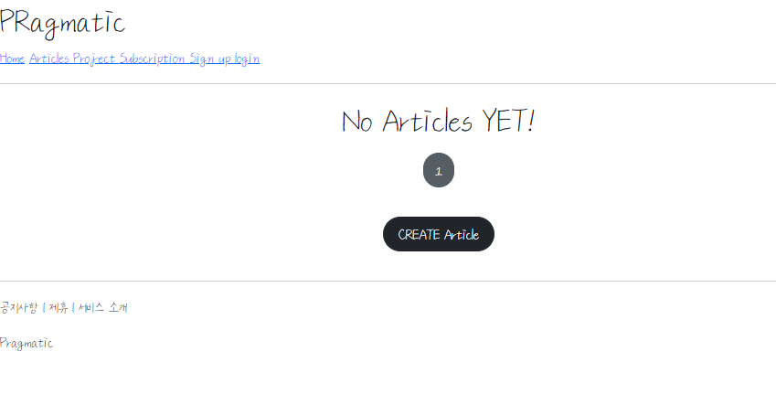
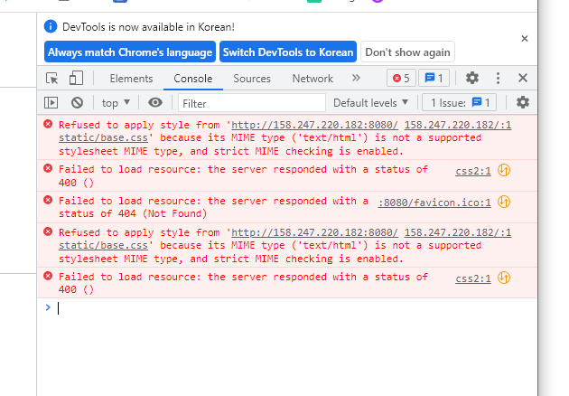
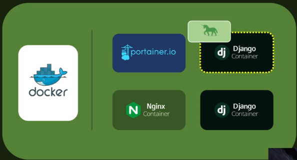
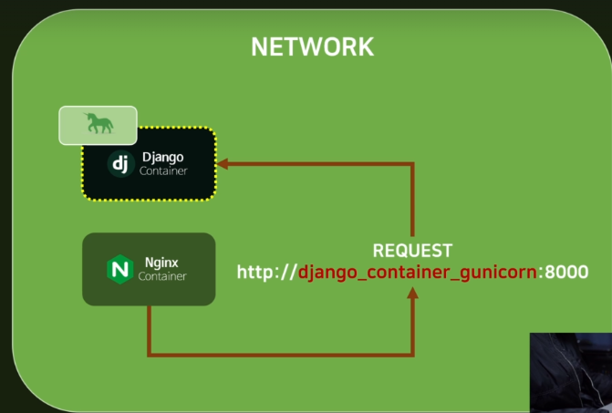
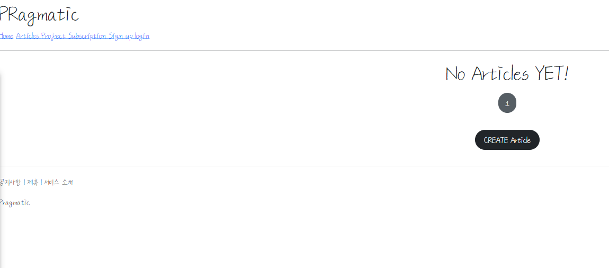

# Docker Network,Volume

## Gunicorn

###  Installing Gunicorn

#### 기존 배포 방식의 문제

- 현재 배포를 했을 때, Docker에서 python manage.py runserver로 서버를 실행하는데 이는 개발 환경에서 권장되지 않으며, 하면 안되는 방식이다. 

- Django 공식문서에서도, runserver의 주의사항이 있는데, 배포 환경에서 해당 명령어를 쓰면 안된다고 명시되어 있다.

- 이는 개발용으로 테스트 하는 것이다. Django는 웹 프레임워크를 만드는 것이지 웹 서버를 만드는 것이 아니다.

- https://docs.djangoproject.com/ko/4.0/intro/tutorial01/

  - Django 개발 서버를 시작했습니다. 개발 서버는 순수 Python으로 작성된 경량 웹 서버입니다. 운영 준비가 될 때까지 Apache와 같은 운영 서버를 구성할 필요 없이 신속하게 개발할 수 있도록 Django에 포함했습니다.

    이쯤에서 하나 기억할 것이 있습니다. 이 서버를 운영 환경과 유사한 환경에서 **사용하지 마십시오.** 개발 중에만 사용할 수 있도록 되어 있습니다. (우리는 웹 서버가 아닌 웹 프레임워크를 만드는 사업을 하고 있습니다.)

- 이를 위해 Django container안에 **Gunicorn**이라는 라이브러리를 설치한다.

#### Gunicorn

- 요청을 앞단에서 받아주는 Nginx라는 웹 서버와 Django 컨테이너를 연결시켜주는 Interface 
- Django 컨테이너 안에 gunicorn을 설치하고, image를 갱신하는 작업이 필요하다
- 또 해당 이미지를 컨테이너로!

#### 설치 및 변경과정

1. library 설치

   ```
   pip install gunicorn
   ```

2. Run server 형식을 Gunicorn command로 변경

   ```dockerfile
   #Dockerfile
   #기존
   ## CMD ["python", "manage.py", "runserver", "0.0.0.0:8000"]
   #변경
   CMD ["gunicorn", "pragmatic.wsgi", "--bind", "0.0.0.0:8000"]
   ```

3. Docker image build
4. host는 8080, container는 8000으로 포트 설정
   - 기존 8000은 container1에서 사용중이기 때문

5. 접속

   

- 기존 runserver와 style 적용 방식이 다름 

  - 

  - base.css 등 staticfile이 적용되지 않았음
  - Nginx가 연결되지 않았기 때문!! 

- 현재 Docker 구조 




## What is Docker Network?

### Nginx container와 Django container 연결 

#### 요청의 흐름 


1. user가 80번 port로 요청을 보냄 

2. 요청이 Nginx 컨테이너로 감 

3. Nginx의 요청을 Django container로 보냄 

- 그렇다면 Nginx에서 Django 컨테이너로 요청을 어떻게 보내야할까?

- 우리는 Nginx에서 Django 컨테이너로 요청을 보낼 때 domain으로 보낼지 IP address로 보낼지 모르는 상태이다.
- 이를 해결해주는 도구가 Docker Network이다.

#### Docker container

- 우리가 만든 여러개의 container를 하나의 network로 묶어주는 역할을 한다. 

- Docker안에 container가 2개 있다고 가정할 때 , 새로운 Network를 만들고, container 이름을 기반으로 container끼리 연결을 하게 할 수 있다! 

- 따라서, NGINX 컨테이너에서 Django 컨테이너 이름을 기반으로 요청을 보낼 수 있다! 

  - http://django_container_gunicorn:8000 

    

#### 연결 시작

1. 모든 Container를 삭제한다. 
2. Network를 만든다. 
   - Network -> Add Network
   - nginx-django라는 이름으로 생성

3. Django container를 만든다

   - 원래 port는 8000으로 외부로 연결시켰지만, user에서 받는 요청을 nginx로 연결시켜서 django로 줄 것이기 때문에 port는 없는대로 선택 

4. Network 설정

   - network 탭에서 nginx-django를 선택 후 deploy 진행

5. Nginx 설정 파일 생성

   - 원래 가져온 Nginx는 기본 설정이기 때문에 custom이 필요

   - root 폴더에 nginx.conf 파일 생성

   - gunicorn에서 기본 소스 가져오기

     - https://gunicorn.org/#deployment

     ```
       server {
         listen 80;
         server_name example.org;
         access_log  /var/log/nginx/example.log;
     
         location / {
             proxy_pass http://127.0.0.1:8000;
             proxy_set_header Host $host;
             proxy_set_header X-Forwarded-For $proxy_add_x_forwarded_for;
         }
       }
     ```

     

   - custom 진행

     - 같은 네트워크 안에서는 컨테이너 이름으로 요청을 줄 수 있다 !! 

     ```
       worker_processes auto; 
     
       events {
       }
       
       http {
       server {
         listen 80;
         server_name example.org;
         access_log  /var/log/nginx/example.log;
     
         location / {
             proxy_pass http://django_container_gunicorn:8000;
             proxy_set_header Host $host;
             proxy_set_header X-Forwarded-For $proxy_add_x_forwarded_for;
         }
       }
     
     }
     ```

6. 파일을 가상서버에 올려야 하기 때문에, Filezila를 이용

   - 설치 경로
     - https://filezilla-project.org/
   - Vultr에서 발급받은, ip, password,username 입력
   - Port는 22로 입력 ! 

   - home으로 들어가서 새로운 경로 생성
     - django_course 폴더 생성
     - 설정한 nginx.conf를 해당 폴더로 이동

7. nginx 컨테이너를 생성

   - nginx 이미지 선택
   - port는 80:80
   - network를 nginx-django로 설정 
   - volume 설정
     - bind 클릭 
     - container 내부
       - /etc/nginx/nginx.conf
     - host
       - /home/django_course/nginx.conf
   - deploy

8. 실행

   - nginx로 접속해도, 이게 django container로 연결되어있기 때문에 기본 url로 접속 가능 

   - IP 입력

     
