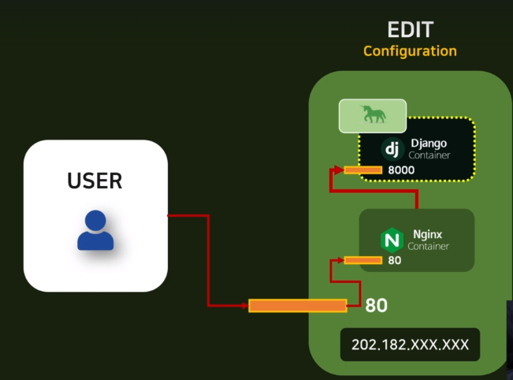

# Docker Network,Volume

## Gunicorn

###  Installing Gunicorn

#### 기존 배포 방식의 문제

- 현재 배포를 했을 때, Docker에서 python manage.py runserver로 서버를 실행하는데 이는 개발 환경에서 권장되지 않으며, 하면 안되는 방식이다. 

- Django 공식문서에서도, runserver의 주의사항이 있는데, 배포 환경에서 해당 명령어를 쓰면 안된다고 명시되어 있다.

- 이는 개발용으로 테스트 하는 것이다. Django는 웹 프레임워크를 만드는 것이지 웹 서버를 만드는 것이 아니다.

- https://docs.djangoproject.com/ko/4.0/intro/tutorial01/

  - Django 개발 서버를 시작했습니다. 개발 서버는 순수 Python으로 작성된 경량 웹 서버입니다. 운영 준비가 될 때까지 Apache와 같은 운영 서버를 구성할 필요 없이 신속하게 개발할 수 있도록 Django에 포함했습니다.

    이쯤에서 하나 기억할 것이 있습니다. 이 서버를 운영 환경과 유사한 환경에서 **사용하지 마십시오.** 개발 중에만 사용할 수 있도록 되어 있습니다. (우리는 웹 서버가 아닌 웹 프레임워크를 만드는 사업을 하고 있습니다.)

- 이를 위해 Django container안에 **Gunicorn**이라는 라이브러리를 설치한다.

#### Gunicorn

- 요청을 앞단에서 받아주는 Nginx라는 웹 서버와 Django 컨테이너를 연결시켜주는 Interface 
- Django 컨테이너 안에 gunicorn을 설치하고, image를 갱신하는 작업이 필요하다
- 또 해당 이미지를 컨테이너로!

#### 설치 및 변경과정

1. library 설치

   ```
   pip install gunicorn
   ```

2. Run server 형식을 Gunicorn command로 변경

   ```dockerfile
   #Dockerfile
   #기존
   ## CMD ["python", "manage.py", "runserver", "0.0.0.0:8000"]
   #변경
   CMD ["gunicorn", "pragmatic.wsgi", "--bind", "0.0.0.0:8000"]
   ```

3. Docker image build
4. host는 8080, container는 8000으로 포트 설정
   - 기존 8000은 container 1에서 사용중이기 때문

5. 접속

   

- 기존 runserver와 style 적용 방식이 다름 

  - 

  - base.css 등 staticfile이 적용되지 않았음
  - Nginx가 연결되지 않았기 때문!! 

- 현재 Docker 구조 


## What is Docker Network?

### Nginx container와 Django container 연결 

#### 요청의 흐름 



1. user가 80번 port로 요청을 보냄 

2. 요청이 Nginx 컨테이너로 감 

3. Nginx의 요청을 Django container로 보냄 

- 그렇다면 Nginx에서 Django 컨테이너로 요청을 어떻게 보내야할까?

- 우리는 Nginx에서 Django 컨테이너로 요청을 보낼 때 domain으로 보낼지 IP address로 보낼지 모르는 상태이다.
- 이를 해결해주는 도구가 Docker Network이다.

#### Docker container

- 우리가 만든 여러개의 container를 하나의 network로 묶어주는 역할을 한다. 

- Docker안에 container가 2개 있다고 가정할 때 , 새로운 Network를 만들고, container 이름을 기반으로 container끼리 연결을 하게 할 수 있다! 

- 따라서, NGINX 컨테이너에서 Django 컨테이너 이름을 기반으로 요청을 보낼 수 있다! 

  - http://django_container_gunicorn:8000 

    

#### 연결 시작

1. 모든 Container를 삭제한다. 
2. Network를 만든다. 
   - Network -> Add Network
   - nginx-django라는 이름으로 생성

3. Django container를 만든다

   - 원래 port는 8000으로 외부로 연결시켰지만, user에서 받는 요청을 nginx로 연결시켜서 django로 줄 것이기 때문에 port는 없는대로 선택 

4. Network 설정

   - network 탭에서 nginx-django를 선택 후 deploy 진행

5. Nginx 설정 파일 생성

   - 원래 가져온 Nginx는 기본 설정이기 때문에 custom이 필요

   - root 폴더에 nginx.conf 파일 생성

   - gunicorn에서 기본 소스 가져오기

     - https://gunicorn.org/#deployment

     ```
       server {
         listen 80;
         server_name example.org;
         access_log  /var/log/nginx/example.log;
     
         location / {
             proxy_pass http://127.0.0.1:8000;
             proxy_set_header Host $host;
             proxy_set_header X-Forwarded-For $proxy_add_x_forwarded_for;
         }
       }
     ```

     

   - custom 진행

     - 같은 네트워크 안에서는 컨테이너 이름으로 요청을 줄 수 있다 !! 

     ```
       worker_processes auto; 
     
       events {
       }
       
       http {
       server {
         listen 80;
         server_name example.org;
         access_log  /var/log/nginx/example.log;
     
         location / {
             proxy_pass http://django_container_gunicorn:8000;
             proxy_set_header Host $host;
             proxy_set_header X-Forwarded-For $proxy_add_x_forwarded_for;
         }
       }
     
     }
     ```

6. 파일을 가상서버에 올려야 하기 때문에, Filezila를 이용

   - 설치 경로
     - https://filezilla-project.org/
   - Vultr에서 발급받은, ip, password,username 입력
   - Port는 22로 입력 ! 

   - home으로 들어가서 새로운 경로 생성
     - django_course 폴더 생성
     - 설정한 nginx.conf를 해당 폴더로 이동

7. nginx 컨테이너를 생성

   - nginx 이미지 선택
   - port는 80:80
   - network를 nginx-django로 설정 
   - volume 설정
     - bind 클릭 
     - container 내부
       - /etc/nginx/nginx.conf
     - host
       - /home/django_course/nginx.conf
   - deploy

8. 실행

   - nginx로 접속해도, 이게 django container로 연결되어있기 때문에 기본 url로 접속 가능 

   - IP 입력

     


## What is Staticfile ?

### History of Web

- 1991년 Tim berners-lee 가 처음으로 웹 사이트를 만들고, HTML Tags를 소개했다.
- 이런 web들은 server가 있었는데, 초기 server는 특정 정적 html 파일들만 제공해주는 서버였다.
- 따라서, client가 요청한 html 파일만 전송할 수 있는 구조였다.
  - 즉, 정적 파일들만 요청하고 보내는 구조 
- 시간이 지나면서, Static 파일들만 이용해서 웹을 구축하면 파일들이 너무 많아져서, 한계에 도달했다.
- 이러한 이유로 동적으로 웹을 구동할 수 있는 기술의 발전이 시작됨 (DYNAMIC)
  - HTML file을 동적으로 생성하고 갱신하는 것 

#### WHO GENERATE DYNAMIC CONTENT

- 누가 동적인 컨텐츠를 만들었는가? 
- 과거에는 서버가 정적,동적인 컨텐츠를 생성해서 클라이언트에게 전송했다.
- 시간이 지나면서 Dynamic content가 복잡해지면서, 서버와 앱을 분리해서 동적 요소들을 다뤘다.
- 요청 로직
  - 클라이언트가 서버에게 파일을 요청한다
  - 정적이라면
    - 서버가 바로 해당 파일을 응답한다.
  - 동적이라면
    - 서버가 다시 Application으로 요청을 보낸다.
    - Application이 서버로 동적 컨텐츠를 전달한다
    - 서버가 유저에게 해당 컨텐츠를 전달한다. 
- 우리에게는 STATIC Content가 Nginx이고, Dynamic content가 Django이다.

**Why gunicorn/django can't serve static files ?**

- 우리는 왜 gunicorn과 django로 정적 파일을 제공받지 못했을까

- gunicorn과 django 서버는 dynamic content를 제공하는 역할의 어플리케이션이기 때문이다!
- 그렇다면, STATIC content를 어떻게 받아야할까?

#### How can I get a static file?

1. Collect static content from django container
   - Django 컨테이너 내부의 css와 html을 한 곳으로 수집한다.
2. Synchronize static contents with nginx container
   - 수집한 컨텐츠들을 nginx와 동기화시킨다.


### Collecting static file

```
python manage.py collectstatic
```

- 결과확인

  

- 해당 폴더들을 nginx와 연결해야 하므로 경로를 기억해야한다.

  - 'C:\Users\Samsung\Desktop\Django\Pinterest\staticfiles'.

- 왜 해당 경로에 폴더가 생성되었는가?

  - settings의 설정

    ```python
    STATIC_URL = '/static/'
    
    # 스태틱 파일들이 어디로 모일지 알려주는 역할 
    # os는 라이브러리 , path는 경로 관련한 모듈 중 join하는 function
    STATIC_ROOT = os.path.join(BASE_DIR,'staticfiles')
    # 스태틱폴더를 따로 만들어서 앱에 종속되지 않고 접근할 수 있게한다. 
    STATICFILES_DIRS = [
        BASE_DIR / "static",
    ]
    ```

- Docker 환경에서 만들어야 하기 때문에 Docker에서 진행해보기! 

#### Docker에서 collect static 진행하기 

```dockerfile
FROM python:3.9.13

WORKDIR /home/

RUN git clone https://github.com/holawan/Pinterest.git

WORKDIR /home/Pinterest/

RUN pip install -r requirements.txt

RUN pip install gunicorn

WORKDIR /home/Pinterest/pragmatic/

RUN echo "SECRET_KEY=[SECRET_KEY]" > .env


WORKDIR /home/Pinterest/

RUN python manage.py migrate

RUN python manage.py collectstatic

EXPOSE 8000


CMD ["gunicorn", "pragmatic.wsgi", "--bind", "0.0.0.0:8000"]
```

- 이미지 빌드하기


## Docker Volume

Django container와 NGINX container를 동기화 하려면 Volume이란 것을 사용해야 한다.

**Volume은 다른 컨테이너 간 데이터를 공유할 수 있는 기능이다.** 

### 2가지 형태의 Volume

#### Bind Volume

- VPS 서버가 HOST이고, Nginx container가 있다.
- HOST server와 Nginx contianer를 Nginx.conf를 이용해서 연동시켜주는 것이 Bind Volume이다. 


#### Named Volume

- Docker 안에서 새로운 이름이 달려있는 Volume을 만든다.
- 해당 volume을 우리가 구동하고 있는 container에 붙여서 동기화 할 수 있다. 
- Volume은 container 안에서는 특정한 directory로 나오는데, Named Volume은 도커가 알아서 관리를 해준다. 
- 이 Volume의 특징은, Container가 사라져도, 계속 남아있다. 
- 우리가 컨테이너를 없애고, 생성해도 데이터들은 계속 이어진다. 


##### 동기화 구조


- named volume을 이용해서, static과 media를 연동시켜서, nginx와 django 내에서 사용할 수 있다! 


### Creating Docker volume

1. 기존 컨테이너들을 삭제한다

2. 볼륨을 추가한다.

   - 따로 설정 필요없이 그냥 add 해준다! 

   - Static Volume

   - Media voume

     

3. Django 컨테이너 만들기

   - **Nginx.conf에 명시해준 이름과 일치시키기!** 

   - Nginx network 사용

   - Volume설정

     - Dockerfile의 경로를 참고해서 폴더가 생길 위치를 정확히 명시해야함

     

4. deploy

5. Nginx 컨테이너 만들기

   - host:container - 80:80
   - Volumes 설정
     - 해당 경로는 개발자의 자유로 설정하되, 기억해야한다! 
     - 컨테이너 내부 파일과 외부 설정 파일을 연결한다.

   - nginx.conf 수정

     - 현재 80포트로 들어온 모든 요청을 django_container로 넘김
     - nginx에서 static 파일만 먼저 동기화된 파일들을 가지고, 앞단에서 처리할 수 있도록 명시해줄 필요가 있다.
     - static과 media로 요청된 데이터를 따로 처리하게 코드 수정 
     - include mime.types를 명시해줘야 구동이 된다. 

     ```
       worker_processes auto; 
     
       events {
       }
       http {
       server {
         listen 80;
         
         include mime.types;
     
         location /static/{
           alias /data/static/;
         }
         location /media/{
           alias /data/media/;
         }
     
         location / {
           #현재 80포트로 들어온 모든 요청을 django_container로 넘김
           #nginx에서 static 파일을 
             proxy_pass http://django_container_gunicorn:8000;
             proxy_set_header Host $host;
             proxy_set_header X-Forwarded-For $proxy_add_x_forwarded_for;
         }
       }
     
     }
     ```

   6. filezila로 nginx.conf 갱신

   7. deploy

   8. TEST

      - 정상적으로 static 파일들이 적용되는 것을 알 수 있다~~!~! 

      
