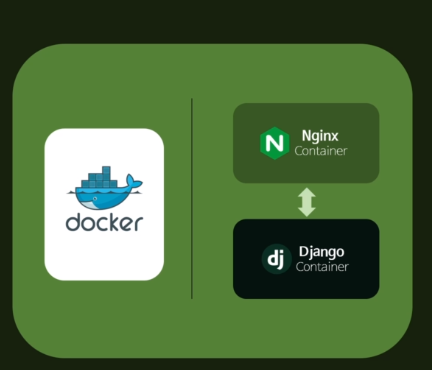
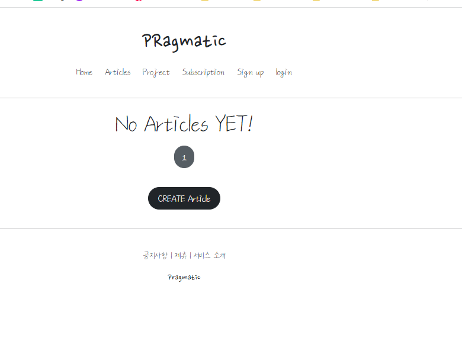

## Database detachment

### Database detachment with MariaDB



- 현재 DB는 Django container 안에 있어서, Data들이 DB 데이터 안에 들어있는 상태이다.
- 하지만, 알 수 없는 이유로 서버가 종료된다면?? 
  - 안에 있는 데이터가 모두 삭제된다.
- 따라서, 해당 데이터들을 MariaDB container로 분리해서, Volume으로 저장한다. 

- DB를 MariaDB로 따로 빼서 VPS 환경에 적용했기 때문에, 개발을 실제로 진행한 Local 환경인 Sqlite3와 다르다. 
- 즉, Local 환경과 배포 환경이 다르다.

### Maria DB 적용하기

- Docker hub에서 mariaDB 공식 이미지를 다운받기 위해 container를 설치한다.
  - 10.5 버젼으로 설치한다.
- env에서 mariadb에서 요구되는 환경변수를 입력한다.
  - MYSQL_ROOT_PASSWORD

### Local, Remote setting file sepration(개발환경과 배포 환경의 분리)

#### 사전 과정

- 프로젝트 폴더에 settings라는 폴더를 생성한다.
- deploy.py, local.py를 만들어서, 배포와 로컬에서 진행할 setting을 설정한다.
- settings.py이름을 base.py로 변경한다.

#### 분리

- 개발환경과 로컬환경이 다른 것들을 분리한다.

  - 기본 설정을 가져오기 위해 해당 구문 입력

    ```python
    from .base import *
    ```

  - env 설정, databases

##### debug

- 배포 환경이기 때문에 Debug=False로 설정한다. 

##### database

- maria db를 안쓰고 왜 mysql을 사용하는가?
  - mariadb는 mysql에서 분리된 것으로 유사한 구조이다. 
  - mysql이 유료화된 이후에 mariadb라는 오픈소스가 탄생했다..
- name 설정은 우리가 배포 환경에서 설정할 DB이름
- HOST는 mariadb container의 이름을 넣어준다. 
- PORT는 mariadb 기본 포트인 3306으로 설정 

```python
# Database
# https://docs.djangoproject.com/en/3.2/ref/settings/#databases

DATABASES = {
    'default': {
        'ENGINE': 'django.db.backends.mysql',
        'NAME': 'user',
        'USER': 'user',
        'PASSWORD': 'password',
        'HOST': 'host',
        'PORT': '3306',
    }
}
```

- Runserver를 하면, settings.py로 접근해야하는데, 1차적으로 폴더 구조가 한 층 더 생겼으므로, 접근이 불가능하다.

  - 따라서, BASE_DIR 설정에 parent를 한 번 더 입력!

  ```python
  BASE_DIR = Path(__file__).resolve().parent.parent.parent
  ```

- manage.py는 실행시 프로젝트 폴더의 settings.py에 접근하는 구조인데, 이름을 다르게 설정했으므로, 수정해줄 필요가 있다.

  - 기존

    ```python
    os.environ.setdefault('DJANGO_SETTINGS_MODULE', 'pragmatic.settings')
    ```

  - 변화

    ```python
    os.environ.setdefault('DJANGO_SETTINGS_MODULE', 'pragmatic.settings.local')
    ```


### Maria DB Container configuration

#### Mariadb container 만들기

- settings.deploy의 이름과 일치시켜야한다.
- network는 nginx - django로 연결 

- Volume에서는 Mariadb를 사용할 때 어디에 데이터를 저장할지 정해줘야한다. 

  - database라는 Volumes를 생성

  - container : /var/lib/mysql로, volume: database volume으로 설정

- ENV 환경변수는 MYSQL_ROOT_PASSWORD, MYSQL_DATABASE, MYSQL_USER, MYSQL_PASSWORD를 설정해줘야한다. 
  - **https://hub.docker.com/_/mariadb** Environment Variables
- Deploy

#### Django container를 변경하기

- Docker file 수정하기
  - 이미지를 구축할 때 외부 컨테이너와 연동하는 것이기 때문에, migrate를 선제적으로 할 필요가 없다. 
  - Docker가 cash 된 git을 불러올 수 있으므로, 임시적인 문구를 달아줘서 이를 방지한다.
  - 배포 환경에 맞춘 manage.py를 변경하기 위해 추가 구문을 넣어준다.Local file에 맞춰진 migrate를 변경해야한다. 
  - Gunicorn도 바뀌어진 환경에 맞게 변경한다.
    - https://docs.gunicorn.org/en/stable/run.html?highlight=django#django
  - mariadb를 사용할 것이기 때문에 mysqlclient도 설치한다.

**수정 전 **

```dockerfile
FROM python:3.9.13

WORKDIR /home/

RUN git clone https://github.com/holawan/Pinterest.git

WORKDIR /home/Pinterest/

RUN pip install -r requirements.txt

RUN pip install gunicorn

WORKDIR /home/Pinterest/pragmatic/

RUN echo "SECRET_KEY=[SECRET_KEY]" > .env

WORKDIR /home/Pinterest/

RUN python manage.py migrate

RUN python manage.py collectstatic
30	0 B	
EXPOSE 8000
31	0 B	
CMD ["gunicorn" "pragmatic.wsgi" "--bind" "0.0.0.0:8000"]
```


**수정 후**

```dockerfile
FROM python:3.9.13

WORKDIR /home/

RUN echo "testing"

RUN git clone https://github.com/holawan/Pinterest.git

WORKDIR /home/Pinterest/

RUN pip install -r requirements.txt

RUN pip install gunicorn

RUN pip install mysqlclient

RUN echo "SECRET_KEY=[SECRET_KEY]" > .env

RUN python manage.py collectstatic

EXPOSE 8000

CMD ["bash", "-c", "python manage.py migrate --settings=pragmatic.settings.deploy && gunicorn pragmatic.wsgi --env DJANGO_SETTINGS_MODULE=pragmatic.settings.deploy --bind 0.0.0.0:8000"]
```

#### 새로운 Django 이미지 및 컨테이너 만들기

- image name : **django_test_image:4**
- container name : django_container_gunicorn

- Network : nginx-django
- Volume : /home/Pinterest/staticfiles/, /home/Pinterest/media/


### 배포 결과! 



- Maria DB로 따로 데이터를 관리하기 때문에, Django 컨테이너를 삭제해도 여전히 DB가 남아있다 
