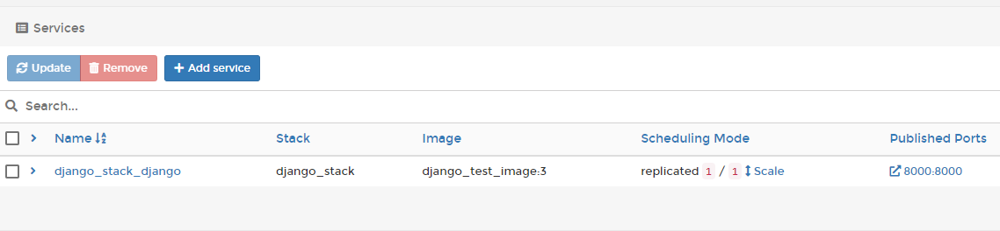

## Docker Stack,Secret,Swarm

## Docker Stack

#### 현재 배포 방식


#### 문제점 1. Repetitive configuration(설정을 반복적으로 해야한다. )

- 현재 배포를 할 때는, 각 컨테이너마다 Port, Volume, Network 등을 계속 세팅해줘야 한다.
- 하지만 이가 너무 비효율적이다. 
  - 이미지가 바뀌거나, 경로가 바뀌는 사소한 이유이기 때문
- 따라서, 컨테이너마다 들어가는 세팅들을 통합적으로 만들고, 해당 통합 환경설정으로 일일이 세팅을 하지 않아도 된다. 
- 이것이 Docker **Stack**
- 이제 컨테이너 하나씩이 아닌 컨테이너들을 한 번에 배포할 것이다. 
- Docker Compose라는 기능도 있는데, 이 기능은 배포용은 아니고 로컬 개발 환경에서 개발 환경을 한 번에 관리하기 좋은 방법이다. 

#### 문제점 2. Container shutdown

- 모종의 이유로 갑자기 컨테이너가 다운 될 수 있다. 
- 만약 Django 컨테이너가 다운되면, Django 컨테이너를 재부팅 시켜야한다. 
- 그런데 그걸 누가 하는가?
  - 언제 서버가 꺼질지 모르는데, 24시간 모니터링을 할 수는 없다. 
- 따라서, 이 것들을 컨테이너가 아닌 하나의 서비스 개념으로 관리해서 해결 할 수 있다.

- Service의 역할은, 만약 Django 컨테이너가 꺼지면 자동으로 설정을 불러온 후 재부팅 할 수 있게한다.

- Service의 장점은 컨테이너를 필요에 따라서, 여러개로 복제할수도 줄일수도 있다.(Scale Out)
- 이 또한, TOTAL STACK FILE에 들어간다.

#### 목표

- 우리는 TOTAL STACK Settings를 YML이라는 파일에 적어놓을 것이다.


## Docker Swarm

### Node

- 우리가 지금까지 만든 스택이 도커 시스템안에 돌아가고 있는데, 이 도커시스템을 포함하고 있는 가상 서버의 단위를 Node라고 부른다. 
- 이 Node는 여러가지가 있을 수 있는데, 여러가지 server를 하나의 서비스(서버)인 것 처럼 묶어주는 것이 Swarm이다.  

### Service

- 서비스는 Scale out으로 여러개의 컨테이너를 동시 다발적으로 만들 수 있다. 

- 이가 어떻게 Swarm 안에서 돌아가는가? 

    - node가 1개일 때

        

    - node가 여러개 필요할 때

    

- 이를 Container Orchestration이라고 함 
    - Docker Swarm, Kubernaetes, Apache 등 여러가지 Orchestration이 있다. Docker는 이 중에서 가장 쉽다 ! 

## Writing yml file for Docker Stack

### yml file 작성

#### yml file test 

1. 기존 Container 모두 삭제

2. SSH 접근하기

    - 빌린 IP로 ssh 로그인
    - docker swarm 시작

    ```
    root@vultr:~# cd ..
    root@vultr:/# cd home/django_couse/
    root@vultr:/home/django_course# docker swarm init
    ```

    - 현재의 node가 매니저가 되면서, 토큰이 나오고 시작된다. 

3. Portainer 사이드바의 변화

    - Secrets, Swarm,Service가 생김 

    - 기존

    

    - 변화

    

4. Docker yml 파일 작성 

    - docker-compose.yml 생성 

    - Version 명시 

        - portainer가 지원하는 3.7 사용

    - service 등록

        ```
        version: '3.7'
        services:
          django:
            image: django_test_image:3
            ports:
              - "8000:8000"
        ```

        - container 입력
            - 이미지 입력
            - Port 입력

5. Stack 추가

    - docker-yml 파일 생성 후 deploy

6. service에 추가된 결과 확인 

​	

#### yml file 작성

```
version: '3.7'
services:
  nginx:
    image: nginx:1.19.5
    networks:
      - network
    volumes:
      - /home/django_course/nginx.conf:/etc/nginx/nginx.conf
      - static-volume:/data/static 
      - media-volume:/data/media
    ports:
      - 80:80 
  # 컨테이너 이름으로 소통이 진행되므로, 이름을 container 이름으로 지어주자
  django_container_gunicorn:
    image: django_test_image:4
    networks:
      - network
    volumes:
      - static-volume:/home/Pinterest/staticfiles
      - media-volume:/home/pragmatic/media 
  # db는 배포 환경의 HOST Name과 같게 해야한다. 
  mariadb:
    image: mariadb:10.5
    networks:
      - network 
    volumes:
    # 경로는 docker hub에 명시된 /var/lib/mysql로 설정하자
      - maria-database:/var/lib/mysql 
    environment:
      MYSQL_ROOT_PASSWORD : password
      MYSQL_DATABASE : database
      MYSQL_USER : username
      MYSQL_PASSWORD : password

networks:
  network:

volumes:
  static-volume: 
  media-volume:
  maria-database: 
      

```

- Stack 확인


- Services 확인


## Docker Secret 

- Secret Key, MariaDb Info 등 비밀 정보를 보호해주는 서비스 ! 

### Secret 생성

- mariadb, secret key 추가해주기 

- 개발환경에서 해당 secret key는 run/secrets/ 경로로 찾을 수 있음 . 

- 따라서, deploy settings 변경

    ```python
    def read_secret(secret_name):
        file = open("/run/secrets/" + secret_name)
        secret = file.read()
        secret = secret.rstrip().lstrip()
        file.close()
    
        return secret
    
    SECRET_KEY = read_secret('DJANGO_SECRET_KEY')
    # SECURITY WARNING: don't run with debug turned on in production!
    DEBUG = False
    
    ALLOWED_HOSTS = ['*']
    
    
    
    DATABASES = {
        'default': {
            'ENGINE': 'django.db.backends.mysql',
            'NAME': 'django',
            'USER': 'django',
            'PASSWORD': read_secret('MYSQL_PASSWORD'),
            'HOST': 'mariadb',
            'PORT': '3306',
        }
    }
    ```

- docker file에서 secret key 제거
- docker compose에도 secrets를 등록하고, mariadb environment에는 형식에 맞게 개편

#### 최종 Dockerfile

```dockerfile
FROM python:3.9.13

WORKDIR /home/

RUN echo "testing_image5"

RUN git clone https://github.com/holawan/Pinterest.git

WORKDIR /home/Pinterest/

RUN pip install -r requirements.txt

RUN pip install gunicorn

RUN pip install mysqlclient


EXPOSE 8000

CMD ["bash", "-c", "python manage.py collectstatic --noinput --settings=pragmatic.settings.deploy && python manage.py migrate --settings=pragmatic.settings.deploy && gunicorn pragmatic.wsgi --env DJANGO_SETTINGS_MODULE=pragmatic.settings.deploy --bind 0.0.0.0:8000"]
```

#### 최종 docker-compose.yml

```
version: '3.7'
services:
  nginx:
    image: nginx:1.19.5
    networks:
      - network
    volumes:
      - /home/django_course/nginx.conf:/etc/nginx/nginx.conf
      - static-volume:/data/static 
      - media-volume:/data/media
    ports:
      - 80:80 
  # 컨테이너 이름으로 소통이 진행되므로, 이름을 container 이름으로 지어주자
  django_container_gunicorn:
    image: django_test_image:5
    networks:
      - network
    volumes:
      - static-volume:/home/Pinterest/staticfiles
      - media-volume:/home/Pinterest/media 
    secrets :
      - MYSQL_PASSWORD
      - DJANGO_SECRET_KEY
  # db는 배포 환경의 HOST Name과 같게 해야한다. 
  mariadb:
    image: mariadb:10.5
    networks:
      - network 
    volumes:
    # 경로는 docker hub에 명시된 /var/lib/mysql로 설정하자
      - maria-database:/var/lib/mysql 
    # mariadb secret을 만들 때 _FILE이라는 접미사로 설정할 수 있고, secret의 경로를 제공해줘야한다. 
    secrets:
      - MYSQL_PASSWORD
      - MYSQL_ROOT_PASSWORD
    environment:
      MYSQL_ROOT_PASSWORD_FILE : /run/secrets/MYSQL_ROOT_PASSWORD
      MYSQL_DATABASE : django
      MYSQL_USER : django 
      MYSQL_PASSWORD_FILE : /run/secrets/MYSQL_PASSWORD

networks:
  network:

volumes:
  static-volume: 
  media-volume:
  maria-database: 
      
secrets:
  DJANGO_SECRET_KEY:
    external: true 

  MYSQL_PASSWORD:
    external: true 

  MYSQL_ROOT_PASSWORD:
    external: true
```

