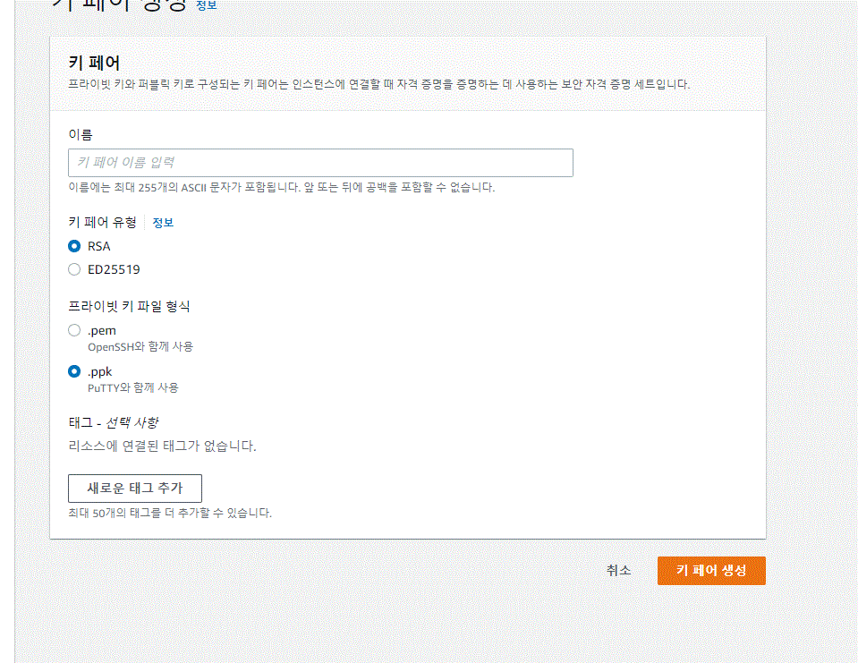

# AWS EC2 Deployment

## Introduction

### 배포구조


- Vultr는 ssh로 server에 접속할 때 ID와 Password를 전달했다.
- AWS에 접속할 때는 ID,Password도 사용 가능하지만 KEY FILE(Pem)을 이용하는 것을 권장한다. 

- Vultr는 Docker가 설치되어 있는 서버를 대여 받았지만, AWS EC2 Instance에는 Docker가 설치되어 있지 않기 때문에 설치해줘야한다. 
- AWS의 다양한 포트가 있는데, 기본 포트들은 Firewall로 막혀있다. 
- 따라서, 필요할 때마다 포트를 열어주는 설정을 해야한다. 


## AWS EC2 Basic Setting

### Basic Setting

- 기본적인 메일 인증, 휴대폰 인증등을 마치고 콘솔에 로그인을 클릭한다. 
- EC2 서비스에 접근한다. 
- 인스턴스를 클릭한다.
    - 

### Key File 만들기

- 사이드바에서 **네트워크 및 보안 -> 키 페어**로 접근 
- 이름을 정하고 키 파일 형식은 .pem으로 사용 



- Key가 추가되면서, key가 다운받아짐 


- Key를 프로젝트 폴더로 이동 

### 인스턴스 만들기

- Ubuntu Server 18.04 대여 
- 인스턴스 유형은 프리티어에서 가능한 t2.micro로 선택 
- 기본설정으로 인스턴스 만들기 
- 인스턴스 생성 결과
    - 

- ID를 클릭하면 세부 정보를 볼 수 있다. 


## AWS EC2 Docker Install

#### 서버 접속

- aws_pragmatic_key로 aws에 접속한다. 
- ubuntu를 빌렸으므로, 해당 IP를 입력한다. 

```
$ ssh -i aws_pragmatic_key.pem ubuntu@[Public_IP]
```

- 입력 후 질문에 yes를 누르면 접속이 된다.	

### Docker 설치 

1. 도커를 조회하고 없다면 설치한다.

```
sudo docker
```

https://docs.docker.com/engine/install/ubuntu/

2. 리눅스 기본 패키지 업데이트

```
sudo apt-get update
```

3. 필요한 패키지 설치

    ```
    sudo apt-get install \
    	apt-transport-https \
    	ca-certificates \
    	curl \
    	gnupg-agent \
    	software-properties-common
    ```

    - 에러가 발생하면
        - https://blog.cosmosfarm.com/archives/248/%EC%9A%B0%EB%B6%84%ED%88%AC-18-04-%EB%8F%84%EC%BB%A4-docker-%EC%84%A4%EC%B9%98-%EB%B0%A9%EB%B2%95/

    ```
    sudo apt install apt-transport-https ca-certificates curl software-properties-commo
    ```

4. Docker의 공식 GPG 키 추가

```
curl -fsSL https://download.docker.com/linux/ubuntu/gpg | sudo apt-key add -
```

5. stable repository 설정

```
sudo add-apt-repository \
 "deb [arch=amd64] https://download.docker.com/linux/ubuntu \
 $(lsb_release -cs) \
 stable"
```

6. apt update

```
sudo apt-get update
```

7. docker 엔진 설치

    ```
    sudo apt-get install docker-ce docker-ce-cli containerd.io
    ```

8. 설치확인

    ```
    sudo dokcer
    ```

### Portainer 설치

https://docs.portainer.io/v/ce-2.9/start/install/server/docker/linux

- 볼륨 만들기

    ```
    sudo docker volume create portainer_data
    ```

- Portainer 실행 

    - 8000 port는 지우고 실행 

    ```
    sudo docker run -d -p 9000:9000 --name portainer \
        --restart=always \
        -v /var/run/docker.sock:/var/run/docker.sock \
        -v portainer_data:/data \
        portainer/portainer-ce:2.9.3
    ```

- 실행 확인

    ```
    sudo docker container ls
    ```

#### Port를 열어주기

1. 인스턴스 -> 보안 
2. 보안그룹 선택 
3. 인바운드 규칙 편집
4. 규칙 추가
    - 0.0.0.0/0 에 9000 포트로 선택 


#### Docker swarm 켜기


## AWS Stack 기반 배포

### 준비사항 

#### 1. Secrets를 다시 만들어주기 

- Portianer 상에서 MYSQL_ROOT_PASSWORD, MYSQL_PASSWORD, DJANGO_SECRET_KEY 입력 

#### 2. Nginx.conf 올려주기 

#### filezila 연결 

- Filezilla 좌측 상단의 사이트 관리자 열기 선택 
- 부여받은 IP 번호 입력, 키파일 입력, 사용자는 ubuntu


- ubuntu에서 nginx 파일 등록

```
ubuntu@ip:~$ cd ..
ubuntu@ip:/home$ sudo mkdir django_course
ubuntu@ip:/home$ sudo chmod 777 django_course/
ubuntu@ip:
```

- django_course 폴더에 nginx.conf 옮기기

### 서버 배포 하기

1. Django image 만들기 

2. 스택 deploy하기

3. 추가 port 열어주기
    - AWS 보안에서 80포트 열어주기 

### 접속확인


## AWS 도메인 연결

### 구성

- AWS에서 EC2 인스턴스로 서버를 굴리고 있다.
- IP 밖에 없으니까 도메인을 구매해야 한다.
    - Gabia 등.. 
- domain을 구매하면 Route53에 연결하고 이를 EC2에 연결한다.
    - 

- AWS 서비스 -> Route 53에 접속 
- 호스팅 영역 생성 

- 가비아에서 도메인 구매
    - .shop이 들어간 도메인을 구매하면 저렴함

### 호스팅

1. 호스팅 영역 구성 
    - 

2. 호스팅 레코드 확인

    - 

    - NS는 AWS에서 지정해준 Name Server이다. 

3. NameServer 정보를 가비아에 입력
    -  

4. 레코드 생성
    - 값에 EC2 인스턴스의 IP를 넣어준다.
    - 레코드 생성을 진행한다

## AWS HTTPS 설정 

### HTTP


- Post의 경우는 body에 정보를 넣어서 보내준다. 

- HTTP Protocol은 실제 실행 시 Network상에 수 많은 서버가 있어서, 여러가지 서버를 거친 후 원하는 서버에 도달하고, 다시 응답을 준다.
- 이 경우에 거쳐가는 Server 중 해커가 있을 수 있다. 그럼 그들이 정보를 모두 볼 수 있는 위험이 있다.

### HTTPS

-  암호화 설정
- POST 데이터를 암호화시켜서 server에 전송하고 응답을 주는 것이다. 
- 이를 통해 정보가 탈취당해도 암호화가 되어있어 정보를 지킬 수 있다.

### LOAD Balancer

- 서버에 처리량이 많아지는 등 이유로 과부화가 걸려서, 증설이 필요할 때 Scale Out 방식으로 서버를 증축해서 구성한다.
- 이 때, 서버에 무리가 가지 않도록 여러 서버에 부하를 균형시켜주는 역할을 하는 것이 LOAD Balancer이다.
- client가 요청을 보낼 때, 여유가 있는 서버로 요청을 보내 부하를 줄여준다.

### LOAD Balancer생성 방법

#### 접근 

- EC2 -> 로드밸런싱 -> 로드밸런서

- **Application Load Balancer**생성 

#### Basic configuration

- 이름 등록 후 Internet-facing 선택 Ip주소는 IPaddress 선택 


#### Network mapping

- VPS 가용영역은 모두 선택

#### Sequrity groups

- 보안 그룹은 현재 배포중인 EC2의 인스턴스와 동일하게 선택 

#### Listeners and routing

- create target group으로 이동 후 Instance를 클릭하고, group name을 입력 한 후 생성
- 타겟 그룹에 접근 후 register targets로 인스턴스 추가 
    - 

#### Secure listener settings


- 새로운 ACM 인증서 요청 
    - 퍼블릭 인증서 요청
        - 
    - 도메인 이름 입력 
    - 요청하기
    - Route 53에서 레코드 생성 클릭
        -  
- 인증서 적용 

- 로드 밸런서 생성

#### 새로운 HTTPS 레코드 생성

- router 53 접근
- 이전 레코드 지우기 
- 레코드 생성
- 트래픽 라우팅 대상을 별칭으로 설정
    - Application/classic load balancer로 설정
    - 이전에 만든 로드밸런서를 선택 


#### 443 포트 열어주기 

- 인스턴스 접근
- 보안그룹
    - 인바운드 규칙 편집
    - 443 포트 열어주기
- 결과확인 


