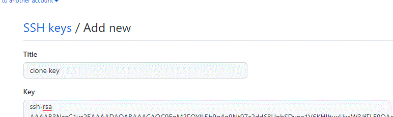

## Django_Private Github Repo and RSA Key Register

- Github에 소스코드를 올리고, 해당 코드를 Dokcer시스템의 이미지를 만들 때 사용한다.
- 이는 해당 코드가 Public일 때 가능하고, 이가 만약 Private라면 자격증명을 해야한다. 
- 우리가 Docker에서 이미지를 만들 때 원래 자동으로 진행되었는데 Private이라면 Credential(RSA Key)이 필요하다. 

### Generate RSA Key

- Private Repo Clone 받아보기

```bash
ubuntu@ip:~$ git clone https://github.com/holawan/Pintereste_Private.git
Cloning into 'Pintereste_Private'...
Username for 'https://github.com': 
```

- ubuntu 상에서 clone을 받으면 username이나 password를 입력해야한다. 
- 하지만 이를 Docker file로 자동으로 입력하려면 RSA Key가 필요하다. 

#### Key 생성 

```bash
ssh-keygen -t rsa -b 4096 -C "youremail"
```

- -t rsa
    - rsa 방식의 암호화 코드를 만든다는 의미 
- -b 4096은 암호화의 정도를 정해주는 것 (기본은 2048)
- -C 는 이메일 주소 

- 해당 구문이 나오면 Enter

    - ```
        Generating public/private rsa key pair.
        Enter file in which to save the key (/home/ubuntu/.ssh/id_rsa): 
        ```

- 보안 설정도 enter하면 key 생성 

#### Key 등록 및 입력  

- Key가 있는 경로로 이동 

```
$ cd .ssh/ ls
authorized_keys  id_rsa  id_rsa.pub
```

- 우리가 등록해야 하는 Key는 id_ras.pub이다. 
- id_rsa는 개인 키로 보안에 중요한 파일이다
- id_rsa.pub는 공개키로 다른 사람들에게 공개해도 되는 key이다. 

```
cat id_rsa.pub
```

- 위의 구문을 입력하면 key가 나오는데, 이를 복사해서 git에 등록해야한다. 

### Register RSA Key to Github

- github 접속 -> settings -> SSH and GPG key 이동 

- 복사한 key를 입력 

    - 

- 다시 clone 받아보기 (ssh 방식으로 받기 )

    - git@github.com:holawan/Pintereste_Private.git

    ```
    e authenticity of host 'github.com (15.164.81.167)' can't be established.
    ECDSA key fingerprint is SHA256
    ```

- git hub의 인증이 필요하다고 나옴 

- github.com이라는 주소에 호스트를 인증시켜야해서, known_hosts라는 파일을 만들어야함 

```
touch /home/ubuntu/.ssh/known_hosts
```

- 해당 파일 안에서 key-scan을 해야함

    ```
    ssh-keyscan github.com >> /home/ubuntu/.ssh/known_hosts
    #key 확인 
    cat ~/.ssh/known_hosts
    ```

- git clone 다시 받기 (ssh 방식으로 받기 )

    ```
    remote: Enumerating objects: 152, done.
    remote: Counting objects: 100% (152/152), done.
    remote: Compressing objects: 100% (115/115), done.
    remote: Total 152 (delta 27), reused 152 (delta 27), pack-reused 0
    Receiving objects: 100% (152/152), 2.73 MiB | 3.05 MiB/s, done.
    Resolving deltas: 100% (27/27), done.
    ```

- 해결 ! 

### Build Image with RSA Key

#### Dockerfile 수정

- ssh key 파일이 들어가는 커맨드 만들기 
    - 컨테이너에서는 /home/이 아닌 root 중심으로 ssh key를 발급해야함 
- github에서 발급받은 ssh key 넣어주기 
- 이미지를 확보한 사람이 해당 개인Key를 보면 되지 않기 때문에 연결을 잘해야함 

#### 파일 옮겨주기

- FileZilla를 통해 Dockerfile ubuntu 폴더로 이동 

#### Docker image 빌드

- t는 태그로 이미지의 이름을 적어주는 것 
- .은 현재 디렉토리의 docker file로 build를 하겠다. 

```
sudo docker image build -t django_test_image:6 .
```

- 주의할점은 Dockerfile상의 clone받는 레포 이름과 작업을 진행할 레포 이름을 갖게 해야함

    ```
    RUN git clone git@github.com:holawan/Pintereste_Private.git
    
    WORKDIR /home/Pintereste_Private/
    ```

- 이미지 빌드 완료

    - ```
        Successfully tagged django_test_image:6
        ```
