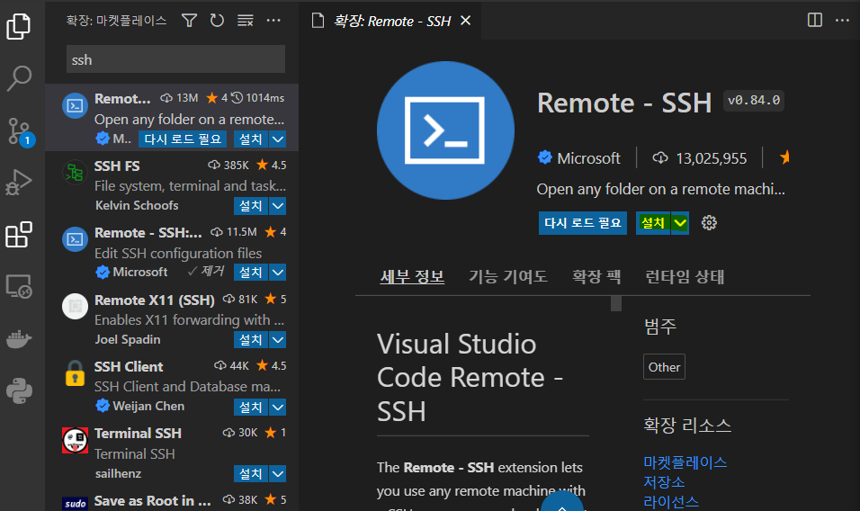

# VS code로 편리하게 EC2 환경 사용하기 

### 1. Remote -SSH 설치



### 2. 원격 ssh 설정

- vscode에서 `F1`을 누르고, ssh 검색 후 `원격-SSH: 새 SSH 호스트 추가` 클릭 


- 연결할 username@ip 입력 

    

- SSH 구성 파일 선택 

    

- local에서 위 경로 중 한 곳으로 이동해, `config` 파일 수정 

     

- 발급받은 `.pem` 키 해당 경로로 이동 후, 경로 맞춰주기 

    ```
    Host k7b103.p.ssafy.io
      HostName k7b209.p.ssafy.io
      User ubuntu
      ForwardAgent yes
      IdentityFile ~/.ssh/K7b103.pem
    ```


### 3. 연결해보기 

- extension의 원격 탐색기 클릭

    

- 추가된 IP 우클릭 후 **현재 창에서 호스트에 연결** 또는 **새창에서 호스트에 연결** 클릭

    

= 

- 폴더 열기 

    

- 원하는 폴더 선택

    

- 확인 버튼을 누르면 빌린 EC2의 Linux 환경을 VScode에서 GUI를 활용하며 사용 가능 

    