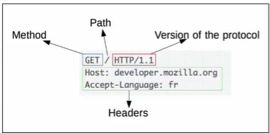

## HTTP

### 개념 

- Hyper Text Transfer Protocol
- 웹 상에서 컨텐츠를 전송하기 위한 약속
- HTML 문서와 같은 리소스들을 가져올 수 있도록 하는 포로토콜 (규칙, 약속)

- 웹에서 이루어지는 모든 데이터 교환의 기초
  - 요청 : 클라이언트에 의해 전송되는 메시지
  - 응답 : 서버에서 응답으로 전송되는 메시지 
- 기본 특성
  - Stateless : 무상태
  - Connectionless : 비연결성

- 쿠키와 세션을 통해 서버 상태를 요청과 연결하도록 함 

#### HTTP 메시지

- 응답

- 요청

#### HTTP request method

- 자원에 대한 행위(수행하고자 하는 동작)을 정의
- 주어진 리소스(자원)에 수행하길 원하는 행동을 나타냄
- HTTP Method 예시
  - GET(조회), POST(작성), PUT(수정), DELETE(삭제)
- HTTP Method를 통해 CRUD를 구분할 수 있다.

#### HTTP response status codes

- 특정 HTTP 요청이 성공적으로 완료되었는지 여부를 나타냄
- 응답은 5개의 그룹으로 나뉘어짐
  - Informational responses(1xx)
  - Successful responses(2xx)
  - Redirection messages(3xx)
  - Client error responses(4xx)
  - Server error responses(5xx)

#### 웹에서의 리소스 식별

- HTTP 요청의 대상을 리소스(자원)라고 함
- 리소스는 문서, 사진 또는 기타 어떤 것이든 될 수 있음
- 각 리소스는 리소스 식별을 위해 HTTP 전체에서 사용되는 URI(Uniform Resource Identifier)로 식별됨

### URI

#### URL, URN

- URL(Uniform Resource Locator)
  - 통합 자원 위치
  - 네트워크 상에서 자원이 어디 있는지 알려주기 위한 약속
  - 과거에는 실제 자원의 위치를 나타냈지만 현재는 추상화된 의미론적 구성
    - 옛날 url은 파일의 위치까지 나타났다. (naver.com/index.html)
  - '웹 주소', '링크'라고도 불림
- URN(Uniform Resource Name)
  - 통합 자원 이름
  - URL과 달리 자원의 위치에 영향을 받지 않는 유일한 이름 역할을 함 
  - 예시
    - ISBN (국제표준도서번호)

#### URI(Uniform Resource Identifier)

- 통합 자원 식별자
- 인터넷의 자원을 식별하는 유일한 주소 (정보의 자원을 표현)
- 인터넷에서 자원을 식별하거나 이름을 지정하는데 사용되는 간단한 문자열
- 하위 개념
  - URL, URN
- URI는 크게 URL과 URN으로 나눌 수 있지만, URN을 사용하는 비중이 매우 적기 때문에 일반적으로 URL은 ULI와 같은 의미로 사용하기도 함.

#### URI의 구조 

- Schema (protocol)
  -  브라우저가 사용해야 하는 프로토콜
  - http(s), data, file, ftp, mailto
- Host (Domain name)
  - 요청을 받는 웹 서버의 이름
  - IP adress를 직접 사용할 수도 있지만, 실 사용시 불편하므로 웹에서 그리 자주 사용되지는 않음
    - google의 IP adress - 142.251.42.142
- Port
  - 웹 서버 상의 리소스에 접근하는데 사용되는 기술적인 '문(gate)'
  - HTTP 프로토콜의 표준 포트
    - HTTP 80
    - HTTPS 443
- Path
  - 웹 서버 상의 리소스 경로
  - 초기에는 실제 파일이 위치한 물리적 위치를 나타냈지만, 오늘날은 물리적인 실제 위치가 아닌 추상화 형태의 구조로 표현 
- Query (Identifier)
  - Query String Parameters
  - 웹 서버에 제공되는 추가적인 매개 변수
  - &로 구분되는 key-value 목록
- Fragment
  - Ancor
  - 자원 안에서의 북마크의 한 종류를 나타냄
  - 브라우저에게 해당 문서(HTML)의 특정 부분을 보여주기 위한 방법
  - 브라우저에게 알려주는 요소이기 때문에 fragment identifier(부분 식별자)라고 부르며, '#' 뒤의 부분은 요청이 서버에 보내지지 않음
