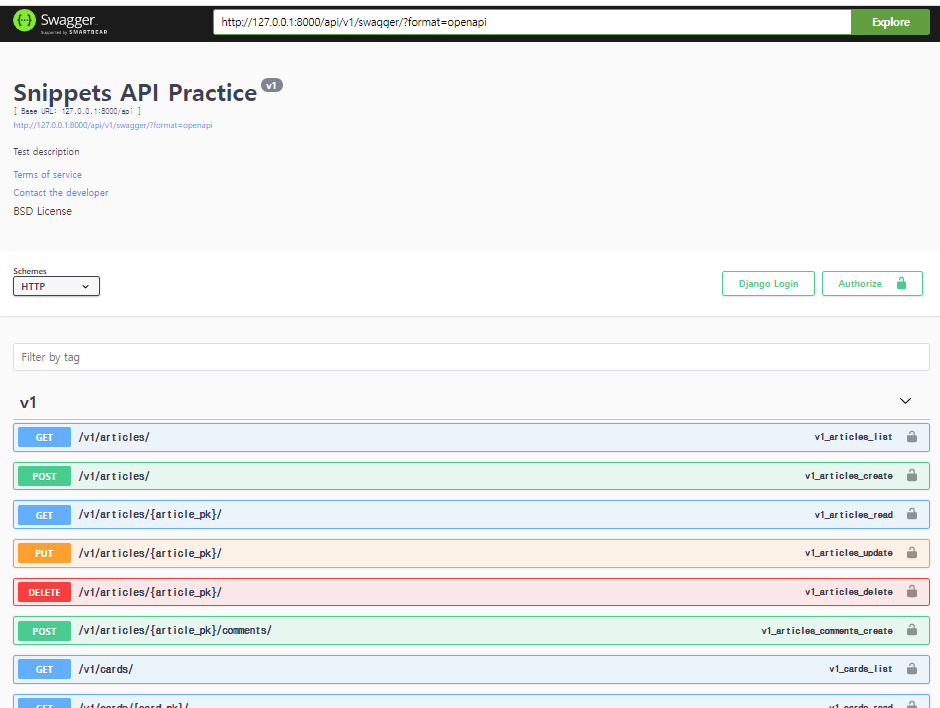

## REST API 문서화 

### drf-yasg 라이브러리

- "Yet another Swagger generator"
- API를 설계하고 문서화 하는데 도움을 주는 라이브러리
- Sqgger & OpenAPI 2.0 문서를 제공

- 스웨거는 개발자가 REST 웹 서비스를 설계, 빌드, 문서화, 소비하는 일을 도와주는 대형 문서도구 시스템 

https://drf-yasg.readthedocs.io/en/stable/readme.html#installation


```python
#ursl.py
from drf_yasg.views import get_schema_view
from drf_yasg import openapi

schema_view = get_schema_view(
   openapi.Info(
    #필수인자
      title="Snippets API Practice",
      default_version='v1',
    
    #아래부터는 선택인자 
      description="Test description",
      terms_of_service="https://www.google.com/policies/terms/",
      contact=openapi.Contact(email="contact@snippets.local"),
      license=openapi.License(name="BSD License"),
   ),
   public=True,
)

urlpatterns = [
    path('swegger/', schema_view.with_ui('swagger')),
]

```




