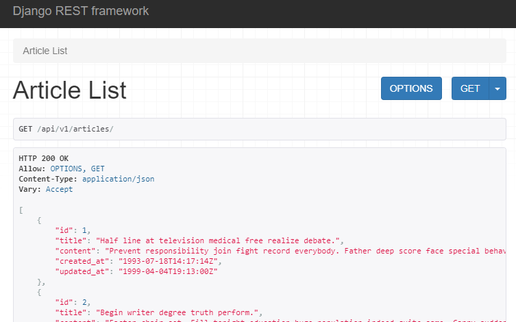
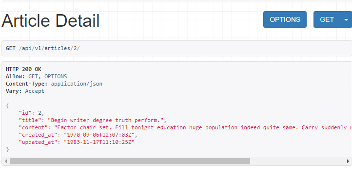
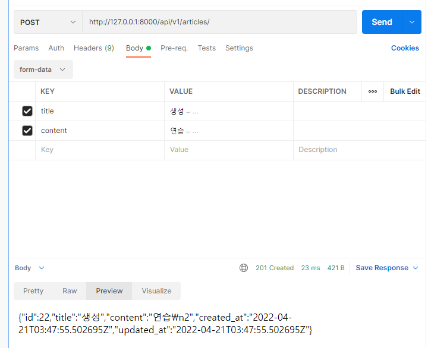

## SingleModel

### DRF with Single Model

- 단일 모델의 data를 직렬화(serialization)하여 JSON으로 변화는 방법에 대한 학습
- 단일 모델을 두고 CRUD 로직을 수행 가능도록 설계
- API 개발을 위한 핵심 기능을 제공하는 도구 활용
  - DRF built-in form
  - POSTMAN

#### POSTMAN

- API를 구축하고 사용하기 위해 여러 도구를 제공하는 API 플랫폼
- 설계, 테스트, 문서화 등의 도구를 제공하으로써 API를 더 빠르게 개발 및 생성 할 수 있도록 도움 


### ModelSerializer

- 모델 필드에 해당하는 필드가 있는 Serializer 클래스를 자동으로 만들 수 있는 shorcut
- 아래 핵심 기능을 제공
  - 모델 정보에 맞춰 자동으로 필드 생성(모델 정보를 알고 있기 때문)
  - serializer에 대한 유효성 검사기를 자동으로 생성(is_valid())
  - .create() & . update() 의 간단한 기본 구현이 포함됨 

- Model의 필드를 어떻게 '직렬화' 할 지 설정하는 것이 핵심
- 이 과정은 Django에서 Model의 필드를 설정하는 것과 동일함 

```python
#articles/serializer.py
class ArticleListSerializer(serializers.ModelSerializer):

    class Meta:
        model = Article
        fields = ('id','title')
```

### Serializer in Shell

##### 단일객체 직렬화 

```shell
#작성한 Serializer import
>>> from articles.serializers import ArticleListSerializer
#기본 인스턴스 구조 확인 
>>> serializer = ArticleListSerializer()
>>> serializer
ArticleListSerializer():
    id = IntegerField(label='ID', read_only=True)
    title = CharField(max_length=100)
# Model instance 객체 
>>> article = Article.objects.get(pk=3)
>>> article
<Article: Article object (3)>
#직렬화 
>>> serializer = ArticleListSerializer(article)
>>> serializer
ArticleListSerializer(<Article: Article object (3)>):
    id = IntegerField(label='ID', read_only=True)
    title = CharField(max_length=100)
>>> serializer.data
{'id': 3, 'title': 'Along several increase teacher to wind kid stock.'}
```

##### QuerysSet 객체 many=True 옵션 없이 직렬화 

```shell
>>> serializer = ArticleListSerializer(articles)
>>> serializer.data
Traceback (most recent call last):
  File "C:\Users\SAMSUNG\Desktop\SSAFY\Django\07_DRF\01_drf\venv\lib\site-packages\rest_framework\fields.py", line 457, in get_attribute
    return get_attribute(instance, self.source_attrs)
  File "C:\Users\SAMSUNG\Desktop\SSAFY\Django\07_DRF\01_drf\venv\lib\site-packages\rest_framework\fields.py", line 97, in get_attribute
    instance = getattr(instance, attr)
AttributeError: 'QuerySet' object has no attribute 'title'

During handling of the above exception, another exception occurred:

Traceback (most recent call last):
  File "<console>", line 1, in <module>
  File "C:\Users\SAMSUNG\Desktop\SSAFY\Django\07_DRF\01_drf\venv\lib\site-packages\rest_framework\serializers.py", line 555, in data   
    ret = super().data
  File "C:\Users\SAMSUNG\Desktop\SSAFY\Django\07_DRF\01_drf\venv\lib\site-packages\rest_framework\serializers.py", line 253, in data   
    self._data = self.to_representation(self.instance)
  File "C:\Users\SAMSUNG\Desktop\SSAFY\Django\07_DRF\01_drf\venv\lib\site-packages\rest_framework\serializers.py", line 509, in to_representation
    attribute = field.get_attribute(instance)
  File "C:\Users\SAMSUNG\Desktop\SSAFY\Django\07_DRF\01_drf\venv\lib\site-packages\rest_framework\fields.py", line 490, in get_attribute
    raise type(exc)(msg)
AttributeError: Got AttributeError when attempting to get a value for field `title` on serializer `ArticleListSerializer`.
The serializer field might be named incorrectly and not match any attribute or key on the `QuerySet` instance.
Original exception text was: 'QuerySet' object has no attribute 'title'.
>>>    
```

##### many =True 설정 

```shell
#many =True 설정 
>>> serializer = ArticleListSerializer(articles,many=True)
>>> serializer.data
[OrderedDict([('id', 3), ('title', 'Along several increase teacher to wind kid stock.')]), OrderedDict([('id', 4), ('title', '수정')]), OrderedDict([('id', 5), ('title', 'Major vote direction accept growth history.')]), OrderedDict([('id', 6), ('title', '제목')]), OrderedDict([('id', 7), ('title', 'title')])]
```

### 'many' argument

- many = True
  - "Serializing multiple objects"
  - 단일 인스턴스 대신 QuerySet 등을 직렬화하기 위해서는 serilizer를 인스턴스화 할 때 many=True를 키워드 인자로 전달해야 함 

### Build RESTful API

|             | GET          | POST    | PUT         | DELETE      |
| ----------- | ------------ | ------- | ----------- | ----------- |
| articles/   | 전체 글 조회 | 글 작성 |             |             |
| articles/1/ | 1번 글 조회  |         | 1번 글 수정 | 1번 글 삭제 |


### 1. GET - Article List

- url 및 view 함수 작성

```python
#urls.py
urlpatterns = [
    path('articles/', views.article_list),
]
#views.py
def article_list(request) :
    #쿼리셋 조회
    articles = Article.objects.all()
    # print(articles)   
    #직렬화하기 쿼리셋이니까 many=True
    serializer = ArticleListSerializer(articles,many=True)
    # print(serializer.data)
    #전체 데이터를 가져오는 것 
    return Response(serializer.data)
```

- api_view decorator
  - 기본적으로 GET 메서드만 허용되며 다른 메서드 요청에 대해서는 405 Method Not Allowed로 응답
  - view 함수가 응답해야 하는 HTTP 메서드의 목록을 리스트의 인자로 받음
  - DRF에서는 선택이 아닌 필수적으로 작성해야 해당 view 함수가 정상적으로 작동함 
  - 데코레이터를 붙이지 않으면 500에러가 뜸 (서버에러)
  - 제목은 view함수를 기준으로 만들어주는데, 언더바를 기준으로 띄어쓰기를 해줌 



### 2. GET - Article Detail

- Article List와 Article Detail을 구분하기 위해 추가 Senialize를 정의 
- 모든 필드를 직렬화하기 위해 fields 옵션을 `__all__`로 설정

```python
#serializer.py
class ArticleSerializer(serializers.ModelSerializer) :

    class Meta:
        model = Article
        fields = '__all__'
#urls.py
urlpatterns = [
    path('articles/<int:article_pk>/', views.article_detail),
]

#views.py
@api_view(['GET'])
def article_detail(request, article_pk) :
    article = get_object_or_404(Article,pk=article_pk)
    serializer = ArticleSerializer(article)

    return Response(serializer.data)
```




### 3 . POST - Create Article

- 201 Created 상태 코드 및 메시지 응답
- RESTful 구조에 맞게 작성
  - URI는 자원을 표현
  - 자원을 조작하는 행위는 HTTP Method
- article_list 함수로 게시글을 조회하거나 생성하는 행위를 모두 처리 가능 
- view함수의 직관성을 위해 else를 자제하고 elif로 메소드를 명시적으로 표현함 

#### view함수 수정(POST 추가 )

```python
from rest_framework import status

@api_view(['GET','POST'])
def article_list(request) :
    elif request.method == 'POST' :
        #데이터를 넣어야 하기 때문에 키워드 인자로 데이터를 넣는다.
        #첫번째 인자가 instance이기 때문에 data를 명시 
        serializer = ArticleSerializer(data=request.data)
        #유효성검사 통과하면 201 CREATED status 반환 
        if serializer.is_valid() :
            serializer.save()
            return Response(serializer.data,status=status.HTTP_201_CREATED)
        #유효성 검사 통과 못하면 BAD REQUEST
        return Response(serializer.errors,status=status.HTTP_400_BAD_REQUEST)
```

#### Status Codes in DRF

- DRF에는 status code를 보다 명확하고 읽기 쉽게 만드는데 사용할 수 있는 정의된 상수 집합을 제공
- status 모듈에 HTTP status code 집합이 모두 포함되어 있음 

- 단순히 status=201 같은 표현으로도 사용할 수 있지만 DRF는 권장하지 않음 
- 

#### raise_exception argumetn

- raise_exeption을 True로 설정해서 유효성 검사에 대한 추가 return 구문을 없앨 수 있음 

```python
#유효성검사 통과하면 201 CREATED status 반환 
#raise_exeption을 통해 else구문을 사용하지 않아도 유효성 검사를 통과하지 못하면, 400 에러 리턴 
if serializer.is_valid(raise_exception=True) :
    serializer.save()
    return Response(serializer.data,status=status.HTTP_201_CREATED)
# #유효성 검사 통과 못하면 BAD REQUEST
# return Response(serializer.errors,status=status.HTTP_400_BAD_REQUEST)
```

- "Rasing an exception on invalid data"
- is_valid()는 유효성 검사 오류가 있는 경우, serializers.ValidationError 예외를 발생시키는 선택적 raise_exception 인자를 사용할 수 있음
- DRF에서 제공하는 기본 예외 처리기에 의해 자동으로 처리되며, 기본적으로 HTTP status code 400을 응답으로 반환 

### 4. DELETE - Delte Article

- 204 No Content 상태 코드 및 메시지 응답
- article_detail 함수로 상세 게시글을 조회하거나 삭제하는 행위 모두 처리 가능 

```python
@api_view(['GET','DELETE'])
def article_detail(request, article_pk) :
    article = get_object_or_404(Article,pk=article_pk)
    elif request.method=='DELETE' :
        article.delete()
        #response에는 넘겨줄 값이 필요한데, 삭제는 이가 없으므로 직접 만들어줌
        data = {
            #pk는 url에서 가져온 article_pk이다. 
            'delete' : f'데이터 {article_pk}번이 삭제 되었습니다.'
        }
        return Response(data, status=status.HTTP_204_NO_CONTENT)
```

### 5. PUT - Update Article

- article_detail 함수로 상세 게시글을 조회하거나 삭제, 수정하는 행위 모두 처리 

```python
@api_view(['GET','DELETE','PUT'])
def article_detail(request, article_pk) :
    elif request.method=='PUT' :
        serializer = ArticleSerializer(article,data=request.data) 
        if serializer.is_valid(raise_exception=True) :
            serializer.save()
            return Response(serializer.data)
```

