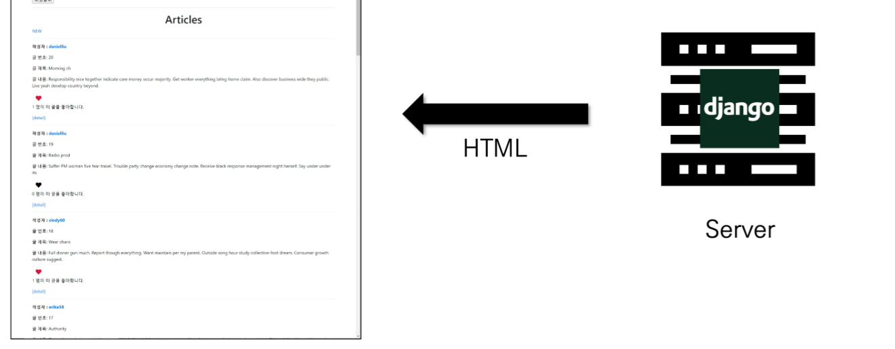
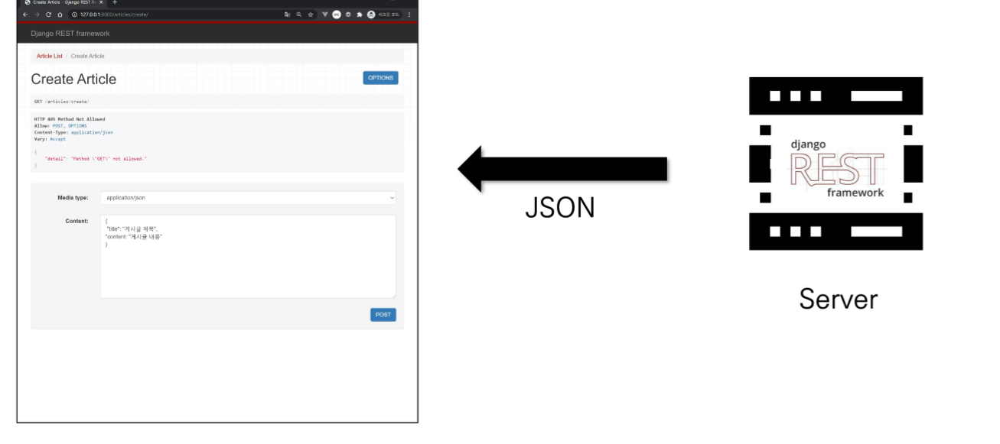
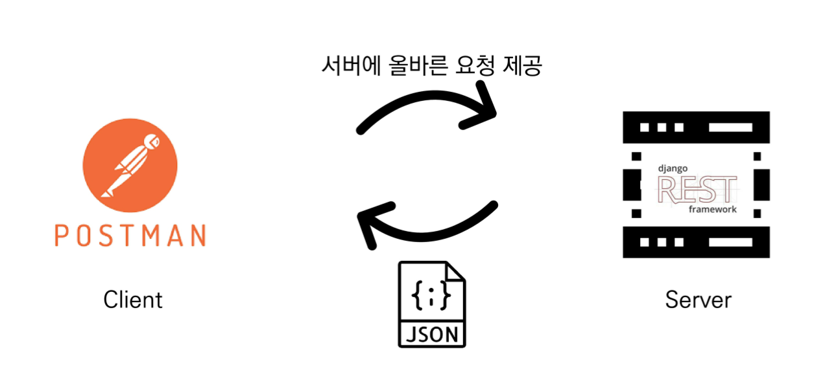

## Server & Client

### Server

- 클라이언트에게 '정보', '서비스'를 제공하는 컴퓨터 시스템
- 정보 & 서비스 
  - Django를 통해 응답한 template
  - DRF를 통해 응답한 JSON

### Client

- 서버에게 그 서버가 맡는(서버가 제공하는) 서비스를 요청하고, 서비스 요청을 위해 필요한 인자를 서버가 요구하는 방식에 맞게 제공하며, 서버로부터 반환되는 응답을 사용자에게 적절한 방식으로 표현하는 기능을 가진 시스템 

### 정리

- Server는 "정보 제공"
  - DB와 통신하며 데이터를 CRUD
  - 요청을 보낸 Client에게 이러한 정보를 응답
- Client는 "정보 요청 & 표현"
  - Server에게 정보(데이터) 요청
  - 응답 받은 정보를 잘 가공하여 화면에 보여줌 
