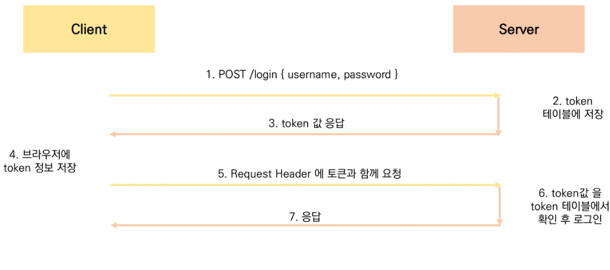
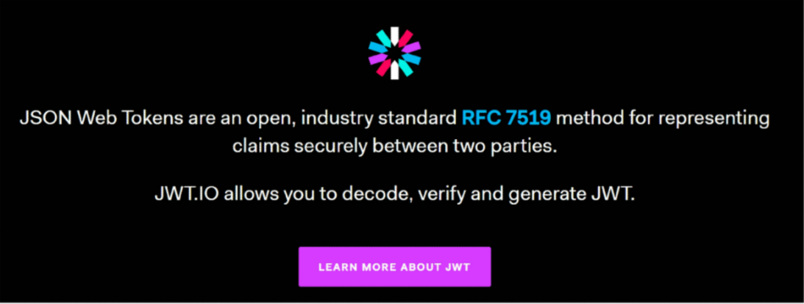

## DRF Authentication

### 다양한 인증방식

1. Session Based
2. Token Based
   - Basic Token
   - JWT
3. Qauth
   - google
   - facebook
   - github

### Basic Authentication Token

- 서버에 username과 password를 JSON형태로 보낸다.
- 서버에서 account_user에서 아이디와 해싱된 비밀번호가 일치하는데이터가 있는지 확인한다.
- 올바른 사용자라고 인식한다.
- authtoken_token이라는 새로운 테이블에 token을 생성하고 몇번 유저인지 맵핑한다.
- server에서 client에게 token을 리턴한다.
- client가 local storage에 token을 저장한다. 

- 인증이 성공했으므로, 이제 서버에 요청을 보낼때마다 인증된 사용자임을 알려야 하는데, 이를 위해 Authorization Token {token값}을 전달한다.

### JWT(Json Web Tokens)

- JSON Web Token
- JSON 포맷을 활용하여 요소 간 안전하게 정보를 교환하기 위한 표준 포맷
- 암호화 알고리즘에 의한 디지털 서명이 되어 있기 때문에 JWT 자체로 검증 가능
- JWT 자체가 필요한 정보를 모두 갖기 때문에 (self-contained) 이를 검증하기 위한 다른 검증 수단(ex. table)이 필요 없음
- 사용처
  - Authentication, Information Exchange

- 기존의 토큰은 팔찌에 인증정보를 새겨놓고, 그를 이용하여 서버에 토큰과 비교해서 인증하는 검증 방식이었다. 이 토큰은 정보가 없이 단순 인증의 기능만을 한다. 
- JWT는 Token 내부에 정보가 들어있는 의미있는 토큰이다.

### JWT 특징

- 기본 토큰 인증 체계와 달리 JWT 인증 확인은 데이터베이스를 사용하여 토큰의 유효성을 검사할 필요가 없음

  - 즉, JWT는 데이터베이스에서 유효성 검사가 필요 없음

  - JWT 자체가 인증에 필요한 정보를 모두 갖기 때문(self-contained)

  - 이는 세션 혹은 기본 토큰을 기반으로 한 인증과의 핵심 차이점

    

  - 토큰 탈취시 서버에서 토큰 무효화가 불가능 (블랙리스팅 테이블 활용)

  - 매우 짧은 유효기간(5min)과 Refresh 토큰을 활용하여 구현

  - MSA(Micro Server Architecture) 구조에서 서버간 인증에 활용

  - One Source(JWT) Multi Use 가능 

