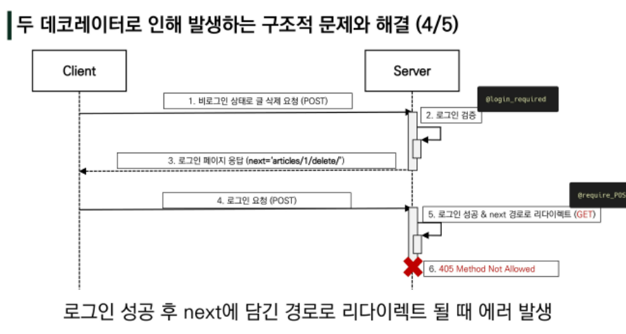

## Authentication System

### The django Authentication System

- Django 인증 시스템은 django.contrib.auth에 Django contrib module로 제공
- 필수 구성은 settings.py에 이미 포함되어 있으며 INSTALLED_APPS 설정에 나열된 아래 두 항목으로 구성됨 
  - django.contrib.auth
    - 인증 프레임워크의 핵심과 기본 모델을 포함
  - django.contrib.contenttypes
    - 사용자가 생성한 모델과 권한을 연결할 수 있음
- Django 인증 시스템은 인증과 권한부여를 함께 제공하며, 이러한 기능이 어느정도 결합되어 일반적으로 인증 시스템이라고 함 

### Authentication & Authorization

- Authentication 
  - 신원 확인
  - 사용자가 자신이 누구인지 확인하는 것
- Authorization
  - 권한 부여
  - 인증된 사용자가 수행할 수 있는 작업을 결정

- auth에 관련되어 Django 내부적으로 accounts라는 이름으로 사용되고 있기 때문에 되도록 auth 관련 앱 이름은 accounts로 지정하는 것을 권장

### 쿠키와 세션

- HTTP 
  - Hyper Text Transfer Protocol
  - HTML 문서와 같은 리소스들을 가져올 수 있도록 해주는 프로토콜(규칙,규악)
  - 웹에서 이루어지는 모든 데이터 교환의 기초
  - 클라이언트 - 서버 프로토콜이기도 함
- HTTP 특징
  - 비연결지향
    - 서버는 요청에 대한 응답을 보낸 후 연결을 끊음
  - 무상태
    - 연결을 끊는 순간 클라이언트와 서버 간의 통신이 끝나며 상태 정보가 유지되지 않음
    - 클라이언트와 서버가 주고 받는 메시지들은 서로 완전히 독립적임
  - 클라이언트와 서버의 지속적인 관계를 유지하기 위해 쿠키와 세션이 존재 

#### 쿠키의 개념

- 서버가 사용자의 웹 브라우저에 전송하는 작은 데이터 조각
- 사용자가 웹사이트를 방문할 경우 해당 웹사이트의 서버를 통해 사용자의 컴퓨터에 설치되는 작은 기록 정보 파일
  - 브라우저는 쿠키를 로컬에 key-value 데이터 형식으로 저장
  - 이렇게 쿠키를 저장해 놓았다가, 동일한 서버에 재 요청 시 저장된 쿠키를 함께 전송
- 소프트웨어가 아니기에 프로그램처럼 실행될 수 없으며 악성코드를 설치할 수 없지만,사용자의 행동을 추적하거나 쿠키를 훔쳐서 해당 사용자의 계정 접근 권한을 획득할 수 있음

- ex) 클라이언트가 서버에 로그인을 요청하면 서버에서 응답과 쿠키를 보내줌 그러면 나중에 재요청 할 때 쿠키가 로그인 된 상태를 포함에서 전달함 

- HTTP 쿠키는 상태가 있는 세션을 만들어 줌 
- 쿠키는 두 요청이 동일한 브라우저에서 들어왔는지 아닌지를 판단할 때 주로 사용
  - 이를 이용해 사용자의 로그인 상태를 유지할 수 있음
  - 상태가 없는 HTTP 프로토콜에서 상태 정보를 기억 시켜주기 때문
- 웹 페이지에 접속하면 요청한 웹 페이지를 받으며 쿠키를 저장하고, 클라이언트가 같은 서버에 재 요청시 요청과 쿠키를 함께 전송

#### 사용 목적

- 세션 관리
  - 로그인, 아이디 자동 완성, 공지 하루 안보기, 팝업 체크, 장바구니 등의 정보 관리
- 개인화
  - 사용자 선호, 테마 등의 설정
- 트래킹
  - 사용자 행동을 기록 및 분석

#### 세션

- 사이트와 특정 브라우저 사이의 '상태'를 유지시키는 것
- 클라이언트가 서버에 접속하면 서버가 특정 sessionid를 발급하고,클라이언트는 발급 받은 session id를 쿠키에 저장
  - 클라이언트가 다시 서버에 접속하면 요청과 함께 쿠키 (session id가 저장된)를 서버에 전달
  - 쿠키는 요청 때마다 서버에 함께 전송되므로 서버에서 session id를 확인해 알맞은 로직을 처리
- ID는 세션을 구별하기 위해 필요하며, 쿠키에는 ID만 저장함 

#### 쿠키 lifetime

- 쿠키의 수명은 두 가지 방법으로 정의할 수 있음

1. Session cookies 
   - 현재 세션이 종료되면 삭제됨
   - 브라우저가 '현재 세션'이 종료되는 시기를 정의
   - 일부 브라우저는 다시 시작할 때 세션 복원을 사용해 세션 쿠키가 오래 지속될 수 있도록 함
2. Persistent cookies
   - Expires 속성에 지정된 날짜 혹은 Max-Age 속성에 지정된 기간이 지나면 삭제 

#### Session in Django

- Django의 세션은 미들웨어를 통해 구현됨
- Django는 database-backed sessions 저장 방식을 기본 값으로 사용
  - 설정을 통해 cached, file-based, cookie-based 방식으로 변경 가능
- Django는 특정 session id를 포함하는 쿠키를 사용해서 각각의 브라우저와 사이트가 연결된 세션을 알아냄
  - 세션 정보는 Dajango DB의 django_session 테이블에 저장됨
- 모든 것을 세션으로 사용하려고 하면 사용자가 많을 때 서버에 부하가 걸릴 수 있음 

- SessionMiddleware
  - 요청 전반에 걸쳐 세션을 관리
- AuthenticationMiddleware
  - 세션을 사용하여 사용자를 요청과 연결

#### MIDDLEWARE

- HTTP 요청과 응답 처리 중간에 작동하는 시스템
- Django는 HTTP 요청이 들어오면 미들웨어를 거쳐 해당 URL에 등록되어 있는 view로 연결해주고 HTTP 응답 역시 미들웨어를 거쳐서 내보냄
- 주로 데이터 관리, 애플리케이션 서비스, 메시징, 인증 및 API 관리를 담당 

<hr>

### 로그인

- 로그인은 session을 Create하는 로직과 같음
- Django는 우리가 session의 메커니즘에 생각하지 않도록 도움을 줌 
- 이를 위해 인증에 관한 built-in forms를 제공

#### Authentication Form

- 사용자 로그인을 위한 form
- request를 첫번째 인자로 취함
  - Authentication은 ModelForm이 아닌 그냥 Form을 상속받는다. 
  - 로그인 과정은 세션을 만드는 것이기 때문에 DB에 저장하는 것이 아니다. 그렇기 때문에 ModelForm을 사용하지 않는다. 
- Authentication Form은 실제 로그인을 하는 것은 아니고 세션을 만들어주는 것이다.

#### Login 함수

- login(request,user,backend=None)
  - 현재 세션에 연결하려는 인증된 사용자가 있는 경우 login()함수가 필요
  - 사용자를 로그인하며 view 함수에서 사용됨
  - HttpRequest 객체와 User 객체가 필요
  - Django의 session framework를 사용하여 세션에 User의 ID를 저장 (==로그인)

#### get_user()

- AuthenticationForm의 인스턴스 메서드
- user_cache는 인스턴스 생성 시에 None으로 할당되며, 유효성검사를 통과했을 경우 로그인 한 사용자 객체로 할당 됨
- 인스턴스의 유효성을 먼저 확인하고, 인스턴스가 유효할 때만 user를 제공하려는 구조 

#### Authentication data in templates

- Context processors 
  - 템플릿이 렌더링 될 때 자동으로 호출 가능한 context 데이터 목록
  - 작성된 프로세서는 RequestContext에서 사용 가능한 변수로 포함됨  

- Users
  - 템플릿 RequestContext를 렌더링 할 때, 현재 로그인한 사용자를 나타내는 auth.User 인스턴스는 템플릿 변수 {{user}}에 저장됨 

#### 로그아웃

- 로그아웃은 session을 삭제하는 로직

- HttpRequest 객체를 인자로 받고 반환값이 없음
- 사용자가 로그인하지 않은 경우 오류를 발생시키지 않음
- 현재 요청에 대한 session data를 DB에서 완전히 삭제하고, 클라이언트의 쿠키에서도 sessionid가 삭제됨
- 이는 다른 사람이 동일한 웹 브라우저를 사용하여 로그인하고, 이전 사용자의 세선 데이터에 액세스하는 것을 방지하기 위함 

#### Limiting access to logged-in users

- 로그인 사용자에 대한 액세스 제한 2가지 방법
  - The raw way
    - is_authenticated attribute
  - The login_required decorator

#### is_authenticated

- User model의 속성 중 하나
- 모든 User 인스턴스에 대해 항상 True인 읽기 전용 속성
- 사용자가 인증되었는지 여부를 알 수 있는 방법
- 일반적으로 request.user에서 이 속성을 사용하며, 미들웨어의 'django.contib.auth.middleware.AuthenticationMiddleware'를 통과했는지 확인
- 단 권한과 고나련 없으며 사용자가 활성화 상태이거나 유효한 세션을 가지고 있는지도 확인하지 않음

- 적용

  - 로그인과 비로그인 상태에서 출력되는 링크를 다르게 설정

  ```django
  
        <h3>Hello, {{user}}</h3>
        <form action="" method="POST">
          
          <input class="btn btn-danger" type="submit" value = "Logout">
        </form>
      
        <a href="" class="btn btn-info" >Login</a>  
      
  ```

  

- 인증된 사용자만 로그인/로그아웃 할 수 있도록 설정

```python
@require_http_methods(['GET','POST'])
def login(request) :
    if request.user.is_authenticated:
        return redirect('articles:index')
    
@require_POST
def logout(request):
    if request.user.is_authenticated : 
        auth_logout(request)
    return redirect('articles:index')
```


#### login_required decorator

- 사용자가 로그인되어 있지 않으면, settings.LOGIN_URL에 설정된 문자열 기반 절대 경로로 redirect 함 
  - LOGIN_URL의 기본 값은 '/accounts/login'
  
- 사용자가 로그인되어 있으면 정상적으로 view 함수를 실행

- 인증 성공 시 사용자가 redirect 되어야하는 경로는 'next'라는 쿼리 문자열 매개 변수에 저장됨 

  - view 함수에 login_required 데코레이터 작성

  - 비로그인 상태에서 account/create 경로로 요청 보내기

### 로그인 사용자에 대한 접근 제한

- 'next' query string parameter
  - 로그인이 정상적으로 진행되면 기존에 요청했던 주소로 redirect하기 위해 주소를 keep 해주는 것
  - 단, 별도로 처리해주지 않으면 우리가 view에서 설정한 redirect 경로로 이동하게 됨 
- action을 비워줘야 적용됨

```python
@require_POST
def likes(request, article_pk):
    if request.user.is_authenticated:
        article = get_object_or_404(Article, pk=article_pk)
        if article.like_users.filter(pk=request.user.pk).exists():
                article.like_users.remove(request.user)
        else:
            article.like_users.add(request.user) 
        
        if request.GET.get('next') :
            return redirect(request.GET.get('next') )
        return redirect('articles:index')
    return redirect('accounts:login')
```

```django
?next=/accounts/{{person.username}}
```

- 위의 방식으로 next 파라미터를 줄 수 있다.
  - likes를 profile과 index에서 누를 수 있는데, 
    -  누르면 원래 view함수에서 articles:index를 리턴한다.
    - 하지만 profile에서 좋아요를 누르면 index로 가면 안되기 때문에 따로 next파라미터를 줘서, 해당 next 파라미터로 redirect하게 한다. 

#### 두 데코레이터로 인해 발생하는 구조적 문제와 해결

- 비로그인 상태에서 게시글 삭제 시도 
  - 405에러 리턴
- @require_POST 작성된 함수에 @login_required를 함께 사용하는 경우 에러 발생
- 로그인 이후 'next' 매개 변수를 따라 해당 함수로 다시 redirect되는데, 이때 get 방식으로 데이터가 전송되서 @require_POST 때문에 405 에러가 발생함
- 두가지 문제 발생
  - redirect 과정에서 POST 데이터 손실
  - redirect 요청은 POST 방식이 불가능하기 때문에 GET방식으로 요청함 



- login_required는 GET method request를 처리할 수 있는 view함수에서만 사용해야함

<hr>

### 회원가입

#### USERCreationForm

- 주어진 username과 password로 권한이 없는 새 user를 생성하는 ModelForm
- 3가지 필드를 가짐
  - username
  - password
  - password 확인 

```python
@require_http_methods(['GET','POST'])
def signup(request) :
    if request.user_is_authenticated:
        return redirect('articles:index')
    if request.method == 'POST' :
        form=UserCreationForm(request.POST)
        if form.is_valid() :
            user = form.save()
            auth_login(request,user)
            return redirect('articles:index')
    else :
        form = UserCreationForm()
        
    context = {
        'form' :form,
    }
    return render(request, 'accounts/signup.html',context)

```

### 회원정보 수정

#### UserChangeForm

- 사용자의 정보 및 권한을 변경하기 위해 admin 인터페이스에서 사용되는 ModelForm

##### 문제점

- 일반 사용자가 접근해서는 안될 정보들까지 모두 수정이 가능해짐
- 따라서 UserChangeForm을 상속받아 CustomUserChangeForm이라는 서브클래스를 작성해 접근 가능한 필드를 조정해야함 

#### get_user_model()

- 현재 프로젝트에서 활성화된 사용자 모델을 반환
- Django는 User클래스를 직접 참조하는 대신 django.contrib.auth.get_user_model()을 사용하여 참조해야 한다고 강조

#### PasswordChangeForm

- 사용자가 비밀번호를 변경할 수 있도록 하는 Form
- 이전 비밀번호를 입력하여 비밀번호를 변경할 수 있도록 함
- 이전 비밀번호를 입력하지 않고 비밀번호를 설정할 수 있는 SetPasswordForm을 상속받는 서브클래스 

#### 암호 변경시 세션 무효화 방지

- update_session_auth_hash(request,user)

- 현재요청과 새 session hash가 파생될 업데이트 된 사용자 객체를 가져오고, session hash를 적절하게 업데이트
- 비밀번호가 변경되면 기존 세션과 회원 인증 정보가 일치하지 않게 되어 로그인 상태를 유지할 수 없기 때문
- 암호가 변경되어도 로그아웃되지 않도록 새로운 password hash로 session을 업데이트함 

