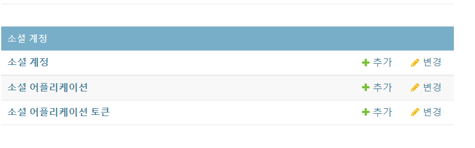

## 소셜 로그인 

**https://django-allauth.readthedocs.io/en/latest/installation.html**


### Settings.py 수정 

#### AUTHENTICATION_BACKENDS 추가

```python
AUTHENTICATION_BACKENDS = [
    # Needed to login by username in Django admin, regardless of `allauth`
    'django.contrib.auth.backends.ModelBackend',

    # `allauth` specific authentication methods, such as login by e-mail
    'allauth.account.auth_backends.AuthenticationBackend',
]
```

#### INSTALLED_APPS 에 앱 추가

```python
INSTALLED_APPS = [
	...
    'allauth',
    'allauth.account',
    'allauth.socialaccount',

    'django.contrib.admin',
    'django.contrib.sites',
    ...
]
```

#### 이용하고 싶은 소셜 가져오기 

```python
INSTALLED_APPS = [
	...
    'allauth.socialaccount',
    'allauth.socialaccount.providers.google',

	...
]
```

#### 마이그레이션하기


### admin 페이지 접속하기

- 접속이 되지 않음 
  - django.contrib.sites를 추가해서 Django에서 어떤 site를 쓸지 정해줘야함

#### settings.py에 SITE ID 추가

```python
#django.contrib.stes 사용시 반드시 SITE_ID 설정 필요
SITE_ID = 1 
```



https://d2.naver.com/helloworld/24942

## OAuth와 로그인

OAuth와 로그인은 반드시 분리해서 이해해야 한다. 일상 생활을 예로 들어 OAuth와 로그인의 차이를 설명해 보겠다.

사원증을 이용해 출입할 수 있는 회사를 생각해 보자. 그런데 외부 손님이 그 회사에 방문할 일이 있다. 회사 사원이 건물에 출입하는 것이 로그인이라면 OAuth는 방문증을 수령한 후 회사에 출입하는 것에 비유할 수 있다.

다음과 같은 절차를 생각해 보자.

- 나방문씨(외부 손님)가 안내 데스크에서 업무적인 목적으로 김목적씨(회사 사원)를 만나러 왔다고 말한다.
- 안내 데스크에서는 김목적씨에게 나방문씨가 방문했다고 연락한다.
- 김목적씨가 안내 데스크로 찾아와 나방문씨의 신원을 확인해 준다.
- 김목적씨는 업무 목적과 인적 사항을 안내 데스크에서 기록한다.
- 안내 데스크에서 나방문 씨에게 방문증을 발급해 준다.
- 김목적씨와 나방문씨는 정해진 장소로 이동해 업무를 진행한다.

위 과정은 방문증 발급과 사용에 빗대어 OAuth 발급 과정과 권한을 이해할 수 있도록 한 것이다. 방문증이란 사전에 정해진 곳만 다닐 수 있도록 하는 것이니, '방문증'을 가진 사람이 출입할 수 있는 곳과 '사원증'을 가진 사람이 출입할 수 있는 곳은 다르다. 역시 직접 서비스에 로그인한 사용자와 OAuth를 이용해 권한을 인증받은 사용자는 할 수 있는 일이 다르다.다. 다음의 화면 두 개는 각각 네이버와 미투데이에 접근 권한 요청이 있음을 알려 주는 화면이다. 미투데이의 경우에는 OAuth 인증 방식을 사용하지 않지만 인증 절차에 대한 예시 정도로 생각해 주기 바란다.


- 사용자가 서비스 (Django)에게 로그인 요청을 보내면 Django가 Google에 요청을 한다. 
- Google이 사용자에게 로그인 요청을 보낸다.
- 사용자가 ID/PW를 구글에 입력한다.
- 구글에서 사용자에게 Athorization Code를 발급한다. 
- 사용자가 Django로 Redirect한다. 
- Django가 Google에 Access Token 요청
- Google이 Django에 Access Token 발급 


https://django-allauth.readthedocs.io/en/latest/providers.html?highlight=google#google


### SOCIALACCOUNT_LOGIN_ON_GET

```python
#urls.py
path('accounts/', include('allauth.urls')),
```

```django
#login.html
<a href="">[GOOGLE LOGIN]</a>

```

```python
#settings.py
SOCIALACCOUNT_LOGIN_ON_GET = True
```

