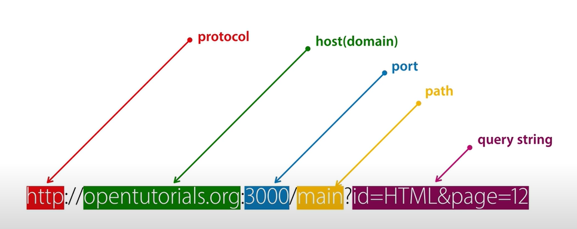
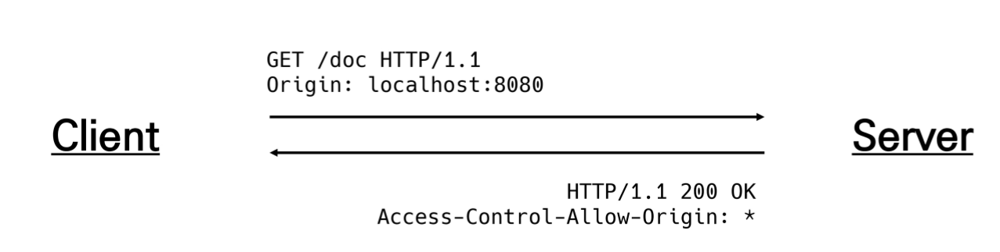

## CORS

### Same-origin policy(SOP)

- "동일 출처 정책"
- 특정 출처(origin)에서 불러온 문서나 스크립트가 다른 출처에서 가져온 리소스와 상호작용 하는 것을 제한하는 보안 방식
- 잠재적으로 해로울 수 있는 문서를 분리함으로써 공격받을 수 있는 경로를 줄임 

### Origin(출처)

- 두 URL의 Protocol, Port, Host가 모두 같아야 동일한 출처라 할 수 있음
- URL http://store.company.com/dir/page.html의 출처를 비교한 예시

| URL                                             | 결과 | 이유                             |
| ----------------------------------------------- | ---- | -------------------------------- |
| http://store.company.com/dir2/other.html        | 성공 | 경로만 다름                      |
| http://store.company.com/dir/inner/another.html | 성공 | 경로만 다름                      |
| http://store.company.com/secure.html            | 실패 | 프로토콜 다름                    |
| http://store.company.com:81/dir/etc.html        | 실패 | 포트 다름(http://는 80이 기본값) |
| http://news.company.com/dir/other.html          | 실패 | 호스트가 다름                    |

### Same-origin 예시




### Cross-Origin Resource Sharing(CORS)

- "교차 출처 리소스(자원) 공유"
- 추가 HTTP header를 사용하여, 특정 출처에서 실행중인 웹 애플리케이션이 다른 출처의 자원에 접근 할 수 있는 권한을 부여하도록 브라우저에 알려주는 체제
- 리소스가 자신의 출처(Domain, Protocol, Port)와 다를 때 교차 출처 HTTP 요청을 실행
- 보안상의 이유로 브라우전느 교차 출처 HTTP 요청을 제한(SOP)
  - 예를 들어 XMLHttpRequest는 SOP를 따름
- 다른 출처의 리소스를 불러오려면 그 출처에서 올바른 CORS header를 포함한 응답을 반환해야 함 

### CORS Policy

- 교차 출처 리소스(자원) 공유 정책
- 다른 출처(origin)에서 온 리소스를 공유하는 것에 대한 정책
- <=>SOP

### 교차 출처 접근 허용하기

- CORS를 사용해 교차 출처 접근을 허용하기
- CORS는 HTTP의 일부로, 어떤 호스트에서 자신의 컨텐츠를 불러갈 수 있는지 **서버에 지정할 수 있는 방법** 


### Why CORS?

1. 브라우저 & 웹 애플리케이션 보호
   - 악의적인 사이트의 데이터를 가져오지 않도록 사전 차단
   - 응답으로 받는 자원에 대한 최소한의 검증
   - 서버는 정상적으로 응답하지만 브라우저에서 차단
2. Server의 자원 관리
   - 누가 해당 리소스에 접근 할 수 있는지 관리 가능 

### How CORS?

- CORS 표준에 의해 추가된 HTTP Header를 통해 이를 통제
- CORS HTTP 응답 예시
  - Access-Control-Allow-Origin / Access-Control-Allow-Credentials

​				 / Access-Control-Allow-Headers/ Access-Control-Allow-Methods/ 

### Access-Control-Allow-Origin 응답 헤더

- 이 응답이 주어진 출처(Origin)으로 부터 요청 코드와 공유될 수 있는지를 나타냄
- 예시
  - **Access-Control-Allow-Origin : ***
  - 브라우저 리소스에 접근하는 임의의 origin으로부터 요청을 허용한다고 알리는 응답에 포함
  - '*'는 모든 도메인에서 접근할 수 있음을 의미
  - '*' 외에 특정 origin 하나를 명시할 수 있음 


### CORS 시나리오 예시

- https://localhost:8080 (Vue.js)의 웹 컨첸츠가

  http://127.0.0.1:8000/ (Django) 도메인의 컨텐츠를 호출하기 원하는 상황 

  

- 요청 헤더의 Origin을 보면 localhost:8080으로 부터 요청이 왔다는 것을 알 수 있음
- 서버는 이에 대한 응답으로 Access-Control-Allow-Origin 헤더를 다시 전송
- 만약 서버 리소스 소유자가 오직 localhost:8080의 요청에 대해서만 리소스에 대한 접근을 허용하려는 경우, '*'가 아닌 Access-Control-Allow-Origin: localhost:8080을 전송해야 함



1. Vue.js에서 A 서버로 요청
2. A 서버는 Access-Control-Allow-Origin에 특정한 Origin을 포함시켜 응답
   - 서버는 CORS Policy와 직접적인 연관 이없고 그저 요청에 응답함
3. 브라우저는 응답에서 Access-Control-Allow-Origin을 확인 후 허요 여부를 결정
4. 프레임워크 별로 이를 지원하는 라이브러리가 존재
   - Django는 django-cors-headers 라이브러리를 통해 응답 헤더 및 추가 설정 가능


### 'django-cors-headers' 라이브러리

- 응답에 CORS header를 추가해주는 라이브러리
- 다른 출처에서 보내는 Django 애플리케이션에 대한 브라우저 내 요청을 허용함
- Django App이 header 정보에 CORS를 설정한 상태로 응답을 줄 수 있게 도와주며, 이 설정을 통해 브라우저는 다른 origin에서 요청을 보내는 것이 가능해짐 

#### settings.py 추가

https://github.com/adamchainz/django-cors-headers

```python
#settings.py
INSTALLED_APPS = [
	...,
     "corsheaders",
 	...,
]

MIDDLEWARE = [
    "corsheaders.middleware.CorsMiddleware",
    ...
]
#특정 origin 에게만 교차 출처 허용
CORS_ALLOWED_ORIGINS = [
    "http://localhost:8080",
]

# 모두에게 교추찰추 허용 (*)
# CORS_ALLOW_ALL_ORIGIN = True
```


### 'django-auth'

https://dj-rest-auth.readthedocs.io/en/latest/

https://www.django-rest-framework.org/api-guide/authentication/

https://www.django-rest-framework.org/api-guide/permissions/

```python
#settings.py
INSTALLED_APPS = [
	...,
    'rest_framework.authtoken', #token 기반 auth

    #DRF auth
    'dj_rest_auth', #signup 제외 auth 담당
    
    ...
]

REST_FRAMEWORK = {
    'DEFAULT_AUTHENTICATION_CLASSES': [
        'rest_framework.authentication.BasicAuthentication',
        'rest_framework.authentication.SessionAuthentication',
    ]
}
```

