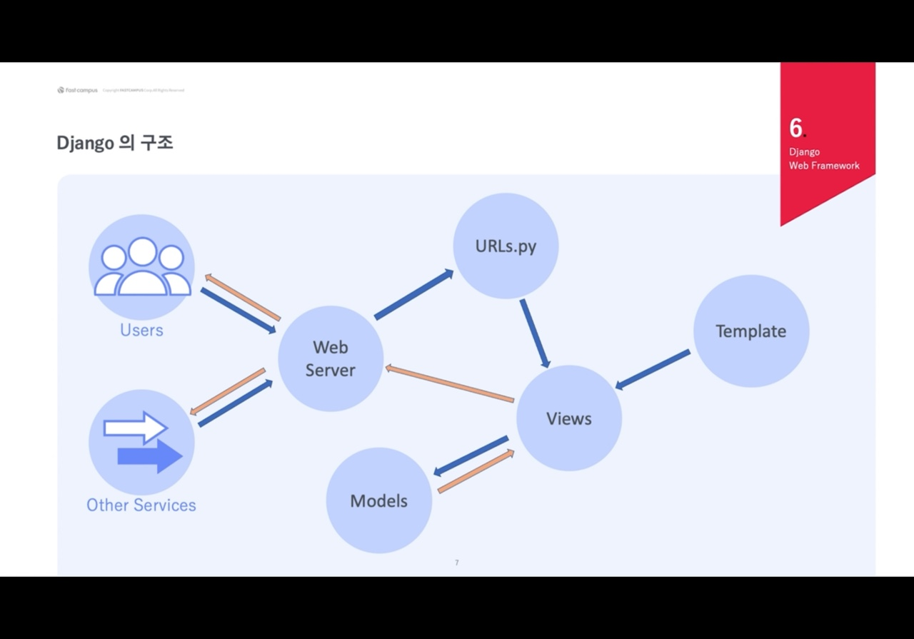

# Django 웹 프레임워크의 이해

### Why Django? 

#### Batteries Included

-  배터리가 포함되어 있는 상태
- 개발자가 개발하고 싶은 모든 것들이 들어있음
- 넓은 커뮤니티로 많은 정보를 수용할 수 있다.
- 빠르고 편안한 개발을 지원한다.

#### 다양한 사용이 가능 

- 문서 관리 시스템 (위키, SNS, 뉴스, 블로그, 쇼핑몰) 등 HTML이나 RSS, JSON,XML 에 상관없이 모두 Django로 이용 가능하다.

#### 안전

- 보안에 능숙하지 않은 개발자도 안전하게 개발을 진행할 수 있다. 
  - 세션, 유저 관리 등 
- CORS 어택 등을 기본적으로 방어해준다. 

#### Shared-nothing Architecture

- 확장성 있는 개발 환경이다. 
- 아키텍쳐가 독립적이어서 언제든 필요하다면 해당 레이어에서 교체 가능하다. 

#### Very Maintainable

- 유지보수가 매우 쉽고, 재사용성이 좋다. 
- 디자인 패턴에 의하여 유지보수 할 수 있다.
- DRY 원칙
  - 불필요한 중복코드를 없애고 편리하게 유지보수 하도록 지원한다. 

### References

- Pinterest, Bitbucket, Udemy, Disaus, Washington Post, NASA , Spotify, JSFiddle ,Reddit , Youtube, National Geography
- Toss, Delivery Hero, Korea, CoinBit, 숨고 등 

### Django는 인기 있는 프레임워크인가?

- 프레임워크의 인기를 측정하는 특별한 수단은 아직 없다. 하지만 Hot Framework나 많은 조사 업체에서는 Stack Overflow나 Reddit에서 언급된 숫자를 가지고 해당 답에 접근할 수 있다.

#### Stack Overflow 질문 수 

Django (255,697 개) vs Flask (111,246 개)

### Framework vs Library

#### 프레임워크 

- 내 코드 -> Django -> Serving
  - 프레임워크가 주체적으로 내 코드를 띄워준다. 
  - Django가 주체인 형식 

#### 라이브러리

- 라이브러리 -> 내 코드 -> Serving
  - 나의 코드가 주체인 방식이다.
  - 라이브러리를 끌어와 내 코드를 serving한다. 

### Django의 탄생

- Django는 어느 한 신문사의 웹 팀에서 2003년부터 개발되어 공통 모듈과 코드 그리고 패턴을 뽑아내 재사용하는 형태를 띄었고, 일반적인 웹 프레임워크로 진화했다.
- 대중들에게 처음 선보인날은 2005년 7월 처음으로 오픈소스로 공개되었으며, 2008년 9월 1.0 버전을 배포했다.

### Django의 구조

##### 파란색 화살표가 Request, 주황색 화살표가 Response 

#### MTV 패턴

- 어떤 서비스에서 Webserver로 요청을 보낸다.
- 그럼 웹서버에서 유효한 url인지 확인하기 위해 url로 요청을 보낸다.
- URL에서  Views로 요청을 보낸다. 
- 렌더링이 필요하면 Views가 Template에서 템플릿을 요청하고 받는다.
- 데이터의 입출력이 필요하면 Models와 상호작용해서 데이터를 요청하고 응답을 받는다. 
