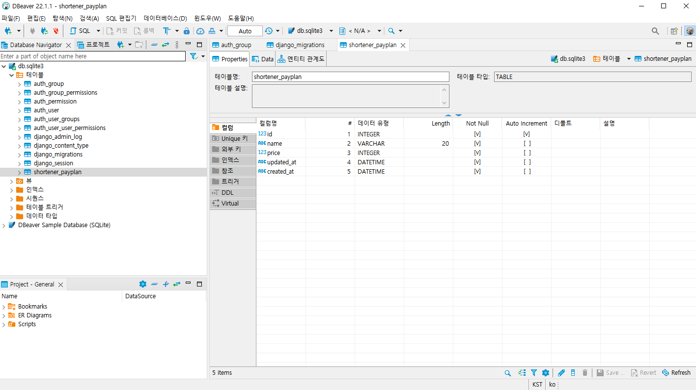

# Django 데이터베이스 모델링

### DB모델링이란? 

#### 어떤 Item에 속성 데이터를 사전에 정의하는 것 .

#### Jobs라는 Table에 각 Job의 정보

- 산업
- 연봉
- 근무지
- 수정일
- 생성일

### Django 에서는?

- Django에서 id는 기본 값(Primary Key) 정의하지 않아도 자동 정의
- 외래키(Foreign Key)를사용하면 뒤에 xxxx_id를 자동으로 생성
  - Job에 위치를 추가하고 싶은데 해당 위치가 다른 테이블에 있다면 location으로 정의해주면 location_id로 데이터 컬럼이 형성됨 

### Django DB 컬럼 타입

- CharField (길이가 정해진 문자열)
- IntegerField (-2147483648 ~ 2147483648)
- PositiveIntegerField
- BigIntegerField (-9223372036854775808 ~ 9223372036854775807)
- Positive BigIntegerField
- DateField(날짜)
- DatetimeField(날짜 + 시간)
- BooleanField (True/False)
- TextField(길이가 정해지지 않는 문자열)
- EmailField(이메일 포맷)
- JSONField (Json 포멧)
- AutoField (Auto Increment 필드 with IntegerField)
- BigAutoField(Auto Increment 필드 with BigInteger Field)
- ForeignKey (다른 테이블 PK 참조 필드)


### DB 모델링 해보기

| 컬럼(Users Table) | 데이터      |
| ----------------- | ----------- |
| pay_plan          | Foreign Key |

| 컬럼 (PayPlan) | 데이터        |
| -------------- | ------------- |
| id             | Big Integer   |
| name           | charfield     |
| price          | IntegerField  |
| updated_at     | DateTimeField |
| created_at     | DateTimeField |

```python
from django.db import models

# Create your models here.

from django.contrib.auth.models import User as U
from django.contrib.auth.models import AbstractUser

class PayPlan(models.Model) :
    name = models.CharField(max_length=20)
    price = models.IntegerField()
    updated_at = models.DateTimeField(auto_now=True)
    created_at = models.DateTimeField(auto_now_add=True)

#AbstractUser 상속받기 
class Users(AbstractUser) :
    pay_plan = models.ForeignKey(PayPlan, on_delete=models.DO_NOTHING)

#장고 내부 USER 모델에과 onetoeone 관계만들어서 detail 관리하기 
class UserDetail(models.Model) :
    user = models.OneToOneField(Users, on_delete=models.CASCADE)
    pay_plan = models.ForeignKey(PayPlan,on_delete=models.DO_NOTHING)
```

 

### CreateSuperUser

- 앱의 첫 슈퍼 유저 사용자를 만드는 방법

```
python manage.py createsuperuser
```


### DBeaver 설치

https://dbeaver.io/download/


