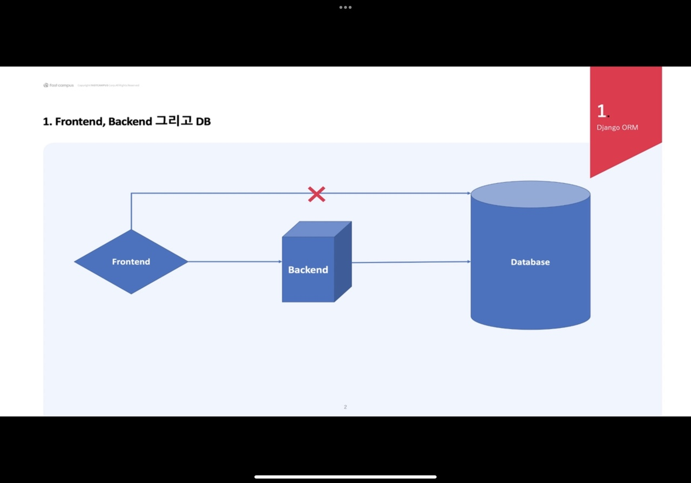
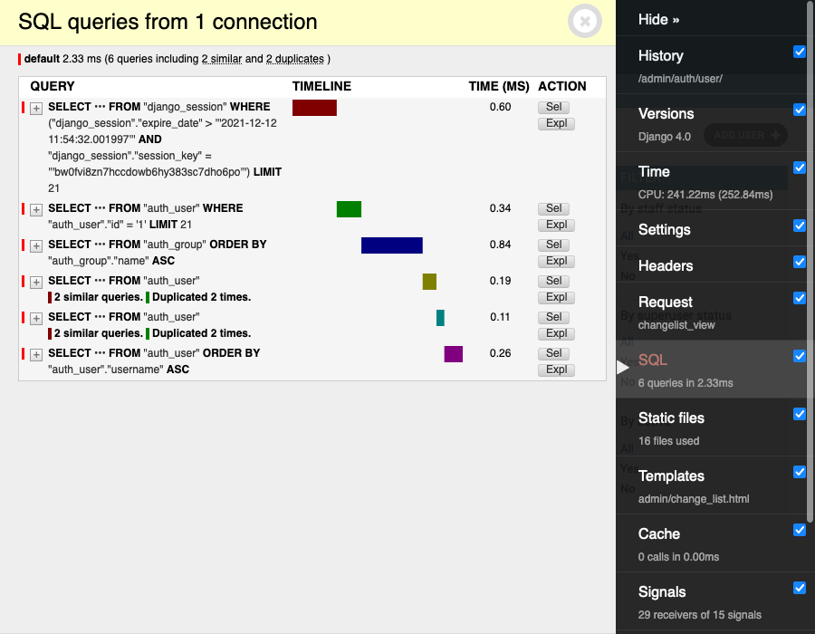
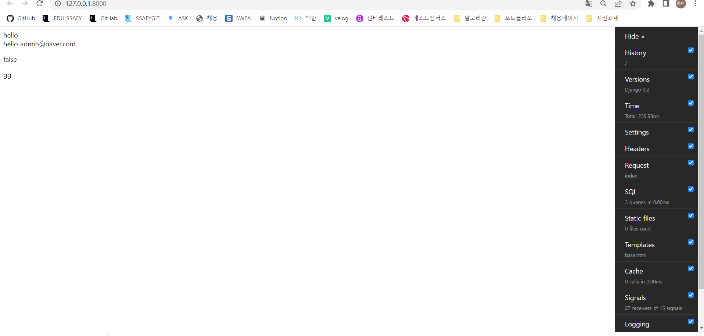

# Django ORM

## Frontend, Backend 그리고 DB



프론트엔드는 고객이나 사용자에게 보여지는 페이지이기 때문에 DB로 직접 접속할 수 없다. 

해당 프론트엔드는 엄연히 말하면, 모두가 노출되는 (Js, HTML, CSS)환경이기 때문에 DB와 직접 연결하면 민감정보 등이 노출될 가능성이 있다. 

따라서, backend를 통해 DB와 연결되고 있다. 

Backend는 비즈니스 로직도 처리하지만 Frontend와 Backend를 잇는 다리 역할을 할 수 있다. 

## ORM 이란?

#### Object Relational Mapping, 객체 -관계 매핑

- Python 객체와 관계형 데이터베이스 연결
- SQL 쿼리를 자동으로 생성함
- 데이터베이스 데이터 <- 매핑 -> Python Object
- 객체를 통해 간접적으로 데이터 베이스 핸들링
- Django ORM, SQLAlchemy, Pony

### ORM의 장점

- 직관적이다.
- SQL 학습 시간보다 Business Logic에 더 집중 할 수 있다.

- 가독성이 올라간다. (Zen of Python)

- 코드 재사용 및 유지보수가 수월하다.
- DBMS 종속성이 줄어든다. 
  - 다양한 SQL 환경에서도 같은 ORM으로 DB 작업을 할 수 있다.
- SQL Ingection을 막아준다. 

### ORM의 단점

- Raw쿼리가 필요한 구간이 반드시 있다.
- 프로젝트의 복잡도가 올라가면, ORM의 난이도도 올라간다.
- 프로시저 사용이 수월하지 않다. 


### Django ORM 문법 종류

.get()

.all()

.filter()

.save()

.delete()

.update()

.exists()

.first()

.count()

.select_related()

.prefetch_related()

.order_by()

### Django Debug Toolbar



#### Django debugtoolbar 사용을 위한 변경

```shell
pip install django-debug-toolbar==3.2.1
```

```python
#settings.py
INSTALLED_APPS = [
    'debug_toolbar', #Django Deubg Toolbar
]
INTERNAL_IPS = [
    "127.0.0.1", #해당 Ip에서만 Debug Toolbar가 작동함 
]#Django Deubg Toolbar
MIDDLEWARE = [
    'debug_toolbar.middleware.DebugToolbarMiddleware', #Django Deubg Toolbar
]
```

```python
#urls.py
import debug_toolbar

urlpatterns = [
     path("__debug__/", include(debug_toolbar.urls)),  # Django Debug Tool
]
```

### Debug toolbar 띄운 모습


