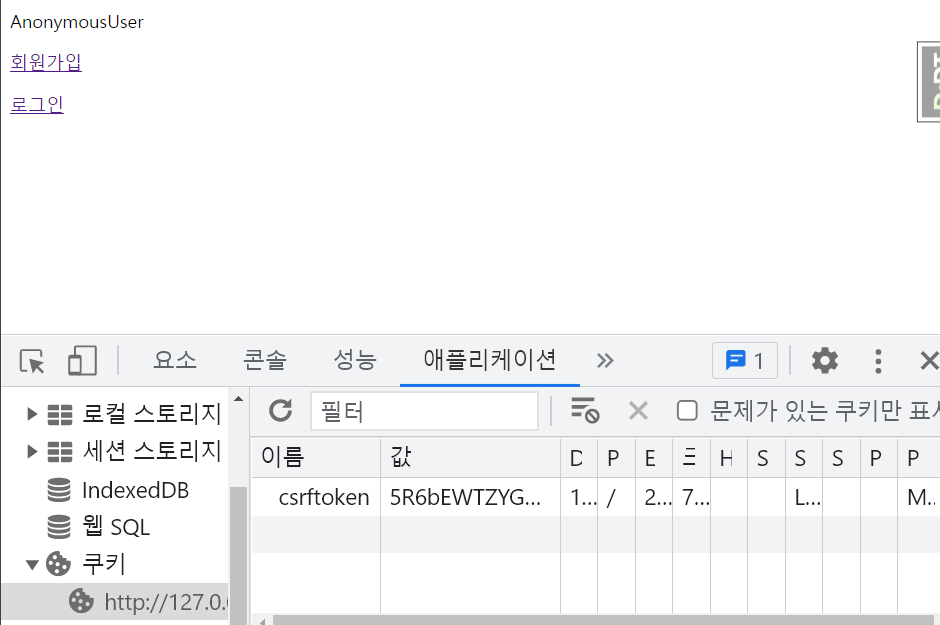

# Django CSRF

## CSRF(Cross Site Request Forgery)

#### 교차 사이트 요청 위조 공격 

- CSRF는 사이트간 위조 요청으로 사용자가 자신의 의지와 무관하게 공격자가 의도한 행위(CRUD)를 웹 사이트에 요청하게 하는 공격이다.
- 공격자는 웹사이트가 신뢰하고 있는 사용자 권한을 이용해 공격을 실행하며, 웹사이트 입장에서는 인증된 유저의 요청을 인가하기 때문에 공격에 노출된다. 

- 사용자가 의도하지 않게 게시판에 글을 작성하거나 쇼핑을 하게 하는 등의 공격으로 잘못된 사이트에서 접속만 해도 POST 요청이 전달될 수 있다.

### Django의 CSRF 방어

- Django의 CSRF 미들웨어 및 템플릿 태그는 CSRF 공격에 대한 사용하기 쉬운 보호 기능을 제공한다.
- Django는 CsrfViewMiddleware를 사용해 request 요청이 백엔드 서버로 전달되어 views에 도착하기 전에 CSRF token으로 확인한다. Token이 유효하지 않다면 403 에러를 발생시킨다. 

### csrf_token

- csrf token을 django template에서 입력하여 공격을 방어할 수 있다.
- 랜덤한 값을 사용자의 세션에 저장하고 모든 요청을 토큰을 통해 검증한다.

```django
<form action="" method="POST">
	
  <table>
    {{form.as_p}}
  </table> 
  <input type="submit">
</form>
```

#### 로그인


- Django의 기본 로그인은 session id를 통해서 로그인 여부를 확인한다.
- 로그아웃시 session id가 쿠키에서 삭제된다.

#### 로그아웃



##### session id 부여 로직

1. 유저가 웹사이트에 로그인
2. 웹사이트의 서버가 유저에게 session id를 부여
3. 유저의 브라우저가 이 session id를 cookie에 보관
4. 통신할때마다 session id를 웹서버에 전송(따라서 Django의 경우 request객체에 session id가 들어있음)
5. session id에 의해 웹사이트는 많은 접속 유저중 특정 유저를 인식할 수 있음

##### CSRFToken

- csrf token은 해당 페이지에서 요청을 한 것인지 외부 페이지에서 요청이 들어온 것인지 구분하는 역할을 한다.
- 따라서 위변조가 안되도록 도와준다.

### csrf_exempt

- Django 자체를 풀스택 프레임워크로 사용하지 않고, 백엔드 서버로 사용한다면 다양한 API를 만들 수 있다.
- 이 경우 API 서버는 access token,  JWT 등을 통해 인증 및 인가를 진행하기 때문에 CSRF 토큰을 사용하지 않아도 된다. 
- 하지만 기본적으로 미들웨어에서 CSRF에 대한 방어를 하기 때문에 403 에러를 마주할 수 있다.
- 따라서, 이를 해제하기 위해 csrf_exempt 데코레이터를 이용할 수 있다.

```python
from django.views.decorators.csrf import csrf_exempt

@csrf_exempt
def article_create(request):
    pass
```


#### 참고한 글

https://taptorestart.tistory.com/entry/Q-%EC%9E%A5%EA%B3%A0django%EC%97%90%EC%84%9C-post-put-delete-%EB%B0%A9%EC%8B%9D-%EC%82%AC%EC%9A%A9-%EC%9C%84%ED%95%B4%EC%84%9C-csrf-%EB%81%84%EB%8A%94-%EB%B0%A9%EB%B2%95%EC%9D%80

https://velog.io/@dooyeonk/Django-%EC%9D%B8%EC%A6%9D-%EC%9D%B8%EA%B0%80-%EA%B5%AC%ED%98%84%ED%95%98%EA%B8%B0

https://valuefactory.tistory.com/708

https://coding-nyan.tistory.com/124
