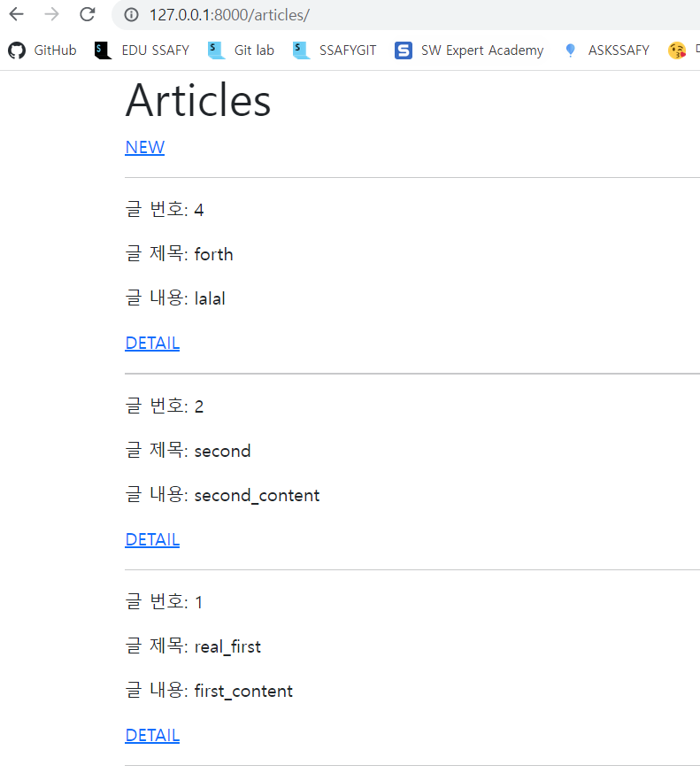
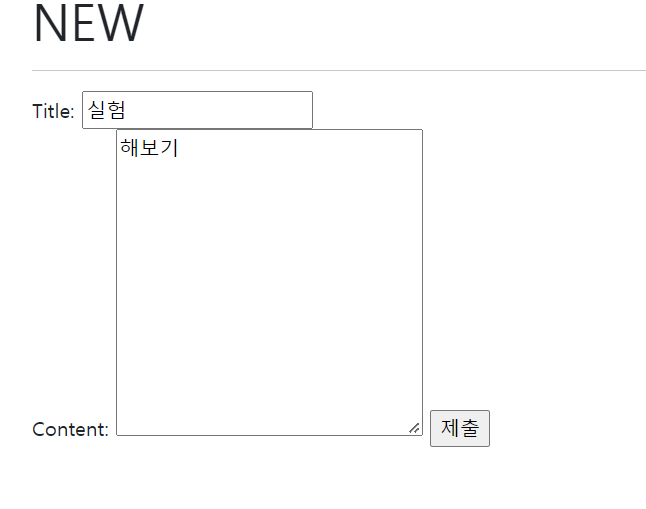
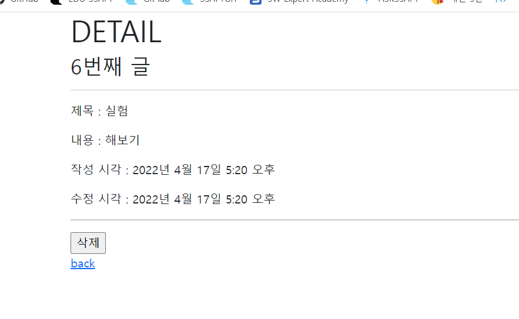

## Django CRUD

### CRUD

- 대부분의 컴퓨터 소프트웨어가 가지는 기본적인 데이터 처리 기능인 Create(생성), Read(읽기), Update(갱신), Delete(삭제)를 묶어서 일컫는 말 

### CRUD 실습

- 모델은 해당 모델로 가정 

```python
class Article(models.Model):
    title = models.CharField(max_length=10)
    content = models.TextField()
    created_at = models.DateTimeField(auto_now_add=True)
    updated_at = models.DateTimeField(auto_now=True)

    def __str__(self):
        return self.title
```

##### str method

- 위 모델 아래 정의된 `__str__` 에 관련된 설명
  - 표준 파이썬 클래스의 메소드인 str()을 정의하여 각각의 object가 사람이 읽을 수 있는 문자열을 반환하도록 할 수 있음
  - 작성후 반드시 shell_plus를 다시 실행해야 반영됨 ! 

### READ

```shell
#아티클 클래스의 모든 데이터 조회 
In [3]: Article.objects.all()
#쿼리셋 형태로 반환 
Out[3]: <QuerySet []>
```

### CREATE

- 데이터를 생성하고 저장하는 방법은 3가지가 있다.

#### 1. 인스턴스 생성 후 인스턴스 변수 설정 

```shell
#artilce 인스턴스 선언
article=Article()
#article의 제목은 first
In [5]: article.title='first'
#article의 내용은 first_content
In [6]: article.content='first_content'
#article 객체 조회 
In [7]: article
Out[7]: <Article: first>
#객체 저장 
In [9]: article.save()
#article 클래스의 데이터 조회 
In [10]: Article.objects.all()
Out[10]: <QuerySet [<Article: first>]>
```

#### 2. 초기 값과 함께 인스턴스 생성

```shell
#article에 제목과 내용 입력 
In [13]: article = Article(title='second',content='second_content')

In [14]: article
Out[14]: <Article: second>
#저장
In [15]: article.save()
#조회 
In [16]: Article.objects.all()
Out[16]: <QuerySet [<Article: first>, <Article: second>]>
```

#### 3. QuerySet API - create( ) 사용

```shell
Article.objects.create(title='third',content='third_content')
Out[17]: <Article: third>
```

#### 결과 확인


#### CREATE 관련 메서드

- save() method

  - Saving objects

  - 객체를 데이터베이스에 저장함

  - 데이터 생성 시 save()를 호출하기 전에는 객체의 ID 값이 무엇인지 알 수 없음

    - ID 값은 Django가 아니라 DB에서 계산되기 때문

  - 단순히 모델을 인스턴스화 하는 것은 DB에 영향을 미치지 않기 때문에 반드시 save()가 필요

    

### READ

- QuerySet API method를 사용해 다양한 조회를 하는 것이 중요
- QuerySet API method는 크게 2가지로 분류
  - Mehthods that return enw querysets
  - Methods that do not return querysets

- all()
  - 현재 QuerySet의 복사본을 반환

```shell
In [18]: Article.objects.all()
Out[18]: <QuerySet [<Article: first>, <Article: second>, <Article: third>]>
```

- get()
  - 주어진 lookup 매개변수와 일치하는 객체를 반환
  - 객체를 찾을 수 없으면 DoesNotExist 예외를 발생시키고, 둘 이상의 객체를 찾으면 MultipleObjectsReturned 예외를 발생 시킴
  - 위와 같은 특징을 가지고 있기 때문에 primary key와 같이 고유(unique)성을 보장하는 조회에서 사용해야 함

```shell
#100번째 pk값을 반환 
In [19]: article = Article.objects.get(pk=100)
DoesNotExist: Article matching query does not exist.
#내용이 first_content인 객체를 반환 
In [21]: Article.objects.get(content='first_content')
Out[21]: <Article: first>
#내용이 first인 객체를 반환 
IN [20]: Article.objects.get(content='first')
DoesNotExist: Article matching query does not exist.
```

- filter()
  - 주어진 lookup 매개변수와 일치하는 객체를 포함하는 새 QuerySet을 반환

```shell
In [25]: Article.objects.filter(content='first_content')
Out[25]: <QuerySet [<Article: first>]>
```


### UPDATE

- article 인스턴스 객체의 인스턴스 변수의 값을 변경 후 저장 

```shell
In [26]: article = Article.objects.get(pk=1)

In [27]: article.title = 'real_first'

In [28]: article.save()

In [29]: article.title
Out[29]: 'real_first'
```


### DELETE

- delete()
  - QuerySet의 몯느 행에 대해 SQL 삭제 쿼리를 수행하고, 삭제된 수와 객체 유형당 삭제 수가 포함된 딕셔너리를 반환

```shell
In [30]: article = Article.objects.get(pk=3)

In [31]: article.delete()
Out[31]: (1, {'articles.Article': 1})
```


### Field lookups

- 조회 시 특정 검색 조건을 지정
- QuerySet 메서드 filter(), exclude() 및 get()에 대한 키워드 인수로 지정됨
- 사용예시
  - Article.objects.filter(pk__gt=2)
  - Article.objects.filter(content__contains='d')\

```shell
#pk가 1보다 큰 객체들 쿼리셋으로 조회 
In [34]: Article.objects.filter(pk__gt=1)
Out[34]: <QuerySet [<Article: second>, <Article: forth>]>
#content가 들어있는 객체들 쿼리셋으로 조회 
In [37]: Article.objects.filter(content__contains='content')
Out[37]: <QuerySet [<Article: real_first>, <Article: second>]>
```

#### QuerySet API 학습

- 데이터베이스 조작을 위한 다양한 QuerySet API methods는 공식문서를 참고

https://docs.djangoproject.com/ko/4.0/ref/models/querysets/#queryset-api-reference


## CRUD with views

### READ

- url 설정

```python
app_name = 'articles'
urlpatterns = [
    path('', views.index, name='index'),
]
```

- view 함수 작성

```python
def index(request):
    # 전체 게시글 조회(오름차순)
    # articles = Article.objects.all()

    # 전체 게시글 조회(내림차순 1, python으로 조작)
    # articles = Article.objects.all()[::-1]
    
    # 전체 게시글 조회(내림차순 2, DB가 조작)
    articles = Article.objects.order_by('-pk')

    # 조회해서 할당한 쿼리셋 데이터를 context로 넘김
    context = {
        'articles': articles,
    }
    return render(request, 'articles/index.html', context)
```

- templates 작성

```django

  <h1>Articles</h1>
  <a href="">NEW</a>
  <hr>
  
    <p>글 번호: {{ article.pk }}</p>  
    <p>글 제목: {{ article.title }}</p>
    <p>글 내용: {{ article.content }}</p>
    <a href="">DETAIL</a>
    <hr>
  

```

- 결과 확인 

```shell
python manage.py runserver
```



### CREATE

- url 설정

```python
app_name = 'articles'
urlpatterns = [
    path('', views.index, name='index'),
    path('new/', views.new, name='new'),
    path('create/', views.create, name='create'),
]
```

- view 함수 작성

```python
def new(request):
    return render(request, 'articles/new.html')


def create(request):
    title = request.POST.get('title')
    content = request.POST.get('content')

    # 1
    # article = Article()
    # article.title = title
    # article.content = content
    # article.save()

    # 2
    article = Article(title=title, content=content)
    article.save()

    # 3
    # Article.objects.create(title=title, content=content)

    # return redirect('/articles/')
    return redirect('articles:detail', article.pk)
```

- templates 작성

```django
#new.html




  <h1>NEW</h1>
  <hr>
  <form action="" method="POST">
    
    <label for="title">Title: </label>
    <input type="text" id="title" name="title"><br>
    <label for="content">Content: </label>
    <textarea name="content" id="content" cols="30" rows="10"></textarea>
    <input type="submit">
  </form>


#create.html



  <h1>성공적으로 글이 작성되었습니다.</h1>


```

- 결과 확인 




