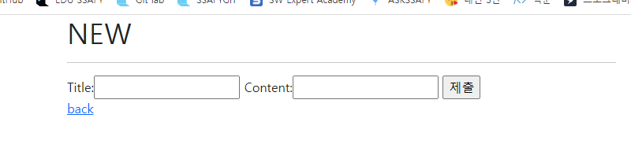
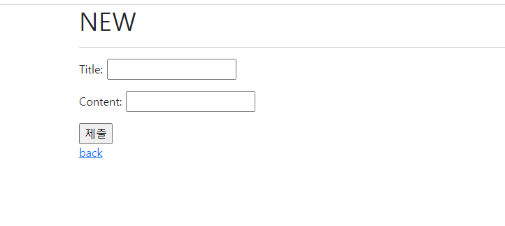
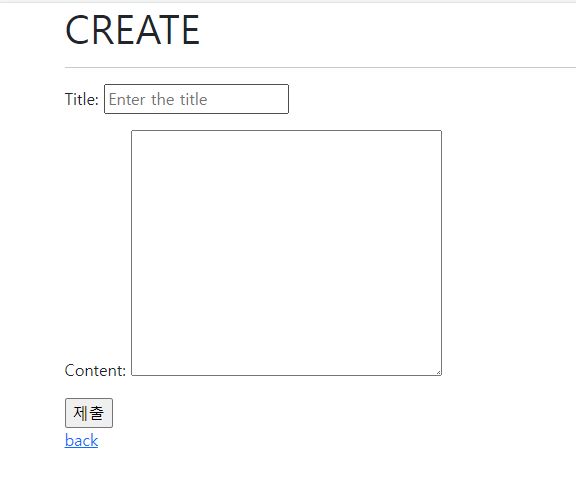

## Django_form_class


### Intro

- 우리는 지금까지 HTML form, input을 통해서 사용자로부터 데이터를 받음
- 이렇게 직접 사용자의 데이터를 받으면 입력된 데이터의 유효성을 검증하고, 필요시에 입력된 데이터를 검증 결과와 함께 다시 표시해야 함 
  - 사용자가 입력한 데이터는 개발자가 요구한 형식이 아닐 수 있음을 항상 생각해야 함
- 이렇게 사용자가 입력한 데이터를 검증하는 것을 '유효성 검증'이라고 하는데, 이 과정을 코드로 모두 구현하는 것은 많은 노력이 필요한 작업임
- Django는 이러한 과중한 작업과 반복 코드를 줄여줌으로써 이 작업을 훨씬 쉽게 만들어줌


### Django's forms

- Form은 Django의 유효성 검사 도구 중 하나로 외부의 악의적 공격 및 데이터 손상에 대한 중요한 방어 수단
- Django는 Form과 관련한 유효성 검사를 단순화 하고 자동화 할 수 있는 기능을 제공하여 개발자로 하여금 직접 작성하는 코드보다 더 안전하고 빠르게 수행 하는 코드를 작성할 수 있게 함
- Django는 form에 관련된 작업의 아래 세 부분을 처리해 줌 
  - 렌더링을 위한 데이터 준비 및 재구성
  - 데이터에 대한 HTML form 생성
  - 클라이언트로부터 받은 데이터 수신 및 처리

###  The Django 'Form Class'

- Django Form 관리 시스템의 핵심
- Form 내 field, field 배치, 디스플레이 widget, label, 초기값, 유효하지 않는 field에 관련된 에러메시지를 결정
- Django는 사용자의 데이터를 받을 때 해야 할 과중한 작업(데이터 유효성 검증, 필요시 입력된 데이터 검증 결과 재출력, 유효한 데이터에 대해 요구되는 동작 수행 등 )과 반복 코드를 줄여 줌 


### Form 선언하기

```python
#forms.py
from django import forms

class ArticleForm(forms.Form) :
    # Models.py와 유사한 구조 (form 클래스를 상속받음)
    title = forms.CharField(max_length=10)
    #글자는 10글자로 고정 
    content = forms.CharField()
```

- Model을 선언하는 것과 유사하며 같은 필드타입을 사용(또한, 일부 매개변수도 유사함)
- forms 라이브러리에서 파생된 Form 클래스를 상속받음

```python
#new.html
  <h1>NEW</h1>
  <hr>
  <form action="" method="POST">
    
    {{form}}
    <input type="submit">
  </form>
  <a href="">back</a>
```

```python
#views.py new함수
def new(request):
    form = ArticleForm()
    context = {
        'form' : form,
    }
    return render(request, 'articles/new.html',context)
```

- Form의 정렬이나 옵션을 자유롭게 생성할 수 없는 문제 발생 

### Form rendering options

1. as_p()

   - 각 필드가 단락(\<p>태그로 감싸져서 렌더링 됨 )

2. as_ul()

   - 각 필드가 목록 항목(\<li> 태그)로 감싸져서 렌더링 됨 
   - \<ul> 태그는 직접 작성해야함 

3. as_table()

   - 각 필드가 테이블(\<tr> 태그)행으로 감싸져서 렌더링 됨
   - \<table> 태그는 직접 작성해야함 

   

#### as_p 적용 전



#### as_p 적용 후 



### Django의 HTML 요소 표현 방법 2가지

1. Form fields
   - input에 대한 유효성 검사 로직을 처리하여 템플릿에 직접 사용됨
2. Widgets
   - 웹 페이지의 HTML input 요소 렌더링
   - GET/POST 딕셔너리에서 데이터 추출
   - widgets은 반드시 Form fields에 할당 됨 

#### Widgets

- Django의 HTML input element 표현
- HTML 렌더링 처리
- 주의사항
  - Form Fields와 혼동되어서는 안됨
  - Form Fields는 input 유효성 검사를 처리
  - Widgets은 웹페이지에서  input element의 단순한 raw한 렌더링 처리 

```python
from django import forms

class ArticleForm(forms.Form) :
    # Models.py와 유사한 구조 (form 클래스를 상속받음)
    title = forms.CharField(max_length=10)
    #Textarea 위젯 사용 ! 
    content = forms.CharField(widget=forms.Textarea)
```

#### SELECT 만들기

```python
from django import forms

class ArticleForm(forms.Form) :
    REGION_A = 'sl'
    REGION_B = 'dj'
    REGION_C = 'bs'

    REGIONS_CHOICES = [
        (REGION_A, '서울'),
        (REGION_B, '대전'),
        (REGION_C, '광주')
    ]

    # Models.py와 유사한 구조 (form 클래스를 상속받음)
    title = forms.CharField(max_length=10)
    content = forms.CharField(widget=forms.Textarea)
    # select 태그 만들기 
    region = forms.ChoiceField(choices = REGIONS_CHOICES, widget = forms.Select())
```


### Model Form Intro

- Django Form을 사용하다 보면 Model에 정의한 필드를 유저로부터 입려받기 위해 Form에서 Model 필드를 재정의하는 행위가 중복될 수 있음
- 그래서 Django는 Model을 통해 Form Class를 만들 수 있는 Model Form이라는 helper를 제공

### Model Form Class

- Model을 통해 Form Class를 만드는 Helper
- 일반 Form Class와 완전히 같은 방식(객체 생성)으로 view에서 사용 가능 

```python
#기존의 Form을 ModelForm으로 변경
class ArticleForm(forms.ModelForm) :
    class Meta :
        model = Article
        fields = '__all__'
        #exclude = ('title',)
```

- forms 라이브러리에서 파생된 ModelForm 클래스를 상속받음
- 정의한 클래스 안에 Meta 클래스를 선언하고, 어떤 모델을 기반으로 Form을 작성할 것인지에 대한 정보를 Meta 클래스에 저장
- exclude는 필드가 여러가지일때 제외하고 싶은 필드가 있으면 exclude에 넣어서 제거한다. 
- 주의사항은 fields와 exclude를 한 번에 쓸 수 는 없고 둘 중 하나만 써야한다. 

#### Model Form 사용 이유

- 모델로 만들어진 테이블 필드 속성에 맞는 HTML element를 만들어준다.
- 이를 통해 받은 데이터를 view 함수에서 유효성 검사를 할 수 있도록 도와준다. 


### Meta class 

- Model의 정보를 작성하는 곳
-  ModelForm을 사용할 경우 사용할 모델이 있어야 하는데 Meta Class가 이를 구성함
  - 해당 Model에 정의한 field 정보를 Form에 적용하기 위함
- Inner Class(Nested Class)
  - 클래스 내부에 선언된 다른 클래스
  - 관련 클래스를 함께 그룹하하여 가독성 및 프로그램 유지 관리를 지원 (논리적으로 묶어서 표현)
  - 외부에서 내부 클래스에 접근할 수 없으므로 코드의 복잡성 줄임
- META 데이터
  - 데이터에 대한 데이터

##### tip

- 회원가입은 DB에 저장해야하니까 ModelForm 사용
- 로그인은 정보만 받으면 되니까 Form 사용

### Create 수정

```python
def create(request):
    form = ArticleForm(request.POST)
    #form에서 전달한 데이터가 유효하면 저장하고 detail을 redircet해라
    if form.is_valid() :
        # form.save()를 하면 생성된 객체를 리턴한다.
        article = form.save()
        return redirect('articles:detail',article.pk)
    #유효하지 않으면 에러를 출력하고 new로 돌아감
    print(form.errors)
    return redirect('articles:new')
    # title = request.POST.get('title')
    # content = request.POST.get('content')

    # article = Article(title=title, content=content)
    # article.save()

    # return redirect('articles:detail', article.pk)
```

- 유효성 검사를 하면 아무래도 model 자체에 설정된 기준을 바탕으로 검사를 하는 것 같다. 

### is_valid\() method

- 유효성 검사를 실행하고, 데이터가 유효한지 여부를 Boolean으로 반환
- 데이터 유효성 검사를 보장하기 위한 많은 테스트에 대해 Django는 is_valid\()를 제공

- 유효성 검사
  - 요청한 데이터가 특정 조건에 충족하는지 확인하는 작업
  - 데이터베이스 각 필드 조건에 올바르지 않은 데이터가 서버로 전송되거나 저장되지 않도록 하는 것

### The save\() method

- Form에 바인딩 된 데이터에서 데이터베이스 객체를 만들고 저장
- ModleForm의 하위(sub)클래스는 기존 모델 인스턴스를 키워드 인자 instance로 받아 들일 수 있음 
  - 이것이 제공되면 save\()는 해당 인스턴스를 수정 (UPDATE)
  - 제공되지 않은 경우 save()는 지정된 모델의 새 인스턴스를 만듬(CREATE)
- Form의 유효성이 확인되지 않은 경우 (hasn't been validated) save()를 호출하면 form.errors를 확인하여 에러 확인 가능 

### CREATE, NEW 함수 합치기

```python
def create(request):
    if request.method == 'POST' :

        form = ArticleForm(request.POST)
        #form에서 전달한 데이터가 유효하면 저장하고 detail을 redircet해라
        if form.is_valid() :
            # form.save()를 하면 생성된 객체를 리턴한다.
            article = form.save()
            return redirect('articles:detail',article.pk)
        #유효하지 않으면 다시 new로 가라 
        # title = request.POST.get('title')
        # content = request.POST.get('content')

        # article = Article(title=title, content=content)
        # article.save()

        # return redirect('articles:detail', article.pk)
    elif request.method == 'GET' :

        form = ArticleForm()
    context = {
        'form' : form,
    }
    # 유효성 검사를 통과하지 못하면 form은 에러메시지를 담고 있다. 그래서 에러메시지를 출력한다. 
    return render(request, 'articles/create.html',context)

```

- 현재 두 함수는 '생성'이라는 기능을 하기위해 만들어졌는데, 이 두개를 합치려면 호출이 POST로 들어오나 GET으로 들어오는지 구분해서 합칠 수 있다. 
- POST이면 들어온 정보에 대해 유효성 검사 후 통과하면 detail로 간다
- 유효성검사를 통과하지 못하면 에러메시지를 담아서 보여준다 
  - save() 메소드를 들어가보면 객체를 save를 하고 그 객체를 return한다.  
- GET이면 form을 생성하는 create.html로 이동한다. 

### Edit, UPDATE 함수 합치기

```python
def update(request, pk):
    article = Article.objects.get(pk=pk)
    if request.method == 'POST' : 
        # instacne=article을 안써주면 새로운 글을 만든다. 
        form = ArticleForm(request.POST,instance=article)
        if form.is_valid() :
            article=form.save()
            return redirect('articles:detail', article.pk) 
    elif request.method == 'GET' :
        # 기존 정보를 받아서 update.html을 표시하기 
        form = ArticleForm(instance=article)
    context = {
        'article' : article,
        'form': form
    }
    return render(request, 'articles/update.html', context)
```

- instance=article은 기존의 정보를 가져와서 화면에 표시해준다는 의미이다.
- update를 할 때 기존 정보가 없으면 새로운 글을 작성한다. 

POST를 if문 첫번째로 사용하는 이유는 POST는 DB와 관련이 있기 때문에 POST로 들어올 때만 DB에 접근하도록 하기 위해서이다 

### Forms.py파일 위치

- form class는 forms.py뿐만 아니라 다른 어느 위치에 두어도 상관 없다.
- 하지만 일반적으로 app폴더/forms.py에 작성하는 것이 일반적이다. 

### Form & Model Form 비교

- Form
  - 어떤 Model에 저장해야 하는지 알 수 없으므로 유효성 검사 이후 cleaned_data 딕셔너리 생성
  - cleaned_data 딕셔너리에서 데이터를 가져온 후 .save()호출해야 함
  - Model에 연관되지 않은 데이터를 받을 때 사용
- ModelForm
  - Django가 해당 model에서 양식에 필요한 대부분의 정보를 이미 정의
  - 어떤 레코드를 만들어야할지 알고 있으므로 바로 .save()호출 가능 

### Widgets 활용하기

- Django의 HTML input element 표현
- HTML 렌더링 처리
- 2가지 작성방법이 있다.

1. 메타 클래스 내부

   권장하지 않음

2. 메타 클래스 상위를 권장

```python
class ArticleForm(forms.ModelForm) :
    # 장고 모델을 참고해서 form을 만들어줌 
    
    # input에 속성을 넣으려면 widget 내부 attribute에 작성을 해야한다.
    title = forms.CharField(
        widget=forms.TextInput(
            # attributes
            attrs = {
                'class' : 'my-title',
                'placeholder':'Enter the title',

            }
        )
    )
    class Meta :
        model = Article
        # 전체 필드 출력하는 __all__
        fields = '__all__'
        #exclude = ('title',)
```



```python
class ArticleForm(forms.ModelForm) :
    # 장고 모델을 참고해서 form을 만들어줌 
    
    # input에 속성을 넣으려면 widget 내부 attribute에 작성을 해야한다.
    title = forms.CharField(
        widget=forms.TextInput(
            # attributes
            attrs = {
                'class' : 'my-title',
                'placeholder':'Enter the title',

            }
        )
    )
    content = forms.CharField(
        widget = forms.Textarea(
            attrs={
                'class' : 'my-content',
                'placeholder' :'Enter the content',

            }
        ),
        error_messages={
            'required' : 'Please enter your content!!!!!',
        }
    )
```


### Create Update html 합치기

- request.resolver_match를 html 내부에 변수로 입력하면

```django
ResolverMatch(func=articles.views.create, args=(), kwargs={}, url_name=create, app_names=['articles'], namespaces=['articles'], route=articles/create/)
```

- 이렇게 매칭된 결과를 볼 수 있다.
- Create와 update는 이전 데이터가 있으면서 그 인스턴스를 수정하는 것인지 새로 생성한는 것인지의 차이로 html이 거의 동일하게 구성되어 있다.
- 따라서, form.html에 해당 html 두가지를 모두 구성할 수 있게 변경한다.

- request.resolver_math.url_name을 통해 구분하도록 한다.

```django

 url이 create이면  
  
    <h1>CREATE</h1>
  
   edit이면  
    <h1>EDIT</h1>
  
  <hr>

  <form action="" method="POST">
    
    
     {{form.as_p}} 
    <input type="submit">
  </form>

  
   url이 crate면 메인으로 가는 back 만들기 
  <a href="">back</a>
  
  <a href="">Home</a>
  <a href="">back</a>
  


```

