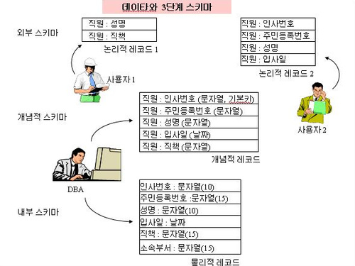
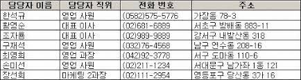
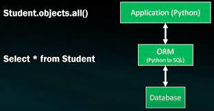
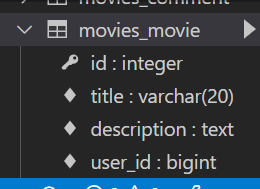
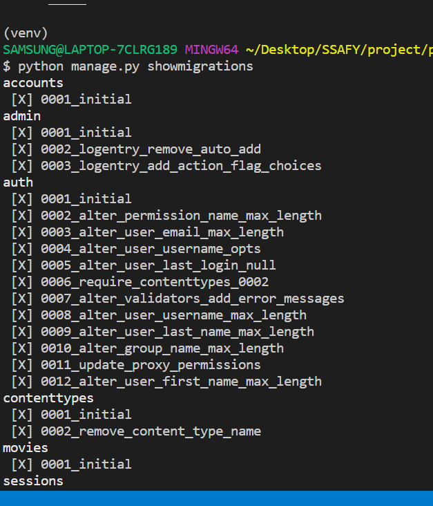

## Django Model

### Model

- 단일한 데이터에 대한 정보를 가짐
  - 사용자가 저장하는 데이터들의 필수적인 필드들과 동작들을 포함
- 저장된 데이터베이스의 구조
- Django는 model을 통해 데이터에 접속하고 관리
- 일반적으로 각각의 model은 하난의 데이터베이스 테이블에 매핑 됨

### Database

- 데이터베이스
  - 체계화된 데이터의 모임
- 쿼리
  - 데이터를 조회하기 위한 명령어
  - 조건에 맞는 데이터를 추출하거나 조작하는 명령여
  - "Query를 날린다." -> DB를 조작한다!

#### Database의 기본 구조

- 스키마 
  - 데이터베이스에서 자료의 구조, 표현방법, 관계 등을 정의한 구조 (structure)
  - 즉, 데이터베이스의 구조와 제약 조건(자료의 구조, 표현방법, 관계)에 관련한 전반적인 명세를 기술한 것 



- 테이블

  - 열(column) : 필드(field) or 속성
    - 각 열에는 고유한 데이터 형식이 지정된다. (INTEGER, TEXT, NULL)

  - 행(row) : 레코드(record) or 튜플
    - 테이블의 데이터는 행에 저장된다. 즉, 근무자 테이블에 7명의 근무자 정보가 저장되어잇으며 7개의 행이 존재한다.

  - 즉, 열과 행의 모델을 사용해 조직된 데이터 요소들의 집합. SQL 데이터베이스에서는 테이블을 **관계**라고도 한다.



- PK
  - 각 행의 고유값으로 Primary Key가 있다.
  - PK는 반드시 설정하여야하며, 데이터베이스 관리 및 관계 설정시 주요하게 활용된다.
  - Framework를 사용하면 Model을 만들 때 자동으로 PK를 만들어주는 경우가 있다.

#### Model

- 웹 애플리케이션의 데이터를 구조화하고 조작하기 위한 도구 


### ORM

- Object-Relational-Mapping
- 객체 지향 프로그래밍 언어를 사용하여 호환되지 않는 유형의 시스템간 (Django-SQL)데이터를 변환하는 프로그래밍 기술
- OOP 프로그래밍에서 RDBMS를 연동할 때 , 데이터베이스와 객체 지향 프로그래밍 언어간의 호환되지 않는 데이터를 변환하는 프로그래밍 기법
- Django는 내장 Django ORM을 사용함



#### ORM의 장점과 단점

- 장점 
  - SQL을 잘 알지 못해도 DB 조작이 가능
  - SQL의 절차적 접근이 아닌 객체 지향적 접근으로 인한 높은 생산성
- 단점
  - ORM 만으로 완전한 서비스를 구현하기 어려운 경우가 있음
- **현대 웹 프레임워크의 요점은 웹 개발의 속도를 높이는 것**


#### ORM 사용 이유 : DB를 객체로 조작하하기 위함


### Migrations

- Django가 model에 생긴 변화를 반영하는 방법

#### Migrations Commands

- Migration 실행 및 DB 스키마를 다루기 위한 몇가지 명령어
- makemigrations
  - model을 변경한 것에 기반한 새로운 마이그레이션(설계도)를 만들 때 사용
- migrate
  - 마이그레이션을 DB에 반영하기 위해 사용
  - 설계도를 실제 DB에 반영하는 과정
  - 모델에서의 변경 사항들과 DB의 스키마가 동기화를 이룸
- sqlmigrate
  - 마이그레이션에 대한 SQL 구문을 보기 위해 사용 
  - 마이그레이션이 SQL 문으로 어떻게 해석되어서 동작할지 미리 확인할 수 있음
- showmigrations
  - 프로젝트 전체의 마이그레이션 상태를 확인하기 위해 사용
  - 마이그레이션 파일들이 migrate 됐는지 안됐는지 여부를 확인할 수 있음

### Migration 해보기 

#### models.py 작성

```python
class Movie(models.Model) :
    title = models.CharField(max_length=10)
    description = models.TextField()
```

- 각 모델은 django.models.Model 클래스의 서브 클래스로 표현됨
  - django.db.models 모듈의 Model 클래스를 상속받음
- model 모듈을 통해 어떠한 타입의 DB 컬럼을 정의할 것인지 정의
  - title과 content는 모델의 필드를 나타냄
  - 각 필드는 클래스 속성으로 지정되어 있으며, 각 속성은 각 데이터베이스의 열에 매핑

#### 모델 필드

- CharField (max_length = None, **options)

  - 길이의 제한이 있는 문자열을 넣을 때 사용
  - CharField의 max_length는 필수 인자
  - 필드의 최대 길이(문자), 데이터베이스 레벨과 Django의 유효성 검사에서 활용

- TextField(**options)

  - 글자의 수가 많을 때 사용
  - max_length 옵션 작성 시 자동 양식 필드인 textarea 위젯에 반영은 되지만 모델과 데이터베이스 수준에는 적용되지 않음
    - max_length 사용은 CharField에서 사용해야함

- DateFields

  - auto_now_add

    - 최초 생성 일자
    - Django ORM이 최초 insert시에만 현재 날짜와 시간으로 갱신(테이블에 어떤 값을 최초로 넣을 때)

  - auto_now

    - 최종 수정 일자

    - Django ORM이 save를 할 때마다 현재 날짜와 시간으로 갱신 

```
$ python manage.py makemigrations
```

- 'migrations/0001_initial.py' 생성 확인

```
$ python manage.py migrate
```

- 0001_initial.py 설계도를 실제 DB에 반영

- 실제 DB table 확인을 위해 sqlite3 확인



```
$ python manage.py sqlmigrate app_name 0001
```

- 해당 migrations 설계도가 SQL 문으로 어떻게 해석되어서 동작할지 미리 확인 할 수 있음

```
BEGIN;
--
-- Create model Movie
--
CREATE TABLE "movies_movie" ("id" integer NOT NULL PRIMARY KEY AUTOINCREMENT, "title" varchar(20) NOT NULL, "description" text NOT NULL, "user_id" bigint NOT NULL REFERENCES "accounts_user" ("id") DEFERRABLE INITIALLY DEFERRED);
--
-- Create model Comment
```

##### showmigrations

```
python manage.py showmigrations
```

- migrations 설계도들이 migrate 됐는지 안됐는지 여부를 확인 할 수 있음




### Database API

- DB를 조작하기 위한 도구
- Django가 기본적으로 ORM을 제공함에 따른 것으로 DB를 편하게 조작할 수 있도록 도움
- Model을 만들면 Django는 객체들을 만들고 읽고 수정하고 지울 수 있는 database-abstract API를 자동으로 만듬
- database-abstract API 혹은 database-access API라고도 함 

#### DB API 구문 - Making Queries

- ex) Article은 Class명, objects는 Manager, all()은 QuerySet API

```python
Article.Objects.all()
```

- Manager
  - Django 모델에 데이터베이스 Query 작업이 제공되는 인터페이스
  - 기본적으로 모든 Django 모델 클래스에 objects라는 Manager를 추가
- QuerySet
  - 데이터베이스로부터 전달받은 객체 목록
  - queryset 안의 객체는 0개, 1개 혹은 여러 개일 수 있음
  - 데이터베이스로부터 조회, 필터, 정렬 등을 수행 할 수 있음

#### Django shell

- 일반 Python shell을 통해서는 장고 프로젝트 환경에 접근할 수 없음
- 그래서 장고 프로젝트설정이 load된 Python shell을 활용해 DB API구문 테스트 진행
- 기본 Django shell보다 더 많은 기능을 제공하는 Shell_plus를 사용해서 진행 
  - django-extension 설치 필요 
