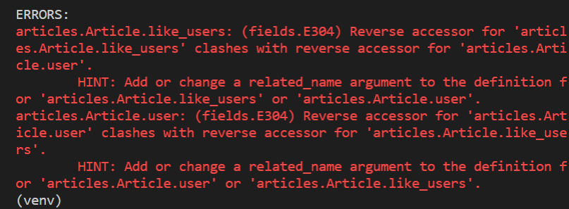
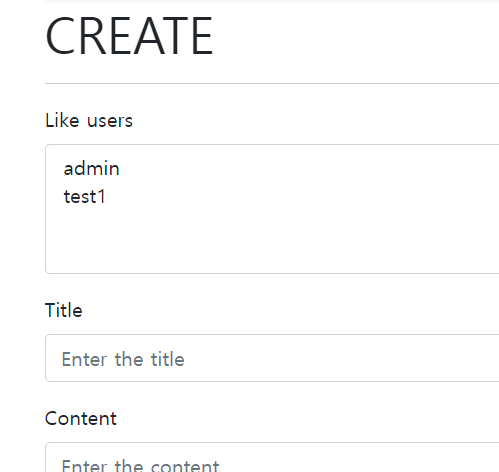
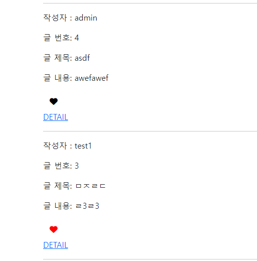
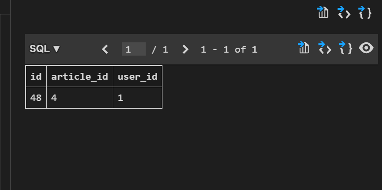
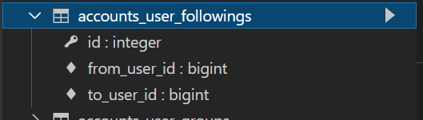

## Relation

### Like 구현하기

- 여러 유저가 한 Article에 좋아요를 누를 수 있고, 한 유저가 여러 Article에 좋아요를 누를 수 잇다.

#### model 구성

```python
class Article(models.Model):
    user = models.ForeignKey(settings.AUTH_USER_MODEL,on_delete=models.CASCADE)
    like_users = models.ManyToManyField(settings.AUTH_USER_MODEL)
    title = models.CharField(max_length=10)
    content = models.TextField()
```



- error 발생 원인
  - user와 접근과 like_user의 접근이 겹쳤기 때문
  - user : Article이 1:N 관계일 때 참조 역참조를 article.user.all(), user.article_set.all()로 진행할 수 있었다.
  - 하지만 이번 like와 진행할 때 고려해보면 User : Article이 M:N관계이다. 그렇다면 참조를 article.like_user.all(),  **user.article_set.all()**로 역참조가 겹치는 문제가 발생한다.
  - 따라서 하나의 필드에 relate_name을 설정해줘서 문제를 해결해야한다. 일반적으로 M:N관계 모델에 이를 설정해준다. 

#### model 수정

```python
class Article(models.Model):
    user = models.ForeignKey(settings.AUTH_USER_MODEL,on_delete=models.CASCADE) like_users=models.ManyToManyField(settings.AUTH_USER_MODEL,related_name='like_articles')
    title = models.CharField(max_length=10)
    content = models.TextField()
```

#### 현재 User - Article 간 사용 가능한 DB API

- article.user
  - 게시글을 작성한 유저 - 1:N
- article.like_users
  - 게시글을 좋아요 한 유저 - M:N 
- user.article_set
  - 유저가 작성한 게시글(역참조) - 1:N

- user.like_articles
  - 유저가 좋아요한 게시글(역참조) - M:N

#### url 작성

```python
app_name = 'articles'
urlpatterns = [
    path('', views.index, name='index'),
    path('<int:article_pk/likes/', views.likes, name='likes'),
]

```

#### views 작성

```python
def likes(request,article_pk) :
    #어떤 객체에 좋아요가 눌렸는지 확인
    article = get_object_or_404(Article, pk=article_pk)
    #누르는게 무조건 좋아요를 활성화하는 것은 아님 좋아요를 2번 누르면 취소되게 구현할 수 있음
    
    #이 게시글에 좋아요를 누른 유저 목록에 현재 요청하는 유저가 있다면 좋아요 취소 
    if request.user in article.like_users.all() : 
        article.like_users.remove(request.user)
    #아니면 좋아요
    else :
        article.like_users.add(request.user)
    
    return redirect('articles:index')
```

#### views 작성2 

```python
def likes(request,article_pk) :
    article = get_object_or_404(Article, pk=article_pk)
        if article.like_users.filter(pk=request.user.pk).exists() :
        article.like_users.remove(request.user)
    else :
        article.like_users.add(request.user)
    
    return redirect('articles:index')
```

#### QuerySet API - 'exists()'

- QuerySet에 결과가 포함되어 있으면 True를 반환하고 그렇지 않으면 False를 반환
- 특히 규모가 큰 QuerySet의 컨텍스트에서 특정 개체 존재 여부와 관련된 검색에 유용
- 고유한 필드(예 : PK)가 있는 모델이 QuerySet의 구성원인지 여부를 찾는 가장 효율적인 방법 
- Queryset이 커졌을 대 in 연산자보다 더 효율적인 효과를 보인다. 

#### 좋아요 버튼 만들기

```django
<form action="" method='POST'>
    
    <input type="submit">
</form>
```

#### 서버 실행



- 좋아요를 누를 유저를 선택할 수 있는 문제가 발생 
  - ArticleForm에서 exclude를 조정

```python
    class Meta :
        model = Article
        exclude = ('user','like_users',)
```

- 좋아요 버튼을 추가 

```django
    <div>
      <form action="" method='POST'>
        
        
        <button class="btn" style="background-color : transparent;">
          <i class="fa regular fa-heart" style="color:red"></i>
        </button>
        
        <button class="btn" style="background-color : transparent;">
          <i class="fa regular fa-heart" style="color:black" ></i>
        </button>
        
      </form>
    </div>
```



#### 좋아요 누른 후 테이블




### Profile Page 작성

- 자연스러운 follow 흐름을 위한 회원 프로필 페이지 작성하기 

#### url 작성

```python
urlpatterns = [
    path('<username>/', views.profile, name='profile')
]
```

- username을 사용할 때 주의사항 
  - username을 맨 위로 올리면 문제가 발생한다 
  - username은 문자열이고 아래에 url도 문자열들이기 때문에 다 맨 위 url에 걸린다. 
  - variable routing이 문자열일 때 가장 아래로 내릴 것 ! 

#### View

```python
def profile(request,username) :
    person = get_object_or_404(get_user_model(),username=username)
    context = {
        'person' : person,
    }
    return render(request, 'accounts/profile.html',context)
```

#### templates

```django
  <h1>{{ person.username}}님의 프로필</h1>
  <hr>

   작성한 게시글 
  <h2>{{person.username}}이 작성한 게시글</h2>

  
    <p>{{article.title}}</p>
  

   작성한 댓글 
  <h2>{{person.username}}이 작성한 댓글</h2>
  
    <p>{{comment.content}}</p>
  
  
   좋아요를 누른 게시물  
  <h2>{{person.username}}이 좋아요를 누른 게시글</h2>
  
    <p>{{article.title}}</p>
  
```


### Follow

- ManyToManyField 작성 후 마이그레이션(user간 팔로우이기 때문에 자기 자신을 참조 )

```python
class User(AbstractUser) :
    followings = models.ManyToManyField('self', symmetrical=False, related_name='followers')
```

#### Symmetrical

- ManyToManyField가 동일한 모델(on self)를 가리키는 정의에서만 사용
- symmetrical=True(기본값)일 경우 Django는 person_set 매니저를 추가하지 않음(True이면 1번이 2번에게 follow를 했을 때 2번도 1번을 자동으로 follow하게 됨 )
- source 모델의 인스턴스가 target 모델의 인스턴스를 참조하면, target 모델 인스턴스도 source 모델 인스턴스를 자동으로 참조하도록 함
  - 즉, 내가 당신 친구라면 당신도 내 친구
  - 대칭을 원하지 않는 경우 False로 설정

#### 필드 확인



#### View

```python
def follow(request,user_pk) :

    me = request.user
    you = get_object_or_404(get_user_model(),pk=user_pk)
    if me!=you :
        if request.user in you.followers.all() :
            you.followers.remove(me)
        else :
            you.followers.add(me)
    return redirect('accounts:profile', you.username)
```


#### html

```django
#profile.html
    
      <form action="" method="POST">
        
        
          <input type="submit" value="언팔">
        
          <input type="submit" value="팔로우">
        

      </form>
    
```

