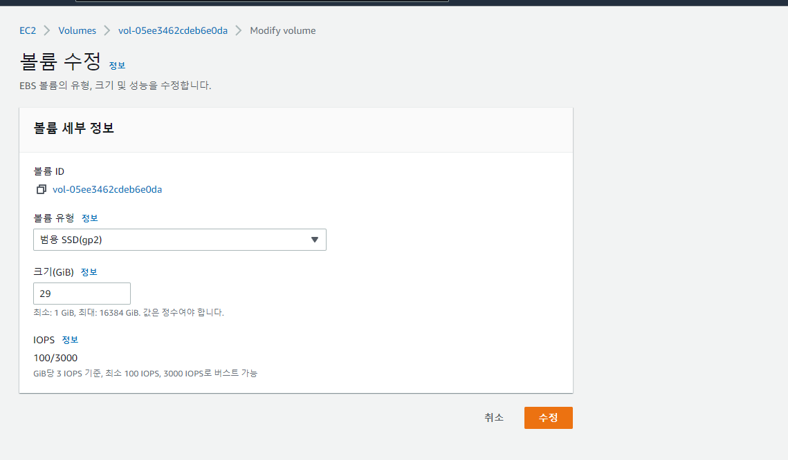

# Ubuntu 용량 확장

- EC2 프리티어로 발급 받은 ubuntu 서버에서 docker로 jupyternotebook, mysql을 다운받으려 했으나, 용량 문제에 계속 부딪혀 디버깅 하다가 해결한 후 해결 방법 공유
- 해결 방법은 별다른 내용은 없으며, EC2 서버에서 볼륨 확장으로 해결함 


### 문제 상황 

**EC2에서 발급받은 ubuntu에서 Docker image를 다운로드 받으려 할 때, 디스크 용량이 부족해서 일어난 문제 !** 


1. Docker를 연습하려고 apache2, ubuntu, mysql, jupyter 등 이미지를 다운받고 컨테이너도 만들고 있었는데, 일차적으로 jupyter notebook 이미지 다운로드 과정에서 에러가 발생했다.

    ```
    failed to register layer: Error processing tar file(exit status 1): write /opt/julia-1.8.0/share/julia/base/reduce.jl: no space left on device
    ```

    - 용량이 부족하다는 의미였고,  mysql,jupyter notebook 연결을 공부하고 있어서, 사용하지 않는 이미지들을 삭제하니 정상적으로 다운로드가 받아졌다.

    - 추가

        - 이미지 다운 및 컨테이너 빌드 

            ```bash
            docker run --rm -d -p 8888:8888 -v /home/ubuntu/Notebook:/home/jovyan/work jupyter/datascience-notebook
            ```

2. MySQL 컨테이너를 생성하려 했더니 MYSQL 이미지 다운로드에도 용량 문제가 발생했다.. jupyternotebook과 MySQL 이미지를 사용하려 하다보니, 둘 중 이제 필요없는 이미지가 없는 상황이었다.

### 해결 방법

#### 1. 필요없는 이미지 및 컨테이너 삭제하기 

- 1-1) 검색을 해보니 일단 필요없는 컨테이너를 종료하거나, 이미지를 삭제하라는 말이 나왔다. 

    - 해당 방법 시도 

        ```bash
        docker container prune #정지된 컨테이너 삭제 
        docker image prune #실행중인 컨테이너 image 외의 이미지 삭제
        docker system prune #정지된 컨테이너, 실행중인 컨테이너 이미지 외의 이미지, 볼륨, 네트워크 삭제
        ```

    - 놀랍게도 시도해보니 거의 용량에 변화가 없었고, 다른 방법을 찾았다.

#### 2. 필요없는 파일 및 패키지 삭제 후 휴지통 비우기

```bash
 sudo apt autoremove --purge
```

```bash
rm -rf ~/.local/share/Trash/files/*
```

- 이 방법도 삭제된 패키지는 없었고, 휴지통도 깨끗했다.


#### 3. 용량 큰 파일 확인하기 

- 용량 사용 현황 확인 

    ```bash
    sudo df -h
    ```

- 용량큰 파일 확인

    - dev/root가 많은 용량을 사용하는 것을 확인하고, 하나하나 들어가보며 어떤 파일이나 디렉토리가 많은 용량을 차지하는지 확인하려 했다. 

        1. 전체 구조에서 용량 확인

            ```bash
            sudo du / -h --max-depth=1
            
            16K     /lost+found
            5.3M    /etc
            1.4G    /snap
            4.0K    /srv
            1.7G    /usr
            72K     /tmp
            4.0K    /mnt
            0       /sys
            16K     /opt
            4.0K    /media
            88K     /home
            9.9G    /var
            944K    /run
            52K     /root
            125M    /boot
            0       /dev
            ```

        2. 용량이 큰 /var에서 확인

            ```bash
            sudo du /var -h --max-depth=1
            
            4.0K    /var/mail
            1.2M    /var/backups
            84K     /var/snap
            4.0K    /var/crash
            98M     /var/cache
            40K     /var/tmp
            26M     /var/log
            28K     /var/spool
            4.0K    /var/opt
            9.8G    /var/lib
            4.0K    /var/local
            9.9G    /var
            ```

        3. var/lib에서 확인 

            ```bash
            sudo du /var/lib -h --max-depth=1
            
            8.0K    /var/lib/shim-signed
            4.0K    /var/lib/man-db
            576K    /var/lib/systemd
            28K     /var/lib/pam
            4.0K    /var/lib/unattended-upgrades
            8.0K    /var/lib/apport
            20K     /var/lib/amazon
            4.0K    /var/lib/dhcp
            153M    /var/lib/apt
            4.0K    /var/lib/udisks2
            423M    /var/lib/snapd
            12K     /var/lib/update-manager
            4.0K    /var/lib/python
            9.2G    /var/lib/docker
            ```

        4. docker에서 확인 

            ```bash
            sudo du /var/lib/docker -h --max-depth=1
            15M     /var/lib/docker/tmp
            16K     /var/lib/docker/plugins
            8.9M    /var/lib/docker/image
            56K     /var/lib/docker/network
            4.0K    /var/lib/docker/runtimes
            92K     /var/lib/docker/buildkit
            4.0K    /var/lib/docker/swarm
            52K     /var/lib/docker/containers
            211M    /var/lib/docker/volumes
            9.0G    /var/lib/docker/overlay2
            4.0K    /var/lib/docker/trust
            9.2G    /var/lib/docker
            ```

- 이 방법을 사용해 docker/overlay2가 용량을 많이 사용하는 것을 알게 되었지만, 구글링을 해보니 1번 방법처럼 이미지 및 컨테이너를 삭제하는 방법을 권유했다.

    - overlay2자체는 permission도 없었고, 삭제를 하면 docker 자체가 다운될 수 있다는 경고도 확인했다. 

    

- 하지만 효과가 없었기 때문에, docker를 날릴까 고민도 했지만, 진짜 만약 컨테이너가 중요하고 내가 만든 이미지를 삭제하기 어려운 상황이면 무작정 날리면 안될 것 같았다.

- docker hub에 이미지를 업로드 하는 방법도 있겠지만 고민하면서 여러가지를 확인해보니 일단 jupyter notebook 이미지의 용량이 매우 크다는 것을 알 수 있었다.

    ```bash
    ubuntu@ip-172-31-42-165:~$ docker images
    REPOSITORY                     TAG       IMAGE ID       CREATED        SIZE
    jupyter/datascience-notebook   latest    4a17ec08a7b6   10 hours ago   4.45GB
    ```

- `sudo df -h`로 확인했을 때 10G가 사용 가능했는데, jupyter의 용량이 4.5GB정도 되다보니, 이건 내 잘못이라기 보다는 발급받은 디스크 자체의 용량의 문제라고 생각 되었다.

#### 4. EC2 볼륨 확장

- 따라서, EC2 프리티어의 최대 용량을 확인했고 30GB까지 쓸 수 있다는 것을 알게 되었다.

- EC2 -> 볼륨 -> 수정으로 접속 후 볼륨을 늘렸다

    

- 하지만, 서버를 껐다 켜보아도 용량의 변화가 없었고 구글링 결과 공식문서를 발견했다.

     https://docs.aws.amazon.com/ko_kr/AWSEC2/latest/UserGuide/recognize-expanded-volume-linux.html

    - 대충 볼륨 크기를 조절하면, 파일 시스템에도 직접 변화를 줘야한다는 말이었다. 

##### 볼륨 확장 하기 커맨드

1. 용량 확인

    ```bash
    ubuntu@ip-172-31-42-165:~$ sudo df -h
    Filesystem      Size  Used Avail Use% Mounted on
    /dev/root       7.6G  2.6G  5.1G  34% /
    devtmpfs        478M     0  478M   0% /dev
    tmpfs           484M     0  484M   0% /dev/shm
    tmpfs            97M  872K   96M   1% /run
    tmpfs           5.0M     0  5.0M   0% /run/lock
    tmpfs           484M     0  484M   0% /sys/fs/cgroup
    /dev/loop1       56M   56M     0 100% /snap/core18/2409
    /dev/loop2       62M   62M     0 100% /snap/core20/1518
    /dev/loop0       26M   26M     0 100% /snap/amazon-ssm-agent/5656/dev/loop3       68M   68M     0 100% /snap/lxd/22753
    /dev/loop4       47M   47M     0 100% /snap/snapd/16010
    /dev/xvda15     105M  5.2M  100M   5% /boot/efi
    /dev/loop5       47M   47M     0 100% /snap/snapd/16292
    /dev/loop6       56M   56M     0 100% /snap/core18/2538
    /dev/loop7       62M   62M     0 100% /snap/core20/1611
    tmpfs            97M     0   97M   0% /run/user/1000
    ```

2. 인스턴스에 연결된 NVMe 블록 디바이스에 대한 정보를 확인 

    ```bash
    ubuntu@ip-172-31-42-165:~$ lsblk
    
    NAME     MAJ:MIN RM  SIZE RO TYPE MOUNTPOINT
    loop0      7:0    0 25.1M  1 loop /snap/amazon-ssm-agent/5656    
    loop1      7:1    0 55.5M  1 loop /snap/core18/2409
    loop2      7:2    0 61.9M  1 loop /snap/core20/1518
    loop3      7:3    0 67.8M  1 loop /snap/lxd/22753
    loop4      7:4    0   47M  1 loop /snap/snapd/16010
    loop5      7:5    0   47M  1 loop /snap/snapd/16292
    loop6      7:6    0 55.6M  1 loop /snap/core18/2538
    loop7      7:7    0   62M  1 loop /snap/core20/1611
    xvda     202:0    0   29G  0 disk
    ├─xvda1  202:1    0  7.9G  0 part /
    ├─xvda14 202:14   0    4M  0 part
    └─xvda15 202:15   0  106M  0 part /boot/efi
    ```

3. 루트 볼륨과 같은 파티션을 확인 후 growpart로 볼륨 확장 

    ```bash
    sudo growpart /dev/xvda 1
    ```

4.  각 볼륨에서 파일 시스템을 확장하기 위한 **resize2fs** 명령 사용

    ```bash
    sudo resize2fs /dev/root
    ```

5. 용량 변경 결과 확인

    ```bash
    ubuntu@ip-172-31-42-165:~$ sudo df -h
    Filesystem      Size  Used Avail Use% Mounted on
    /dev/root        28G  2.6G   26G  10% /
    devtmpfs        478M     0  478M   0% /dev
    tmpfs           484M     0  484M   0% /dev/shm
    tmpfs            97M  872K   96M   1% /run
    tmpfs           5.0M     0  5.0M   0% /run/lock
    tmpfs           484M     0  484M   0% /sys/fs/cgroup
    /dev/loop1       56M   56M     0 100% /snap/core18/2409
    /dev/loop2       62M   62M     0 100% /snap/core20/1518
    /dev/loop0       26M   26M     0 100% /snap/amazon-ssm-agent/5656/dev/loop3       68M   68M     0 100% /snap/lxd/22753
    /dev/loop4       47M   47M     0 100% /snap/snapd/16010
    /dev/xvda15     105M  5.2M  100M   5% /boot/efi
    /dev/loop5       47M   47M     0 100% /snap/snapd/16292
    /dev/loop6       56M   56M     0 100% /snap/core18/2538
    /dev/loop7       62M   62M     0 100% /snap/core20/1611
    tmpfs            97M     0   97M   0% /run/user/1000
    ```


### 후기

```bash
ubuntu@ip-172-31-42-165:~$ docker ps
CONTAINER ID   IMAGE                          COMMAND                  CREATED          STATUS                    PORTS                                                  NAMES
53ab43449de0   mysqldb                        "docker-entrypoint.s…"   8 seconds ago    Up 7 seconds              0.0.0.0:3306->3306/tcp, :::3306->3306/tcp, 33060/tcp   mydb
20c3f174f5f6   jupyter/datascience-notebook   "tini -g -- start-no…"   12 minutes ago   Up 12 minutes (healthy)   0.0.0.0:8888->8888/tcp, :::8888->8888/tcp              boring_tu
```

- 성공적으로 mysql, jupyter 둘 다 이미지 다운과 컨테이너 빌드가 잘 되었다.
- 1시간 정도 삽질 했지만, 그래도 유용한 정보를 스스로(?) 얻은 것 같아서 좋다. 
