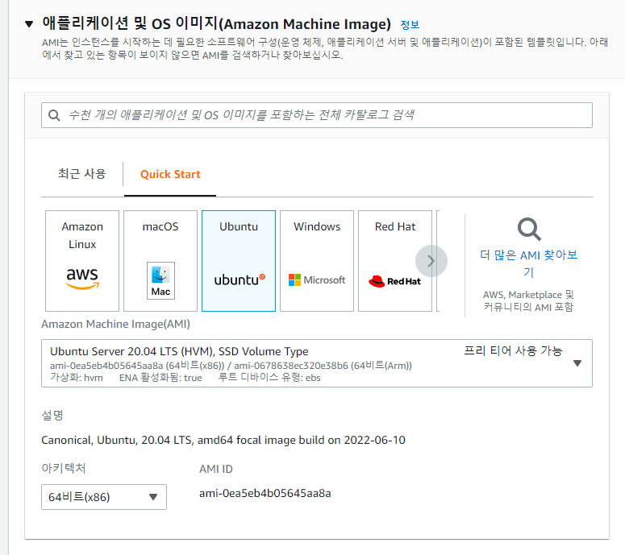
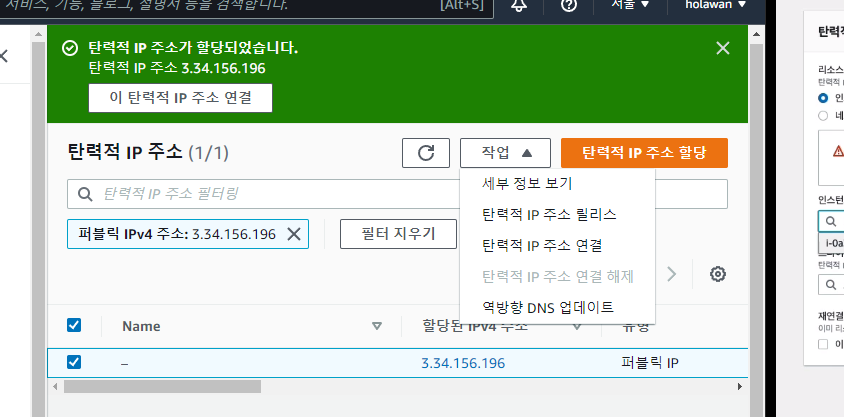
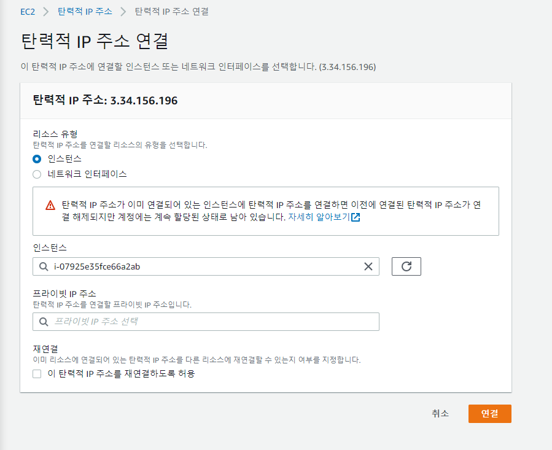
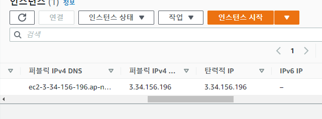
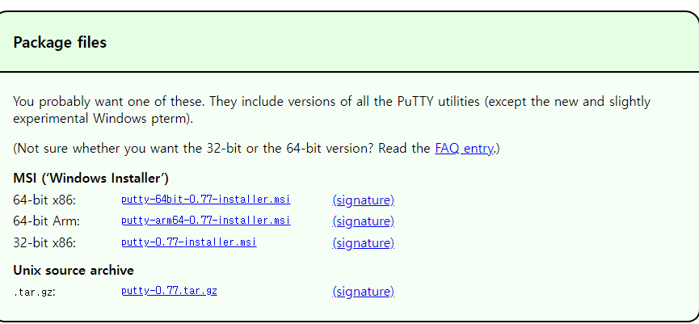
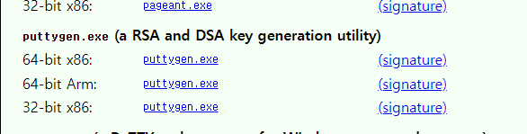
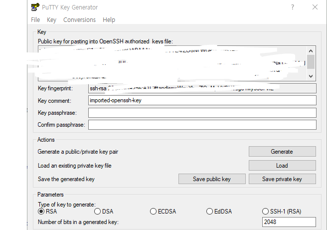
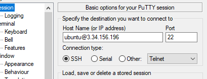
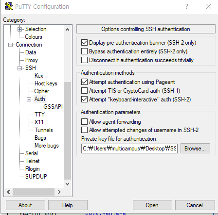
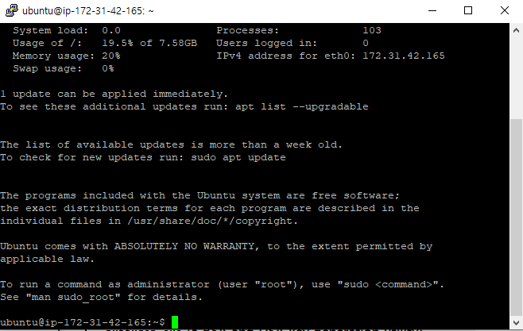

# 클라우드 서비스 (AWS)

- AWS라는 클라우드 서비스를 이용해 Linux 서버를 만들고 Linux에 접속해서 Docker에 필요한 Linux 명령어 정리 

### 가볍게 이해하는 클라우드 컴퓨팅

- 리눅스 설치 방법

    1. 가상 머신 소프트웨어

        PC 환경에 따라서, 예상치 못한 문제들을 만날 수 있음, 설치가 불가

    2. 클라우드 컴퓨팅 서비스 활용

        - 최신 기술에 익숙해진다는 장점
        - 동일한 환경에서 사용이 가능
        - 단, 설정에 따라 진행 필요 

- 클라우드 컴퓨팅 서비스 

    - 서버 환경을 미리 구축해놓고, 간단한 설정으로 바로 사용할 수 있도록 만든 서비스 

    - 이전 : 미리 서버 컴퓨터를 구축
    - 현재 : 클라우드 컴퓨팅 환경 사용 

## 클라우드 컴퓨팅 설정 - 리눅스 설치 

### EC2(서버) 생성 

- 회원가입 후 EC2로 이동
- 인스턴스 시작 클릭
- 애플리케이션은 프리티어 사용 가능하며 장기지원하는 20.0.4로 선택 



- 인스턴스 유형은 프리티어 사용 가능한 t2.micro 사용 

- 새 키 페어 생성 후 pem 키 저장 
    - 서버에 접속가능하게 해주는 공인인증서 같은 느낌으로 절대 외부사이트에 업로드 금지 

#### 탄력적 IP 주소 설정

- 사이드 바에 있는 **네트워크 및 보안** -> **탄력적 IP**로 이동 

- 탄력적 IP 주소 기본 옵션으로 할당 후 작업을 클릭해 인스턴스와 연결 





- 퍼블릭 고정 IP 연결 완료 ! 
    - 고정 IP 미설정 시 과금의 우려가 있음

- 퍼블릭 IP/ 탄력적 IP 확인



### EC2(서버) 접속 

#### 참고 : UNIX 계열 시스템에서의 파일 권한

- 사용자
    - 소유자 : 소유자에 대한 권한
    - 그룹:  소유자가 속해 있는 그룹에 대한 권한
    - 공개 : 모든 사용자들에 대한 권한
- 퍼미션 종류, (권한 기호)
    - 읽기(r) : 읽기 권한
    - 쓰기(w) : 쓰기 권한
    - 실행(x) : 실행 권한

#### chmod - 파일 권한 변경

- 숫자를 사용하는 방법

- 소유자(u)

    | 표기 | r       | w       | x       |
    | ---- | ------- | ------- | ------- |
    | 최대 | 2^2 = 4 | 2^1 = 2 | 2^0  =1 |

    합 : 7 

- 그룹(g)

    | 표기 | r       | -       | x       |
    | ---- | ------- | ------- | ------- |
    | 최대 | 2^2 = 4 | 2^1 = 2 | 2^0  =1 |

​		합 : 5

- 기타 (o)

    | 표기 | r       | -       | -       |
    | ---- | ------- | ------- | ------- |
    | 최대 | 2^2 = 4 | 2^1 = 2 | 2^0  =1 |

​		합 : 4 

```bash
rwxrwxrwx = 777
r-xr-xr-x = 555
r-------- = 400
rwx------ = 700
```

```bash
chmod 400 my-key-pair.pem
```

- 하위 폴더 포함 모든 권한 다주기
    - chmod -R 777 directory

#### 윈도우즈 접속

##### putty 설정 

- 가이드 : http://docs.aws.amazon.com/ko_kr/AWSEC2/latest/UserGuide/putty.html

    - putty(ssh client), puttygen 설치 필요

        (https://www.chiark.greenend.org.uk/~sgtatham/putty/latest.html)

1. putty 및 puttygen 설치 

- 

- 

2. putty gen에서 pem파일을 ppk파일로 변환

- 

3. putty 실행 

- session IP 등록 

    - ubuntu@탄력적 IP 

        

- Connection - SSH - Auth로 이동 후 ppk 파일 로드 



- session으로 이동 후 설정 이름을 생성 
    - 매번 동작을 하지 않기 위해 

4. 접속 확인

    - open 클릭 후 잘 연결 되는지 확인 

    
