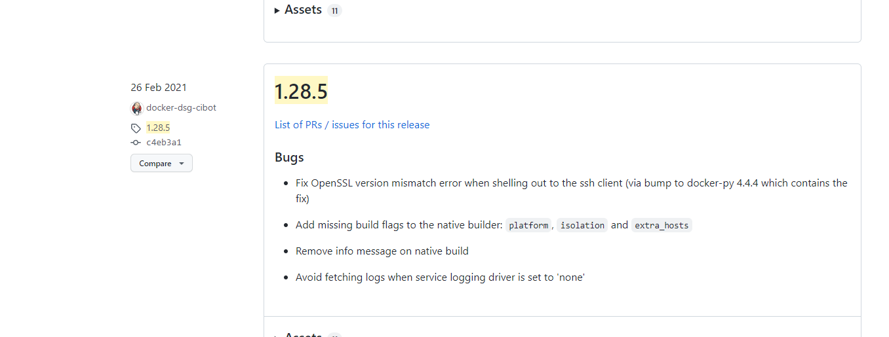

# Docker 설치

## Window

1. BIOS에서 Intel Virtualization Technology, VT-d 옵션 추가
    - BIOS는 각 메인보드 제조사마다 화면이 다르며, 옵션명이 다름
2. 제어판 -> 프로그램 -> Window 기능 켜기 에서
    - Hyper V 옵션 체크
3. 윈도우 10 Home 또는 윈도우 7
    - Docker Toolbox 설치
4. Window 10 pro 이상
    - Docker for Windows 설치 

## Ubuntu 20.04에서 Docker 

### Docker 설치

1. 최신 패키지 리스트 업데이트

    ```bash
    sudo apt update
    ```

2. docker 다운로드를 위해 필요한 https 관련 패키지 설치

    ```bash
    sudo apt install apt-transport-https ca-certificates curl software-properties-common
    ```

    - 아래 https 접근을 위한 프로그램 설치 

3. docker repository 접근을 위한 GPG key 설정

    ```bash
    curl -fsSL https://download.docker.com/linux/ubuntu/gpg | sudo apt-key add -
    ```

    - apt-key는 공인인증서를 다운 받는 것 

4. docker repository 등록

    ```bash
    sudo add-apt-repository "deb [arch=amd64] https://download.docker.com/linux/ubuntu focal stable"
    ```

    - docker는 ubuntu 패키지에서 프로그램을 다운받을 수 있도록 등록된 기본 서버와 달리 docker용 서버에서 따로 docker를 받고 등록을 행야함 

5. 등록한 docker repository 까지 포함하여 최신 패키지 리스트 업데이트

    ```bash
    sudo apt update
    ```

6. docker 설치

    ```bash
    sudo apt install docker-ce
    ```

7. docker 실행 중임을 확인

    ```bash
    sudo systemctl status docker
    ```

### sudo 명령 없이 docekr 명령어 사용하기 설정

1. 현 사용자 (ubuntu) ID를 docker group에 포함

    ```bash
    sudo usermod -aG docker ${USER}
    ```

2. 터미널 끊고, 다시 ssh로 터미널 접속 (다시 로그인)

3. 현 ID가 docker group에 포함되어 있는지 확인 ( docker가 리스트에 나오면됨 )

    ```bash
    id -nG
    ```

4. 이제 sudo 없이 docker 명령을 바로 할 수 있음


### docker-compose 설치

1. release page에서 버전 확인 후, 원한다면 아래 링크에서(1.28.5)라 명시된 버전을 변경

    https://github.com/docker/compose/releases?q=1.28.5&expanded=true

    

    ```bash
    sudo curl -L "https://github.com/docker/compose/releases/download/1.28.5/docker-compose-$(uname -s)-$(uname -m)" -o /usr/local/bin/docker-compose
    ```

2. 실행 권한 주기

    ```bash
    sudo chmod +x /usr/local/bin/docker-compose
    ```

3. 다음 명령 실행시 버전 확인 가능하면 성공

    ```bash
    docker-compose --version
    ```

    
