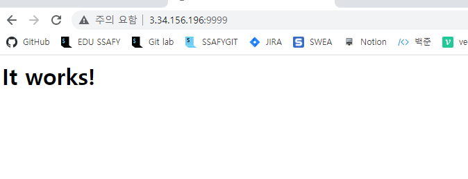

# Docker 주요 명령 익히기

## 도커에 대한 기본 이해

### Docker란?

- 다양한 운영체제와 시스템 환경 상에서, 서버 셋업을 위한 작업이 각각 다르고 복잡함. 도커는 컨테이너 기반의 가상화 플랫폼으로, 컨테이너 상에 서버를 셋업해놓을 수 있음. 따라서 기반 환경이 다르더라도, 언제든 해당 컨테이너를 실행만 하면, 동일한 서버 셋업이 가능함

### Docker Internals

- docker는 **리눅스 컨테이너부터 시작된 기술**임. 내부 기술에 대해 가볍게라도 이해하면 훨씬 깊은 레벨의 이해가 가능함

### LXC (LinuX Containers)

- 단일 컴퓨팅 시스템에 설치된 리눅스 운영체제 상에서, 다른 영역과 완전히 분리된 별도의 리눅스 시스템을 운영할 수 있는 리눅스 커널 기술
- 리눅스 운영체제 레벨에서 영역과 자원 할당 (CPU, 메모리 ,네트워크) 등을 분리하여, 마치 별도의 시스템을 사용할 수 있는 기술을 의미함
    - 다른 가상 시스템의 경우, 하드웨어 레벨에서 별도의 컴퓨터인 것처럼 분리해서 사용할 수 있는 기술도 있음. 이를 운영체제 레벨에서 할 수 있는 기술이라고 이해하면 쉬임
- docker는 리눅스 커널에서 LXC 기술을 사용해서, 
    - '리눅스 컨테이너'를 만들고, (분리된 공간을 리눅스 컨테이너라고 부름)
    - 리눅스 컨테이너 상에 별도로 구성된 파일 시스템 설정 및 응용 프로그램을 실행할 수 있도록 하는 기술을 정의한 것이라고 이해하면 됨
    - 우리가 Linxu에 접속하면 자기 폴더가 있고, root라는 슈퍼 관리자가 있고, 나만의 파일 시스템도 있다.
        - chroot라는 명령을 사용하면 별도의 분리된 하나의 컴퓨터(Linux)가 생긴다. 
        - 이를 '리눅스 컨테이너'라고 부른다. 
    - docker는 docker를 만들 때마다 컨테이너를 만들어서 그 안에 개별적 시스템이 동작하도록 만든 LXC와 유사한 기술이다.
- 초기 docker는 LXC 기술을 기반으로 구현되었으나, 최근에는 별도 컨테이너 기술을 구현하여 사용하고 있음

## Docker 주요 구성 요소

### Docker Engine

- docker는 서버/클라이언트 구조로 이루어짐
    - 서버는 docker daemon process 형태로 동작함
        - 데몬이란, 보통 계속 실행중인 프로그램으로 이해하면 됨 (계속 떠있다고도 이야기함)
    - docker daemon process에 요청하기 위해, 프로세스 간 통신 기법이 필요하며, docker는 이를 위해 REST API를 사용함
        - 참고 : 더 깊은 이해를 위해서는 컴퓨터 공학 운영체제의 프로세스 구조와, 프로세스간 커뮤니케이션 부분을 이해해야 함
    - docker command는 일종의 클라이언트라고 이해
        - docker command를 내리면, 결국 내부적으로 REST API를 사용해서, docker daemon process를 호출하는 방식
        - ex
            - docker ps라고 명령하면, 내부적으로는 마치 명령처럼 REST API를 호출함
                - http GET 'docekr daemon process'/api-version/containers

### Docker Image 

- docker container를 생성하기 위한 명령들을 가진 템플릿
- 여러 이미지들을 layer로 쌓아서, 원하는 형태의 이미지를 만드는 것이 일반적임
    - 예 : ubuntu 이미지에 apache 웹서버 이미지를 얹어서, 웹 서버 이미지를 만듬
- image는 scripts의 집합으로 볼 수 있다.
    - ubuntu 설치, 웹 서버 설치, 특정 파일을 넣는 스크립트 등등..
    - 그렇기 때문에 공식적인 이미지들을 가져와서 추가적인 커스텀을 통해 사용하는 경우가 많다.

### Docker container

- Docker image가 리눅스 컨테이너 형태로 실행한 상태(instacne)를 의미함
- docker daemon에 있는 커널에서 LXC로 리눅스 컨테이너를 생성한 후, 해당 컨테이너 docker image에 포함된 명령을 실행하여, docker container를 만들고 실행함
- docekr container는 분리된 공간이므로, docker daemon process를 통해 접속할 수도 있고, 내부에 들어가서, 코드 수정, 재실행등도 가능함
- 결국 docker는 image와 container를 다뤄서, 작업한다고 이해하면 됨 


### Docker image 주요 명령

- 큰 그림으로 결국 다음과 같은 단계를 거치므로, docker image 관련 명령부터 알아보기
    1. docker 설치
    2. docker image 다운로드
    3. 다운로드 받은 image로 docker container 생성 및 실행
- 모든 docker 명령은 CLI (Command Line Interface)로 키보드로 직접 명령을 작성하는 형태로 수행하며, 명령 형식은 크게 다음과 같은 형태임

```bash
docker 명령 옵션 선택자(이미지ID/컨테이너 등)
```

- docker는 image와 container 명령이 각각 별도로 존재 

- 다음과 같이 image를 다루는지, container를 다루는지를 명시적으로 이해하기 위해, docker 다음에 image 또는 container를 기재해줌
    - 명령은 어차피 다르므로, 굳이 image 또는 container를 붙이지 않아도 되지만, 최근에는 해당 키워드를 붙이는 경향이 있음

```bash
docker image 명령 옵션 ...
docker container 명령 옵션 ...
```


#### 1. 이미지 다운로드를 위한 Docker hub 가입

- docker 이미지를 직접 작성해서 사용할 수 있음

- 파이썬/javascript 라이브러리처럼 손쉽게 미리 작성해놓은 docker 이미지를 다운로드 받을 수 있음

    - 이를 위해 docker에는 docker hub시스템을 제공함

- docker hub 가입 방법

    - https://hub.dokcer.com에서 회원가입
    - docker hub 로그인 방법
        - 맥/윈도우의 각 docker for mac, docker for windows에서는 로그인 할 수 있는 별도 UI 제공
    - docker hub에 로그인할 수 있는 command line도 제공됨

    ```bash
    docker login # 다음 ㅁ여령 후, Username과 Password 입력 
    ```

    - docekr hub 로그아웃

    ```bash
    docker logout
    ```

#### 2. 다운로드 받을 이미지 검색

```bash
docker search ubuntu
docker search --limit=5 ubuntu
```

- docker 이미지는 크게 이미지명[:태그]로 이루어질 수 있음
- 태그는 보통 버전 정보를 넣는 경우가 많음
- 이미지명에 태그를 넣지 않으면, 최신버전의 이미지를 의미하며, latest가 태그로 붙음 

- ubuntu로 검색하면 다양한 이미지 리스트가 생성됨

    ```bash
    ubuntu@ip-172-31-42-165:~$ docker search ubuntu
    NAME                             DESCRIPTION                                     STARS     OFFICIAL   AUTOMATED                                                                                 IAL   AUTOMATED
    ubuntu                           Ubuntu is a Debian-based Linux operating sys…   14846     [OK] 
    websphere-liberty                WebSphere Liberty multi-architecture images …   288       [OK] 
    ubuntu-upstart                   DEPRECATED, as is Upstart (find other proces…   112       [OK] 
    neurodebian                      NeuroDebian provides neuroscience research s…   92        [OK] 
    ...
    ```

    - 이 중에서 가장 상위의 ubuntu 이미지가 공식 이미지임
        - 더 확실한 방법은 OFFICIAL 여부를 확인할 수 있음
    - kasmweb/ubuntu-bionic-desktop 와 같이 / 가 있는 경우는 / 앞단의 문자열이 Docker hub 사용자 명이며 해당 사용자가 업로드한 이미지라고 인식하면됨 

- 너무 많은 이미지 검색시 --limit 옵션으로 이미지 수를 상위에서 끊을 수 있음 

- dockerHub에 있는 특정 이미지의 태그 리스트를 볼 수 있는 공식적인 CLI 명령은 없으며, dockerhub 사이트 상에서 검색으로 확인 가능 

#### 3. 이미지 다운로드

- 태그를 안붙이면, default로 latest를 다운로드 받을 수 있음

    ```bash
    docker pull ubuntu
    ```

- 다음과 같이 특정 태그를 사용하면 해당 버전 다운로드

    ```bash
    docker pull ubuntu:20.10
    ```

- docker pull 명령은 이미지를 다루는 명령이므로 docker image pull로 쓸 수 있음 

#### 4. 다운로드 받은 image list 확인

- docker images 명령과 docker image ls 명령으로 동일한 기능을 수행할 수 있음
    - 이와 같이 대부분의 프레임워크나 기능들은 동일한 기능을 하는 다양한 명령어가 존재하는 경우가 많으며, 이 중에서는 손에 익는 것 사용하자
- docker images 명령 

```bash
ubuntu@ip-172-31-42-165:~$ docker pull ubuntu:20.04
20.04: Pulling from library/ubuntu
3b65ec22a9e9: Pull complete
Digest: sha256:af5efa9c28de78b754777af9b4d850112cad01899a5d37d2617bb94dc63a49aa
Status: Downloaded newer image for ubuntu:20.04
docker.io/library/ubuntu:20.04
ubuntu@ip-172-31-42-165:~$ docker images
REPOSITORY   TAG       IMAGE ID       CREATED       SIZE
ubuntu       20.04     3bc6e9f30f51   3 weeks ago   72.8MB

ubuntu@ip-172-31-42-165:~$ docker images -q
3bc6e9f30f51
```

- docker image -q는 다른 명령과 같이 혼합해 사용 가능하니 알아두자 

#### 5. 이미지 삭제

- docker rmi 명령과 docker image rm 명령으로 동일한 기능을 수행할 수 있음 

```bash
docker rmi 이미지ID (또는 이미지 REPOSITORY 이름)

docker image rm 이미지ID(또는 이미지 REPOSITORY 이름)
```

```bash
ubuntu@ip-172-31-42-165:~$ docker image rm ubuntu:20.04
Untagged: ubuntu:20.04
Untagged: ubuntu@sha256:af5efa9c28de78b754777af9b4d850112cad01899a5d37d2617bb94dc63a49aa        
Deleted: sha256:3bc6e9f30f51d2bbf9307fc9d0bdfc30caa38cf4e3b05a714230f9a9b3381d84
Deleted: sha256:c3f11d77a5de76ec836c52333d45ac3742c7b27d3d83feba6ec978e223715c67
```

- 일괄적으로 이미지 및 컨테이너를 모두 삭제하는 명령은 컨테이너 명령을 익힌 후 알아보자 

    

### Docker container 관련 주요 명령

- docker container 관련해서는 몇몇 가장 많이 쓰이는 옵션을 포함한 명령목록이 있긴 하지만, 관련 명령이 어떻게 수성되는지 차근차근 세부 명령 알아보기

#### 1. 컨테이너 생성

- 각 이미지는 컨테이너로 만들어줘야 실행 가능함
- 이미지와 컨테이너는 각각 관리해줘야 함
- 컨테이너 생성 시, docker 프로그램에서 이름이 자동 부여됨

```bash
ubuntu@ip-172-31-42-165:~$ docker create ubuntu:20.04
92e9faed869db087280ad9f69a55f3eb7104ab495a022235e83e07f7bcc600b4
```

#### 2. 생성된 컨테이너 확인

- 현재 실행중인 컨테이너 확인
- ```docker ps```

```bash
ubuntu@ip-172-31-42-165:~$ docker ps
CONTAINER ID   IMAGE     COMMAND   CREATED   STATUS    PORTS     NAMES
```

- 실행중이지 않은 컨테이너까지 포함해서, 전체 컨테이너 확인
    - 맨 끝의 NAME에 기재된 이름이 컨테이너 이름임

```bash
ubuntu@ip-172-31-42-165:~$ docker ps -a
CONTAINER ID   IMAGE          COMMAND   CREATED              STATUS    PORTS     NAMES
92e9faed869d   ubuntu:20.04   "bash"    About a minute ago   Created             lucid_thompson 
```

| 항목         | 설명                                                         |
| ------------ | ------------------------------------------------------------ |
| CONTAINER ID | 컨테이너 ID                                                  |
| IMAGE        | 이미지 이름                                                  |
| COMMAND      | 컨테이너 실행 시 실행되는 프로세스 이름                      |
| CREATED      | 컨테이너 생성 후 경과 시간                                   |
| STATUS       | 컨테이너 실행 상태 (Created: 생성, UP: 실행 중, Pause: 중지, Existed: 종료) |
| PORTS        | 호스트와 컨테이너 포트 사이의 연결 관계                      |
| NAMES        | 컨테이너 이름                                                |

- 각 이미지마다, 컨테이너 생성시 실행되는 프로세스를 기재할 수 있음. ubuntu의 경우 bash 쉘 프로그램이 실행되며, 이를 COMMAND 목록에서 확인 가능 (실제 실행 파일은 리눅스 시스템의 bin 디렉토리에서 bash 프로그램을 실행하기 때문에 /bin/bash로 표기 됨)

- 실행중이지 않은 컨테이너 포함해서 생서된 컨테이너 ID 조회 

    ```bash
    docker ps -a -q
    ```

#### 3. 컨테이너 삭제

```bash
docker rm 삭제할 컨테이너 이름(컨테이너 리스트의 NAMES 의미)
```

```bash
ubuntu@ip-172-31-42-165:~$ docker ps -a
CONTAINER ID   IMAGE          COMMAND   CREATED              STATUS    PORTS     NAMES
92e9faed869d   ubuntu:20.04   "bash"    About a minute ago   Created             lucid_thompson 
```

- 해당 경우에서 docker rm ubuntu라고 입력하면 에러가 발생하며, 컨테이너 ID나 NAMES로 삭제해야함 
    - ```docker rm lucid_thompson``` or ```docker rm 92e9faed869d```

- 컨테이너 관리를 위해, 컨테이너 이름을 지정할 수 있음

    - --name 옵션

        ```bash
        docker create --name 내가원하는컨테이너이름 이미지 이름
        #예
        docker create --name helloubuntu ubuntu
        docker ps -a
        CONTAINER ID   IMAGE          COMMAND   CREATED          STATUS    PORTS     NAMES
        2e237360e014   ubuntu:20.04   "bash"    7 seconds ago    Created             helloubuntu
        ```

#### 4. 컨테이너 실행

```bash
docker start 컨테이너 이름
```

- 위 예에서 다운로드받고 생성한 helloubuntu 컨테이너를 실행하면, 바로 중지됨

    - 이유

        - docker는 컨테이너를 하나의 응용프로그램으로 다루고 있음
        - 즉, 운영체제가 아니라, 운영체제 상에서 실행하는 응용프로그램을 포함해서 하나의 프로그램을 실행하고 중지하는 것을 다루고 있음
        - 따라서, 컨테이너에서 실행하게끔 설정된 응용프로그램의 실행이 끝나면, 해당 컨테이너는 중지됨
        - 이미지 세부 정보를 알 수 있는 docker inspect 명령을 우선 이해하기
            - 다음과 같이 명령하면, cmd 항목에서 해당 컨테이너 실행 시, 실행하는 명령(응용프로그램)이 기재되어 있음  

        ```bash
        docker inspect ubuntu
        "Cmd" : [
        		"/bin/sh",
        		"-c",
        		"#(nop)",
        		"CMD [\"/bin/bash\"]"
        		
        ]
        ```

        - 해당 명령은 /bin/bash이고, 이는 bash라는 쉘 프로그램임 (bash는 리눅스 기본 쉘 프로그램)
        - 해당 명령은 터미널을 통해, 키보드 입력을 표준 스트림 중 표준 입력(STDIN)으로 받을 수 있는 상태이어야, 대기 상태로 계속 실행되며, 그렇지 않다면, 입력을 받을 수 없기 때문에, 종료됨
        - 따라서, 단순히 docker start helloubuntu와 같이 별도 터미널 및 표준 입력 연결 설정 없이 실행 시, 실행하자마자 끝나고, 이에 따라 해당 컨테이너도 바로 중지됨 

- 표준 스트림 (Standard streams)

    - 리눅스(유닉스 계열)에서 동작하는 프로그램은 실행시, 세개의 스트림이 오픈 됨
        - STDIN : 표준 입력
        - STDOUT : 표준 출력
        - STDERR : 표준 에러
    - 보통 터미널을 오픈하고, 명령을 실행하면, 터미널의 표준 스트림이 명령에 해당하는 프로세스에 상속되어, 해당 프로세스는 터미널의 표준 입출력을 사용할 수 있게 됨 
        - 터미널 실행 시, 보통 쉘 프로그램이 실행되고, 쉘 프로그램을 통해, 명령을 실행하면, 명령에 해당하는 프로그램을 쉘 프로그램이 실행함
        - 이 때, 내부적으로 쉘 프로그램은 fork() 시스템 콜을 사용해서, 명령에 해당하는 프로그램을 실행시킴
        - fork() 시스템 콜을 사용할 경우, 해당 함수를 호출하는 프로그램은 부모 프로세스가 되고, fork()를 통해 실해되는 프로그램은 자식 프로세스가 됨
            - 더 깊이는 부모 프로세스가 자식 프로세스에 복사되고, 이후에 자식 프로세스 실행에 필요한 데이터가 업데이트되는 형태로 실행되므로,
            - 부모 프로세스의 표준 입출력은 그대로 자식 프로세스에 복사되기 때문에, 결과적으로 상속과 유사한 기능을 하게 됨 

#### 5. docekr run 명령

- ubuntu 자체만 컨테이너를 만들 경우, 다음 명령으로 터미널 및 입력(STDIN)을 연결해줘야 함
    - ubuntu 컨테이너의 입력(STDIN) (-i 옵션)을 가성 터미널 (-t 옵션)에 할당해주어, 결과적으로 PC상에서의 입력이 ubuntu 컨테이너 입력에 들어갈 수 있도록 해줌
    - 이를 통해 ubuntu 컨테이너의 bash 쉘은 입력받을 수 잇는 상태로, 종료되지 않고, 실행중인 상태가 됨 

##### docker run 주요 옵션

| 옵션   | 설명                                                         |
| ------ | ------------------------------------------------------------ |
| -i     | 컨테이너 입력(STDIN)을 열어놓는 옵션 (주로 -it로 -i 옵션과 -t 옵션을 함께 사용) |
| -t     | 가상 터미널(tty)을 할당하는 옵션 (주로 -it로 -i 옵션과 -t 옵션을 함께 사용) |
| --name | 컨테이너 이름 설정 옵션                                      |
| -d     | 컨테이너를 백그라운드에 실행하는 옵션                        |
| --rm   | 컨테이너 종료시 컨테이너를 자동으로 삭제하는 옵션            |
| -p     | 호스트와 컨테이너 포트를 연결하는 옵션                       |
| -v     | 호스트와 컨테이너 디렉토리를 연결하는 옵션                   |

- -it 옵션의 의미

    - docker 컨테이너에 표준 입력을 오픈해놓고, (-i옵션)
    - pseudo tty를 만들어서 (-t 옵션) 해당 표준 입력을 pseudo tty에 연결해 놓음
    - 따라서, 키보드 입력을 pseudo tty를 통해, 컨테이너의 표준 입력으로 전달할 수 있도록 하는 것임

    ```bash
    ubuntu@ip-172-31-42-165:~$ docker run -it ubuntu:20.04
    root@e06d4b79919f:/#
    ```

    

- pseudo tty

    - tty는 teletypewriter의 약자로, 리눅스 (유닉스 계열)에서는 콘솔 또는 터미널을 의미함
    - tty를 통해 리눅스에 키보드 입력을 전달할 수 있으며, 하나의 tty 이외에 다양한 터미널에서 접속을 지원하기 위해, 두번째 tty부터 가상(pseudo)이라는 말이 붙어서, pseudo tty라고 이야기함

    ```bash
    #컨테이너 실행 후, 해당 ubuntu 내로 들어가서, 터미널로 명령을 진행할 수 있음
    docker run -it ubuntu
    #컨테이너 이름을 원하는 이름으로 변경시
    docekr run -it --name helloubuntu ubuntu
    #exit 명령으로 종료 시, 컨테이너도 중지됨
    docker ps -a 
    ```

    - 위와 같이 입력하면, ubuntu 내로 들어가서 터미널로 명령을 내릴 수 있음
        - exit 명령하면, 도커 컨테이너에서 나올 수 있음
        - 해당 컨테이너는 중지됨

- 컨테이너 종료시 자동으로 컨테이너까지 삭제하는 옵션

    ```bash
    docker run -it --rm --name helloubuntu2 ubuntu
    #exit 명령으로 종료 시, 컨테이너도 자동 삭제
    docker ps -a #이전에 남겨져있던 컨테이너만 보여질 수 있고, helloubuntu2는 삭제되어 없음 
    ```

- 컨테이너를 백그라운드에서 실행하기 (실행중인 상태이지만, 터미널로 입력은 받지 않는 상태로 만들기)

    ```bash
    ubuntu@ip-172-31-42-165:~$ docker run -it -d --name helloubuntu3 ubuntu:20.04
    920649af6f73a6434075eb765a64546f4ab6162c733c099b817375e18c10f56b
    
    ubuntu@ip-172-31-42-165:~$ docker ps
    CONTAINER ID   IMAGE          COMMAND   CREATED         STATUS         PORTS     NAMES
    920649af6f73   ubuntu:20.04   "bash"    4 seconds ago   Up 3 seconds             helloubuntu3 
    ```

    - 필요할 때만 들어갈 수 있음

        ```bash
        docker attach helloubuntu3
        ```

        

#### 6. 실행중인 컨테이너 종료하기

- 컨테이너 종료하기

    - 이전에 백그라운드로 실행한 helloubuntu3를 중지하려면 해당 명령 실행

    ```bash
    docker stop helloubuntu3
    ```

    - 실행중인 컨테이너의 실행 상태를 멈추는 것은 docker pause이며, 이 때 멈춘 컨테이너를 다시 실행하는 명령은 docker unpause

#### 7. 웹서버로 docker run 옵션 테스트

- 웹서버는 크게 두가지 프로그램이 많이 사용됨
    - apache
    - nginx

##### 7-1. apache 웹서버 공식 docker 찾기

- 각 docker마다 공식이름이 프로그램명과 동일한 경우가 일반적이지만, apache는 httpd 이름을 사용함

    ```bash
    docker search httpd
    ```

- 너무 많으면 limit 로 검색하기

    ```bash
    docker search httpd --limit=5
    ```

##### 7-2. 이미지 다운로드 받고 바로 컨테이너로 만들어 실행시키기 (-p 옵션 이해하기)

```bash
docker run httpd
```

- 다음과 같이 명령하면 몇 가지 문제점 존재

- 처음에 다음과 같이 메시지가 나오는 것은 문제가 안됨. 자신의 PC에 해당 이미지가 없다는 의미로, 바로 이후에 해당 이미지 이름을 Docker hub에서 찾아 다운로드 진행

    ```bash
    Unable to find image 'httpd:latest' locally
    ```

- 커멘드 라인에서 다음 명령을 할 수 없음(해당 컨테이너가 foreground로 실행되고 있기 때문)

    - apache 웹서버가 실행된 상태로, 해당 프로그램 로그만 화면에 보여짐 (다른 터미널로 docker ps를 명령하면, 해당 컨테이너가 실행중임은 알 수 있음)
    - Ctrl + C로 강제 중단시킨 후, 다음과 같이 명령함 (관련 컨테이너는 중지 상태에 있으므로, 삭제해도 됨)
    - -d 옵션을 주어 background에서 해당 컨테이너를 실행하면됨. 보통 컨테이너는 background로 실행하는 것이 일반적 

    ```bash
    docker run -d --name apacheweb httpd
    ```

- 이번에는 해당 웹서버에 어떻게 접속해야할지 알 수 없음

    - 포트 포워딩이 필요함
    - docker를 실행한 PC를 Host PC(호스트 PC)라고 함.
    - docker 컨테이너가 실행되면, 172.17.0.0/16 (서브넷이 255.255.0.0)인 Pribate IP가 할당 됨
        - /16은 16비트까지 IP 할당이 된다는 의미로, 172.17..0~172.17.255.255까지 동일 네트워크 상에 IP 주소를 가질 수 있음을 의미함
    - 호스트 PC IP에 특정 port로 access 시, 해당 port를 docker 컨테이너의 특정 Private IP의 특정 포트로 변환해줄 수 있음. 이를 NAPT(Network Address Port Traslation) 기술이라고 함  

    - 이를 지원해주는 옵션이 -p 옵션임
        - 따라서, 다음과 같이 작성하면, apacheweb2 컨테이너는 apache 웹서버 프로그램을 실행하고, 호스트 PC에 9999 포트로 접속하면, 자동으로 이를 해당 컨테이너의 80포트로 연결해주겠다라는 의미임

    ````bash
    docker run -d -p 9999:80 --name apacheweb2 httpd
    ````

    - 위와 같이 실행 후, EC2로 접속해 인바운드 규칙을 편집한다.

        - EC2 -> 보안 -> 보안 그룹 접속 
        - 

        - 인바운드 규칙에서 9999포트를 모든 IP에서 허용하면 정상적으로 접근 가능 
        - 

##### 7.3 나만의 웹서비스 docker 만들기 (-v 옵션 이해하기)

- 'it works'는 httpd 이미지의 apache 웹서버 기본 설정에 의해, /usr/local/apache2/htdocs 폴더에 있는 index.html에 적혀있는 html 태그임

- 따라서, 해당 폴더를 내가 원하는 index.html 파일로 교체한다면 나의 웹페이지를 보여줄 수 있음

- 호스트 PC 상에 나만의 index.html 파일이 있다면, -v 옵션을 사용해서, 호스트 PC의 특정 폴더를  docker 컨테이너의 특정 폴더로 교체할 수 있음

    - docker는 이미지를 기반으로 컨테이너를 만들기 때문에, 컨테이너 상에서 파일을 업데이트하거나, 생성할 경우, 컨테이너가 종료되면, 해당 파일은 없어지게 됨
        - 이를 보완하기 위해, 특정 폴더를 -v 옵션으로 교체 (공유 또는 바인딩이라는 용어를 더 많이 사용)하면, 해당 폴더는 호스트 PC상에 있기 때문에, 컨테이너가 종료되더라도, 파일을 유지할 수 있음

    ```bash
    #-v 옵션만 쓴다면 다음과 같이 작성 가능 
    docker run -v 호스트_PC의_절대경로:도커_컨테이너_절대경로 httpd 
    
    #다른 옵션과 함께 사용한 실제 예(호스트 PC 경로에 한글이나 띄어쓰기가 있다면 따옴포료 묶어줘야함)
    docker run -d -p 9999:80 -v /home/ubuntu/2021_DEV_HTML:/usr/local/apache2/htdocs --name apacheweb3 httpd
    ```

    - 컨테이너가 사라지더라도 이를 보존하기 위해 volume이라는 옵션을 사용하는 것으로, DB 유지를 위해 Volume 옵션은 중요하다 

    - 폴더 옮기기 

        - Filezilla 설치 
        - 폴더 원하는 공간으로 옮기기 
        - volume 경로 지정하기 

    - **정상적으로 volume이 연결되지 않아 컨테이너 접속하기**

        - ```bash
            docker exec -it apacheweb /bin/bash
            ```

        - 접속 후 경로 확인 결과 오타였음 

- 현업 팁 : docker 명령을 직접 내릴 때는 명령이 매우 길기 때문에, 보통 메모장 등에 명령셋들을 저장한 후, 복사/붙이기로 하나씩 실행하는 경우가 많음 

#### 8. docker가 사용하고 있는 저장매체 현황 확인하기

- 추후 docker가사용하는 저장매체 공간이 이슈가 될 수도 있으므로, 관련 명령 학습 

    ```bash
    docker system df 
    ```

##### docker와 alpine 

- docker 이미지는 여러개의 이미지가 계층(layer)으로 쌓인 형태로 작성이 됨

    - 예를 들면, C 라이브러리 이미지를 쌓고, 여기에 bash와 같은 쉘 프로그램 이미지를 쌓고, 여기에 응용 프로그램 이미지를 쌓는 방식

    - 통상 리눅스 사용시, 다양한 기능을 가진 ubuntu 등의 리눅스 패키지를 사용하지만, docker 컨테이너의 경우는 특정 응용프로그램 실행을 목적으로 하는 경우가 많기 때문에, 다양한 기능을 모두 포함할 필요가 없음 (동일한 기능을 한다면, 도커 이미지/컨테이너 사이즈가 작으면 작을 수록 좋음)

- 대부분의 docker 이미지에 가장 기본이 되는 이미지는 ubuntu가 아니라, alpine인 경우가 많음

    - apline은
        - musl libc 라는 임베디드 리눅스(초경량 시스템을 위한 리눅스 시스템)를 위한 C/POSIX library (C 언어를 위한 기본 함수 및 POSIX라는 표준 규격에 맞춘 기본 함수를 포함한 라이브러리)와 
        - BusyBox는 운영체제 운영에 필요한 가장 기본이 되는 유틸리티(시스템 프로그램)만 모아놓은 리눅스 패키지 

##### httpd와 alpine

- httpd도 태그 중에 alpine이라는 태그가 있음 

- httpd:alpine 실행해보기 

    ```bash
    docker run -d -p 9999:80 -v /home/ubuntu/2021_DEV_HTML:/usr/local/apache2/htdocs --name apacheweb3 httpd:alpine
    ```

#### 9. docker 컨테이너 상태 확인

```bash
docker container stats
```

#### 10. 실행중인 컨테이너에 명령 실행하기

- 컨테이너 실행중일때만 다음 명령을 실행할 수 있음

    ```bash
    docker exec 옵션 컨테이너_ID 명령 인자
    ```

- 테스트

    - -it: docker run에서 설명한 표준입력(-i), 터미널(-t) 옵션이며, docker exec에서도 사용 가능
    - 다음과 같이 명령하면, /bin/sh 쉘 프로그램을 실행하면서, 터미널에 연결되므로, 컨테이너 안으로 들어갈 수 있음
        - /bin/bash가 아닌 /bin/sh를 쓴 이유는 /bin/bash는 alpine 리눅스에는 들어있지 않기 때문

    ```bash
    docker exec -it apacheweb2 /bin/sh
    ```

#### 11. 실행중인 컨테이너에 연결하기

- docker run으로 다음과 같이 터미널을 연결해놓은 상태로, 백그라운드로 실행시

    - 여러 옵션은 "-dit"와 같이 한번에 붙여써도 되고, 다음과 같이 나눠써도 됨

    ```bash
    docker run -it -d --name myubuntu3 ubuntu
    docker run -dit --name myubuntu3 ubuntu
    ```

    - 다음과 같이 실행하면, 해당 컨테이너가 연결되어, 컨테이너 내에서 쉘 프로그램을 사용하여, 명령을 내릴 수 있음

    ```bash
    docker attach myubuntu3
    ```

    - exec 명령은 해당 컨테이너에 신규 명령을 실행하는 명령이고, attach는 컨테이너에 연결하는 명령임

        - docker exec -it [container_name] /bin/bash

          ```bash
          : 외부에서 컨테이너 진입할 때 사용한다.
          ```

        - docker attach [container_name 또는 container_ID]
        
          ```bash
          : container 실행시 사용한다.
          ```

#### 12. 모든 컨테이너 삭제하기 (+ 모든 docker 이미지 삭제)

- 위와 같이 docker run 명령을 가장 많이 사용할 수 밖에 없는 상황이지만, docker run 사용시 항상 컨테이너가 별도로 생성됨.
- 따라서, 모든 컨테이너를 한 번에 지우고 싶은 경우가 있으며, 다음과 같은 명령 조합으로 가능함

```bash
docker stop $(docker ps -a -q) # 모든 컨테이너 중지
docker rm $(docker ps -a -q)
```

- 추가로 모든 docker 이미지 삭제 명령도 다음과 같음

```bash
docker rmi $(docker images -q)
docker rmi -f $(docker images -q)
```

- 한번에 컨테이너 중지, 삭제, 이미지 삭제 하기 (각자 별도로 적어놓고, 한번에 실행하기)

```bash
docker stop $(docker ps -a -q)
docker rm $(docker ps -a -q)
docker rmi -f $(docker images -q)
```

- 별도로 다음 명령도 사용 가능

    - 하지만, 다음 명령은 실행중인 container, 또는 실행중인 컨테이너의 image 등은 삭제하지 않음
        - 따라서 생각보다는 많이 사용되지 않음 

    ```bash
    docker container prune #정지된 컨테이너 삭제 
    docker image prune #실행중인 컨테이너 image 외의 이미지 삭제
    docker system prune #정지된 컨테이너, 실행중인 컨테이너 이미지 외의 이미지, 볼륨, 네트워크 삭제
    ```

    
