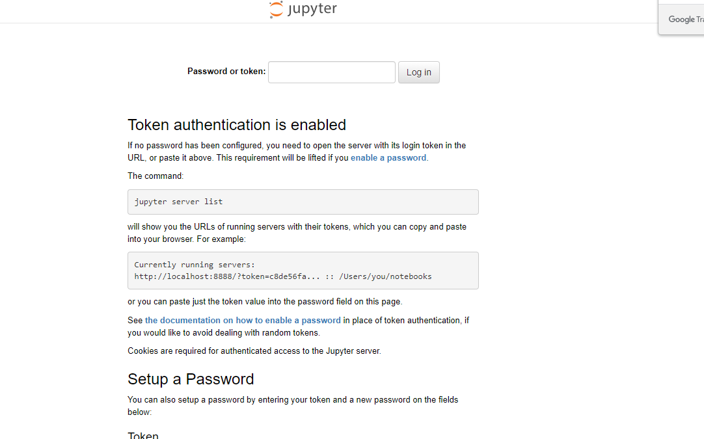
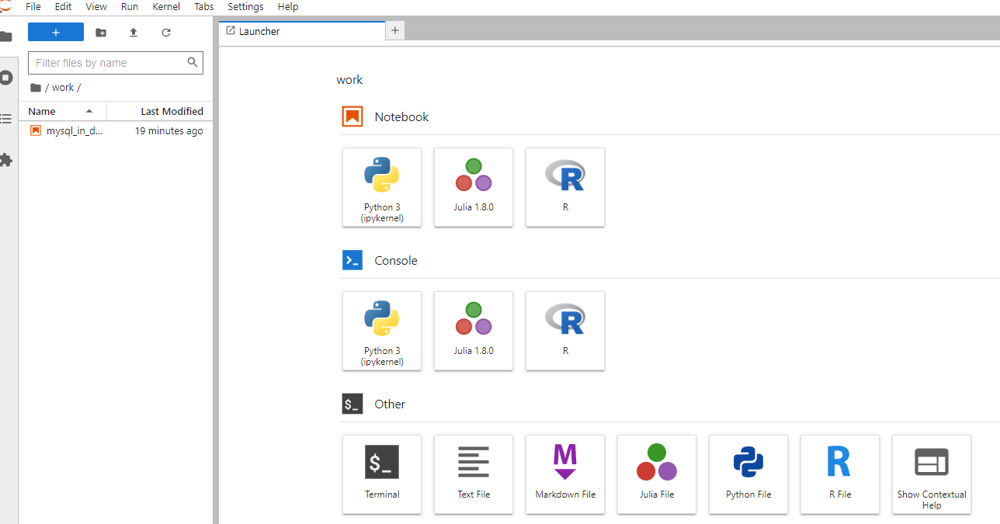
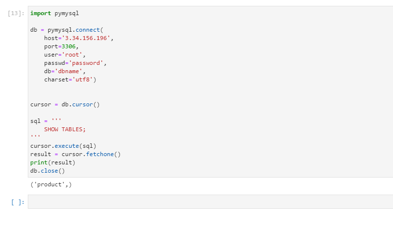

# 컨테이너 활용과 연결

## Docker로 jupyter notebook 띄우기

### jupyter notebook 

**jupyter notebook은 파이썬 코드를 실행하기 위한 툴**

- 컨테이너 내부에서 jupyternotebook이 실행되는 폴더인 /home/jovyan 폴더를 호스트 PC의 현재 폴더로 만들어서, 호스트 PC에서 docker를 실행하는 폴더에 있는 주피터 노트북 파일 작업이 가능하도록 함

- /home/ubuntu에 Notebook이라는 디렉토리를 만들고 mysql_in_docker.ipynb 파일(쥬피너 노트북 파일)을 filezilla를 이용해 옮기기 

```
docker run --rm -d -p 8888:8888 -v /home/ubuntu/Notebook:/home/jovyan/work jupyter/datascience-notebook
```

- jupyter/datascience-notebook

    - https://hub.docker.com/r/jupyter/datascience-notebook

    - 오류 발생 및 해결

        ```
        failed to register layer: Error processing tar file(exit status 1): write /opt/julia-1.8.0/share/julia/base/reduce.jl: no space left on device
        ```

        - 이미지 다운로드 중 해당 에러 발생
        - 전체 긁어서 복사했을 때 나오지 않아서, 마지막 단어를 긁어보니 용량이 부족해서 이미지를 다운로드 받을 수 없는 것으로 확인
            - 사용하지 않는 이미지 삭제 후 다운하니 성공 ! 

- 인바운드 규칙 추가로 8888 포트 열어주기 

- 서버 접속
    - 

- 토큰 넣어주기 

    - 컨테이너 빌드 시 토큰을 주는데, 이를 log로 확인해야함 
    - 먼저 컨테이너 id 확인 후 log 찍기 

    ```
    ubuntu@ip-172-31-42-165:~$ docker ps
    CONTAINER ID   IMAGE                          COMMAND                  CREATED         STATUS 
                      PORTS                                       NAMES
    ea759e3b7afd   jupyter/datascience-notebook   "tini -g -- start-no…"   3 minutes ago   Up 3 minutes (healthy)   0.0.0.0:8888->8888/tcp, :::8888->8888/tcp   determined_villani
    ubuntu@ip-172-31-42-165:~$ docker logs ea759
    ```

    - token= 이후에 토큰복사 

        - 토큰 양식 예 : http://127.0.0.1:8888/lab?token=239034a038c7fc13f23b76fcd842b6fc81ced97616c14b9e  

    - 접속 성공

        

### 컨테이너와 컨테이너 연결하기

- docker run 옵션으로 --link 옵션을 사용하여 연결할 수 있음
- --link <본래 컨테이너 이름>:<컨테이너를 가리킬 이름>

#### MySQL

- mysql 컨테이너 생성용 dockerfile

```dockerfile
# Dockerfile_MYSQL

FROM mysql:5.7

#mysql 슈퍼관리자인 root ID에 대한 password란에 원하는 패스워드 설정
ENV MYSQL_ROOT_PASSWORD=password
#dbname란에 원하는 데이터베이스 이름 설정
ENV MYSQL_DATABASE=dbname

```

- docker image 작성

```
#docker 이미지 작성
docker build --tag mysqldb -f Dockerfile_MYSQL ./

#컨테이너 생성하기 3306 포트에 연결하고, volume 옵션 설정
docker run -d -p 3306:3306 --name mydb -v /home/ubuntu/mysqldata:/var/lib/mysql mysqldb
```

- 3306 포트 열어주기

- 연결 성공 

    ```
    db = pymysql.connect(
        host='3.34.156.196', 
        port=3306, 
        user='root', 
        passwd='password', 
        db='dbname', 
        charset='utf8')
    ```

    



## 도커와 도커 연결하기

- --link 옵션 사용해서 주피터 노트북 컨테이너 실행하기
- link 
    - 특정 컨테이너와 다른 컨테이너를 도커 내부적인 network로 연결하는 방식
    - 꼭 다른 컨테이너를 지칭할 이름을 명시해주기 ! 
    - mysql과 같은 경우에는 호스트 이름을 직접 주기 보다는, 위험이 있기 때문에 컨테이너 이름으로 지정해주는 것도 좋은 방법이다 !  

```
#모든 컨테이너 삭제 후, 재실행

# -p 설정 없이 mysql 컨테이너 실행

docker run --rm -d --name mydb -v /home/ubuntu/mysqldata:/var/lib/mysql mysqldb

# -link 컨테이너이름:연결할컨테이너를 지칭할 이름
docker run --rm -d -p 8888:8888 -v /home/ubuntu/Notebook:/home/jovyan/work --link mydb:myjupyterdb jupyter/datascience-notebook
```

- mysql
    - 만약 /home/ubuntu/mysqldata라는 폴더가 없더라도 dockerrun으로 해당 폴더를 지정하면, 폴더가 자동으로 생성된다 ! 
    - -p설정 없이 mysql 컨테이너를 만들었기 때문에 외부에서 접근이 불가능하다. 
    - EXPOSE 3306/tcp가 있기 때문에, 3306포트가 이미 열려있다. 이가 host pc의 port로 접속할 수는 없지만 열려있는 것이다.
- jupyter
    - --link mydb:myjupyterdb
        - 쥬피터 노트북 컨테이너가 통신하려 하는 컨테이너는 **mydb** 그 컨테이너에 접속할 때 사용하는 이름은 **myjupyterdb**

- mysql_in_docker.ipynb의 **mysql docker에 접속하기** 실행하기

    - 기존 코드에서
        - host를 mysqldb (docker run 시 --link 옵션으로 설정한 컨테이너를 가리킬 이름)로 바꾸고,
        - port를 3306으로 변경한 것임 (docker run 시 호스트 PC 포트가 아니라, mysqldb 컨테이너에서 오픈한 포트)
    - 컨테이너간 연결은 컨테이너를 가리킬 이름으로 설정하고, 해당 이름과 컨테이너에서 오픈한 포트로 접속하면 됨 

    ```python
    db = pymysql.connect(
        host='myjupyterdb', 
        port=3306, 
        user='root', 
        passwd='password', 
        db='dbname', 
        charset='utf8')
    ```

    - 이제 host를 link로 설정해준 myjupyterdb로 연결가능 
