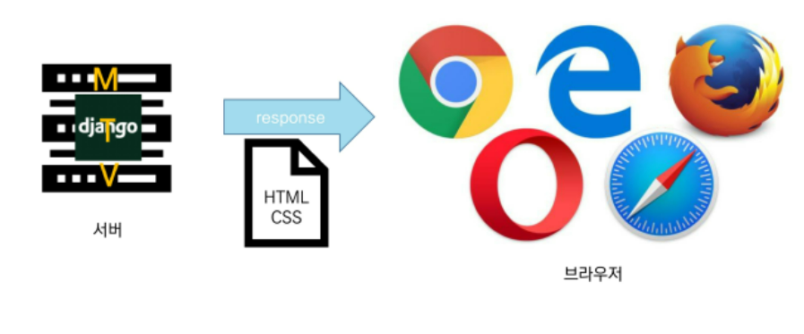
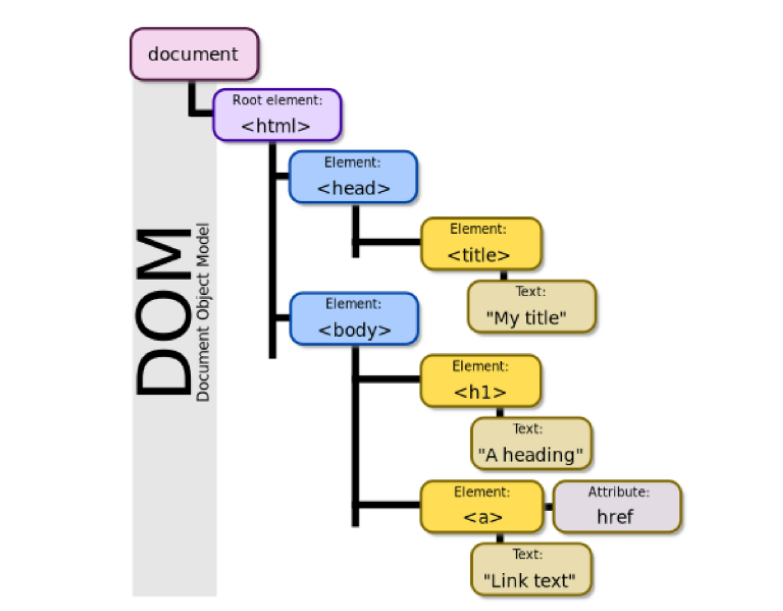
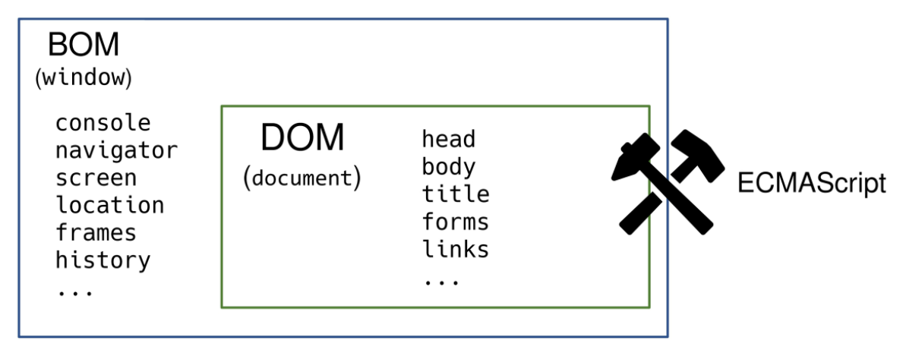

# JavaScript 기초

## JavaScript Intro

### 동작 방식



#### 서버사이드

- 서버 입장에서 어떻게 사용자의 요청을 분석하고 비즈니스 로직에 따라 응답을 줄 것인가?

### 브라우저(browser)

- URL로 웹(WWW)을 탐색하며 서버와 통신하고, HTML 문서나 파일을 출력하는 GUI 기반의 소프트웨어
- 인터넷의 컨텐츠를 검색 및 열람하도록 함
- '웹 브라우저'라고도 함
- 주요 브라우저
  - Google, Chrome, Mozilla Firefox, Microsoft Edge, Opera, Safari

### JavaScript의 필요성

- 브라우저 화면을 '동적'으로 움직이기 위함
  - HTML과 CSS를 가지고는 게임처럼 만들수는 없다.

- 브라우저를 조작할 수 있는 **유일한 언어**
  - DB를 조작하기 위해서는 SQL이 필요하다. 특히 RDBMS (ORM도 있긴하지만..)
  - 마찬가지로 브라우저를 조작할 수 있는 건 JS밖에 없다.
  - CSS,HTML은 마크업정도이다.

- 2021년 기준 가장 인기있는 프로그래밍 언어는 JavaScript


## Browser

### 브라우저에서 할 수 있는 일

- DOM 조작(Document Object Model)
  - 문서(HTML) 조작
- BOM 조작(Browser Object Model)
  - navigator, screen, location, frames, history, XHR
- JavaScript Core (ECMAScript)
  - Data Structure(Object,Array), Conditional Expression, Iteration
  - 위에 2개 조작을 위해서는 ECMAScript가 필요하다. 

### DOM이란 ?

- HTML, XML과 같은 문서를 다루기 위한 프로그래밍 인터페이스
- 문서를 구조화하고, 구조화된 구성 요소를 하나의 객체로 취급하여 다루는 논리적 트리 모델
- 문서가 객체(object)로 구조화되어 있으며 key로 접근 가능
- 단순한 속성 접근, 메서드 활용뿐만 아니라 프로그래밍 언어적 특성을 활용한 조작 가능
- 즉, 문서를 프로그래밍 언어로 조작할 수 있다.
- HTML은 string 덩어리일 뿐인데, 이를 구조화 시키는 과정이 필요하고, 구조화된 자료 구조를 DOM이라고 부름 
- 주요 객체
  - window : DOM을 표현하는 창(브라우저 탭). 최상위 객체(작성시 생략 가능)
  - document : 페이지 컨텐츠의 Entry Point 역할을 하며, `<head>`, `<body>` 등과 같은 수많은 다른 요소들을 포함
  - navigator, location, history, screen



### DOM - 해석

- 파싱
  - 구문 분석, 해석
  - 브라우저가 문자열을 해석하여 DOM Tree로 만드는 과정


### BOM

- Browser Object Model
- 자바스크립트가 브라우저와 소통하기 위한 모델
- 브라우저의 창이나 프레임을 추상화해서 프로그래밍적으로 제어할 수 있도록 제공하는 수단
  - 버튼, URL 입력창, 타이틀 바 등 브라우저 윈도우 및 웹 페이지 일부분을 제어 가능
- window 객체는 모든 브라우저로부터 지원받으며 브라우저의 창(window)를 지칭 

### JavaScript Core

- 브라우저(BOM & DOM)을 조작하기 위한 명령어 약속(언어)
- 따라서, 브라우저(BOM)과 그 내부의 문서(DOM)을 조작하기 위해 ECMAScript(JS)를 학습



### ECMA Script

- ECMA(ECMA International)
  - 정보 통신에 대한 표준을 제정하는 비영리화 표준화 기구

- ECMAScript는 ECMA에서 ECMA-262* 규격에 따라 정의한 언어
  - ECMA-262* : 범용적인 목적의 프로그래밍 언어에 대한 명세
- ECMAScript6는 ECMA에서 제안하는 6번째 표준 명세를 말함
  - ECMAScript6의 발표 연도에 따라 ECMAScript2015라고도 불림

### 세미콜론

- 자바스크립트는 세미콜론을 선택적으로 사용 가능
- 세미콜론이 없으면 ASI*에 의해 자동으로 세미콜론이 삽입됨
  - ASI* : 자동 세미콜론 삽입 규칙 (Automatic Semicolon Insertion)

#### 예시

```javascript
// 세미콜론이 있는 경우
const greeting = 'Hello, world!' ;
console.log(greeting);

//세미콜론이 있는 경우
const greeting = 'Hello, world!'
console.log(greeting)
```


### 코딩 스타일 가이드

- 코딩 스타일의 핵심은 합의된 원칙과 일관성
  - 절대적인 하나의 정답은 없으며, 상황에 맞게 원칙을 정하고 일관성 있게 사용하는 것이 중요
- 코딩 스타일은 코드의 품질에 직결되는 중요한 요소
  - 코드의 가독성, 유지보수 또는 팀원과의 커뮤니케이션 등 개발 과정 전체에 영향을 끼침
- 자바스크립트 코딩 스타일 가이드
  - Airbnb Javascript Style Guide (내가 사용할 가이드)
  - Google Javascript Style Guide
  - standardjs

## 변수

### 변수와 식별자

#### 식별자 정의와 특징

- 식별자(identifier)는 변수를 구분할 수 있는 변수명을 말함
- 식별자는 반드시 문자, 달러($) 또는 밑줄(_)로 시작
- 대소문자를 구분하며, 클래스명 외에는 모두 소문자로 시작 
- 예약어* 사용 불가능
  - for, if, function 등

### 식별자 작성 스타일

- 카멜 케이스(camelCase, lower-camel-case)
  - 변수, 객체, 함수에 사용
  - 두 번째 단어의 첫글자부터 대문자

```javascript
//변수
let dog
let variableName

//객체
const userInfo = {name : 'TOM', age : 20}

//함수
function add() {}
function getName() {}
```

- 파스칼 케이스(PascalCase, upper-camel-case)
  - 클래스, 생성자에 사용
  - 모든 단어의 첫 번째 글자를 대문자로 작성

```javascript
//클래스
class User{
    constructor(options) {
        this.name = options.name
    }
}

//생성자 함수
function User(options) {
    this.name = options.name
}
```

- 대문자 스네이크 케이스(SNAKE_CASE)
  - 상수(constants)*에 사용
    - 상수의 정의 : 개발자의 의도와 상관없이 변경될 가능성이 없는 값을 의미
    - API_KEY
  - 모든 단어 대분자 작성 & 단어 사이에 **언더스코어** 삽입

```javascript
// 값이 바뀌지 않을 상수
const API_KEY = 'my-key'
const PI = Math.PI

//재할당이 일어나지 않는 변수
const numbers = [1,2,3]
```


#### 변수 선언 키워드 (let, const)

- let
  - 재할당 할 예정인 변수 선언 시 사용
  - 변수 재선언 불가능
  - 블록 스코프
- const 
  - 재할당 할 예정이 없는 변수 선언시 사용 
  - 변수 재선언 불가능
  - 블록 스코프

#### 선언, 할당, 초기화

```javascript
let foo //선언
console.log(foo) // undefined

foo = 11 //할당
console.log(foo)  // 11

let bar = 0 //선언 + 할당
console.log(bar) //0
```

- 선언
  - 변수를 생성하는 행위 또는 시점
- 할당
  - 선언된 변수에 값을 저장하는 행위 또는 시점
- 초기화
  - 선언된 변수에 처음으로 값을 저장하는 행위 또는 시점 
