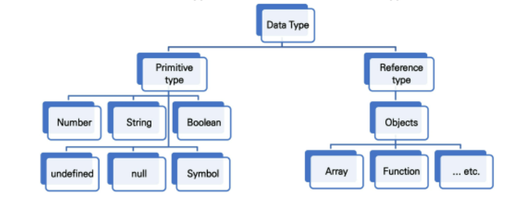

# JavaScript 기초

## 데이터 타입

### 데이터 타입 종류

- 자바스크립트의 모든 값은 특정한 데이터 타입을 가짐
- 크게 원시 타입과 참조 타입으로 분류됨



### 원시 타입과 참조 타입 비교

- 원시 타입 (Primitive type)
  - 객체 (object)가 아닌 기본 타입
  - 변수에 해당 타입의 값이 담김
  - 다른 변수에 복사할 때 실제 값이 복사됨

```javascript
let message = '안녕하세요' //1. message 선언 및 할당

let greeting = message //2. greeting에 message 복사
console.log(greeting) //3. 안녕하세요 ! 출력

message = 'Hello, world' //4. message 재할당
console.log(greeting) //5. '안녕하세요!'출력

// => 즉, 원시 타입은 실제 해당 타입의 값을 변수에 저장한다. 
```

- 참조 타입(Reference type)
  - 객체(object) 타입의 자료형
  - 변수에 해당 객체의 참조 값이 담김
  - 다른 변수에 복사할 때 참조 값이 복사됨

```javascript
const message = ['안녕하세요'] //1. message 선언 및 할당

const greeting = message // 2. greeting에 message 복사
console.log(greeting)  //3. ['안녕하세요!'] 출력 

message[0] = 'Hello,world!' //4. message 재할당
console.log(greeting)  //5. ['Hello world!'] 출력

// => 즉, 참조 타입은 해당 객체를 참조할 수 있는 참조 값을 저장한다.
```


### 원시타입

#### 숫자타입

- 정수, 실수 구분 없는 하나의 숫자 타입
- 부동소수점 형식을 따름
- NaN(Not a number)
  - 계산 불가능한 경우 반환되는 값
  - 'asdf'/100  = > NaN

```javascript
const a = 13 //양의 정수
const b = -5 //음의 정수
const c = 3.14 //실수
const d = 2.998e8 //거듭제곱
const e = Infinity //양의 무한대
const f = -Infinity //음의 무한대
const g = NaN // 산술연산 불가
1/0 // Infinity
-1/0 //-Infinity
NaN //NaN
'asdf'/100 //NaN
```

#### 문자열 타입

- 텍스트 데이터를 나타내는 타입
- 16비트 유니코드 문자의 집합
- 작은따옴표 또는 큰따옴표 모두 가능
- 템플릿 리터럴(Template Literal)
  - ES6부터 지원 
  - 따옴표 대신 backtick('')으로 표현
  - ${expression} 형태로 표현식 삽입 가능 

```javascript
const firstName = 'Brandan'
const lastName = 'eich'
const fullName = '${firstname}${lastname}'

console.log(fullName) // Brandan Eich
```

#### undefined

- 변수의 값이 없음을 나타내는 데이터 타입
- 변수 선언 이후 직접 값을 할당하지 않으면, 자동으로 undefined가 할당됨
- 개발자 의도가 담기지 않음 

```javascript
let firstName
console.log(firstName) //undefined
```

#### null

- 변수의 값이 없음을 의도적으로 표현 할 때 사용하는 데이터 타입
- 개발자 의도가 담김 
- null 타입과 typeof 연산자
  - typeof 연산자 : 자료형 평가를 위한 연산자
  - null 타입은 ECMA 명세의 원시 타입의 정의에 따라 원시 타입에 속하지만, typeof 연산자의 결과는 객체(object)로 표현됨

#### undefined 타입과 null 타입 비교

##### undefined

- 빈 값을 표현하기 위한 데이터 타입
- 변수 선언 시 아무 값도 할당하지 않으면, 자바스크립트가 자동으로 할당
- typeof 연산자의 결과는 undefined

```javascript
type of undefined // undefined
```

##### null

- 빈 값을 표현하기 위한 데이터 타입
- 개발자가 의도적으로 표현할 경우 할당
- typeof 연산자의 결과는 object

```javascript
typeof null //object
```

#### Boolean 타입

- 논리적으로 참 또는 거짓을 나타내는 타입
- ture 또는 false로 표현
- 조건문 또는 반복문에서 유용하게 사용
  - 조건문 또는 반복문에서 boolean이 아닌 데이터 타입은 자동 형변환 규칙에 따라 true 또는 false로 변환됨

```javascript
let isAdmin = true
console.log(isAdmin) //true

let isAdmin = false
console.log(isAdmin) //false
```

#### 정리

- 조건문 또는 반복문에서 표현식의 결과가 참/거짓으로 판별되는 경우 

| 데이터 타입 | 거짓      | 참          |
| ----------- | --------- | ----------- |
| Undefined   | 항상 거짓 | X           |
| Null        | 항상 거짓 | X           |
| Number      | 0,-0,Nan  | 나머지 모두 |
| String      | 빈 문자열 | 나머지 모두 |
| Object      | X         | 항상 참     |

### 참조타입(Reference type)

#### 타입 별 챕터 링크

- 함수
- 배열
- 객체
