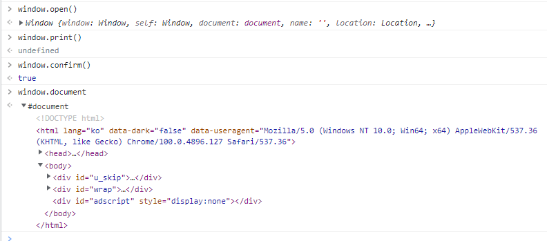
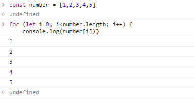
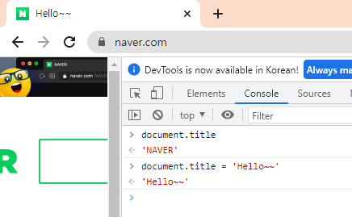

# DOM

### 브라우저에서 할 수 있는 일 

- DOM 조작
  - 문서(HTML) 조작
- BOM 조작
  - navigator, screen, location, frames, history, XHR
- JavaScript Core (ECMAScript)
  - Data Structure(Obejct, Array), Conditional Expression, Iteration

### DOM이란?

- HTML, XML과 같은 문서를 다루기 위한 문서 프로그래밍 인터페이스
- 문서를 구조화하고 구조화된 구성 요소를 하나의 객체로 취급하여 다루는 논리적 트리 모델
- 문서가 구조화되어 있으며 각 요소는 객체(Object) 취급
- 단순한 속성 접근, 메서드 활용 뿐만 아니라 프로그램이 언어적 특성을 활용한 조작 가능
- 주요 객체
  - window : DOM을 표현하는 창. 가장 최상위 객체 (작성 시 생략 가능)
  - document : 페이지 컨텐츠의 Entry Point 역할을 하며, `<body>` 등과 같은 수많은 다른 요소들을 포함
  - navigator, location, history, screen

### DOM - 해석

- 파싱
  - 구문 분석, 해석
  - 브라우저가 문자열을 해석하여 DOM Tree로 만드는 과정

### BOM 이란?

- Browser Object Model
- 자바스크립트가 브라우저와 소통하기 위한 모델
- 브라우저의 창이나 프레임을 추상화해서 프로그래밍적으로 제어할 수 있도록 제공하는 수단
  - 버튼, URL 입력창, 타이틀 바 등 브라우저 윈도우 및 웹 페이지 일부분을 제어 가능
- window 객체는 모든 브라우저로부터 지원받으며 브라우저의 창(window)를 지칭 

### BOM 조작

### JavaScript Core

- 프로그래밍 언어

## DOM 조작

### 개념

- Document는 문서 한 장(HTML)에 해당하고 이를 조작
- DOM 조작 순서
  - 선택 (select)
  - 변경(Manipulation)

### Document 위치

### DOM 관련 객체의 상속 구조

- EventTarget
  - Event Listner를 가질 수 있는 객체가 구현하는 DOM 인터페이스
- Node
  - 여러가지 DOM 타입들이 상속하는 인터페이스

- Element
  - Doucment 안의 모든 객체가 상속하는 가장 범용적인 인터페이스
  - 부모의 Node와 그 부모인 EventTarget의 속성을 상속
- Document
  - 브라우저가 불러온 웹 페이지를 나타냄
  - DOM 트리의 진입점(entry point) 역할을 수행
- HTMLElement
  - 모든 종류의 HTML 요소
  - 부모 element의 속성 상속

### DOM 선택 - 선택 관련 메서드

- document.querySelector(selector)
  - 제공한 선택자와 일치하는 element 하나 선택
  - 제공한 CSS selector를 만족하는 첫 번째 element 객체를 반환 (없다면 null)
- document.querySelectorAll(selector)
  - 제공한 선택자와 일치하는 여러 element를 선택
  - 매칭 할 하나 이상의 셀력터를 포함하는 유효한 CSS selector를 인자(문자열)로 받음
  - 지정된 셀렉터에서 일치하는 NodeList를 반환

- getElementsById(id)
- getElementsByTagName(name)
- getElementsByClassName(names)

#### querySelector(), querySelctorAll()을 사용하는 이유

- id, class 그리고 tag 선택자 등을 모두 사용 가능하므로, 더 구체적이고 유연하게 선택 가능
  - ex) document.querySelector('#id'), document.querySelectAll('.class')

### DOM 선택 - 선택 메서드별 반환 타입

1. 단일 element
   - getElementById()
   - querySelector()
2. HTMLCollection
   - getElementsByTagName()
   - getElementsByClassName()
3. NodeList
   - querySelectorAll()

### DOM 선택 - HTMLCollection & NodeList

- 둘 다 배열과 같이 각 항목에 접근하기 위한 index를 제공 (유사배열)
- HTMLCollection
  - name, id, index 속성으로 각 항목에 접근 가능
- NodeList
  - index로만 각 항목에 접근 가능
  - 단, HTMLCollection과 달리 배열에서 사용하는 forEach 메서드 및 다양한 메서드 사용 가능
- 둘 다 Live Collection으로 DOM의 변경 사항을 실시간으로 반영하지만, querySelectorAll()에 의해 반환되는 NodeList는 Static Collection으로 실시간으로 반영되지 않음 

### DOM 선택 - Collection

- Live Collection
  - 문서가 바뀔 때 실시간으로 업데이트 됨
  - DOM의 변경사항을 실시간으로 collection에 반영
  - ex) HTMLCollection, NodeLIst
- Static Collection(non-live)
  - DOM이 변경되어도 collection 내용에는 영향을 주지 않음
  - **querySelectorAll()의 반환 NodeList만 static collection**

### DOM 선택 실습

### DOM 변경 - 변경 관련 메서드(Creation)

- document.createElement()
  - 작성한 태그 명의 HTML 요소를 생성하여 반환
- Element.append()
  - 특정 부모 Node의 자식 NodeList 중 마지막 자식 다음에 Node 객체나 DOMstring을 삽입
  - 여러 개의 Node 객체, DOMstring을 추가 할 수 있음
  - 반환 값이 없음
- Node.appendChild()
  - 한 Node를 특정 부모 Node 자식 NodeList 중 마지막 자식으로 삽입(Node만 추가 가능)
  - 한 번에 오직 하나의 Node만 추가할 수 있음
  - 만약 주어진 Node가 이미 문서에 존재하는 다른 Node를 참조한다면 새로운 위치로 이동

### DOM 변경 실습 

#### ParentNode.append() vs Node.appendChild()

- append()를 사용하면 DOMString 객체를 추가할 수도 있지만, appendChild()는 Node 객체만 허용
- append()는 반환 값이 없지만, appendChild()는 추가된 Node 객체를 반환
- append()는 여러 Node 객체와 문자열을 추가할 수 있지만, .appendChild()는 하나의 Node 객체만 추가할 수 있음

### DOM 변경 - 변경 관련 속성 (poroperty)

- Node.innerText
  - Node 객체와 그 자손의 텍스트 컨텐츠(DOMString)를 표현 (해당 요소 내부의 raw text) 
    - 사람이 읽을 수 있는 요소만 남김
  - 즉, 줄 바꿈을 인식하고 숨겨진 내용을 무시하는 등 최종적으로 스타일링이 적용된 모습으로 표현
- Element.innerHTML
  - 요소(element) 내에 포함된 HTML 마크업을 반환
  - XSS 공격에 취약하므로 사용 시 주의해야함

#### XSS (Cross-site Scripting)

- 공격자가 입력요소를 사용하여(`<input>`)웹 사이트 클라이언트 측 코드에 악성 스크립트를 삽입해 공격하는 방법
- 피해자(사용자)의 브라우저가 악성 스크립트를 실행하며 공격자가 액세스 제어를 우회하고 사용자를 가장 잘 할 수 있도록 함 

### DOM 삭제 - 삭제 관련 메서드

- ChildNode.remove() 
  - Node가 속한 트리에서 해당 Node를 제거
- Node.removeChild()
  - DOM에서 자식 Node를 제거하고 제거된 Node를 반환
  - Node는 인자로 들어가는 자식 Node의 부모 Node

### DOM 속성 - 속성 관련 메서드

- Element.setAttribute(name, value)
  - 지정된 요소의 값을 설정
  - 속성이 이미 존재하면 값을 갱신, 존재하지 않으면 지정된 이름과 값으로 새 속성을 추가
- Element.getAttribute(attributeName)
  - 해당 요소의 지정된 값(문자열)을 반환
  - 인자(attributeName)는 값을 얻고자 하는 속성의 이름 

