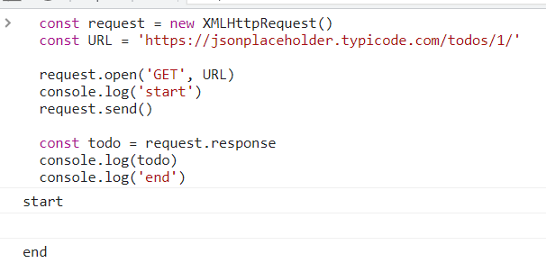
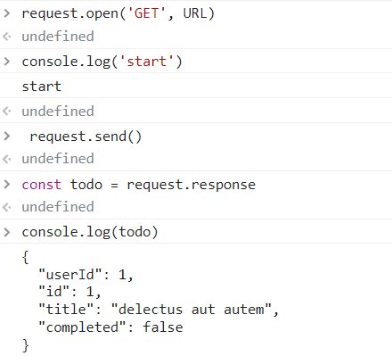

# JavaScript

## AJAX

### AJAX란 

- Asynchronous JavaScript And XML (비동기식 JavaScript와 XML)
- 서버와 통신하기 위해 XMLHttpRequest 객체를 활용
- JSON, XML, HTML 그리고 일반 텍스트 형식 등을 포함한 다양한 포맷을 주고 받을 수 있음
- AJAX의 X가 XML을 의미하긴 하지만, 요즘은 더 가벼운 용량과 JavaScript의 일부라는 장점 때문에 JSON을 더 많이 사용함

### AJAX 특징

- 페이지 전체를 reload(새로고침)를 하지 않고서도 수행되는 "비동기성"
  - 서버의 응답에 따라 전체 페이지가 아닌 일부분만을 업데이트 할 수 있음
- AJAX의 주요 두가지 특징은 아래의 작업을 할 수 있게 해줌
  - 페이지 새로 고침 없이 서버에 요청
  - 서버로부터 데이터를 받고 작업을 수행

### AJAX 배경

- 2005년 Google Maps & Gmail 등에 활용되는 기술을 설명하기 위해 AJAX라는 용어를 최초로 사용
- AJAX는 특정 기술이 아닌 기존의 여러 기술을 사용하는 새로운 접근법을 설명하는 용어
  - 기존 기술을 잘 활용할 수 있는 방식으로 구성 및 재조합한 새로운 접근법
- Google 사용 예시
  - Gmail
    - 메일 전송 요청이 모두 처리  되기 전 다른 페이지로 넘어가더라도 메일은 전송 됨
  - GoogleMaps
    - 스크롤 행위 하나하나가 모두 요청이지만 페이지는 갱신되지 않음

### XMLHttpRequest 객체

- 서버와 상호작용하기 위해 사용되며 전체 페이지의 새로 고침 없이 데이터를 받아올 수 있음
- 사용자의 작업을 방해하지 않으면서 페이지 일부를 업데이트 할 수 있음
- 주로 AJAX 프로그래밍에 사용
- 이름과 달리 XML뿐만 아니라 모든 종류의 데이터를 받아올 수 있음
- 생성자
  - XMLHttpRequest()

### XMLHttpRequest 예시

- console에 todo 데이터가 출력되지 않음
- 데이터의 응답을 기다리지 않고 console.log()를 먼저 실행했기 때문 

```javascript
const request = new XMLHttpRequest()
const URL = 'https://jsonplaceholder.typicode.com/todos/1/'

request.open('GET', URL)
console.log('start')
request.send()

const todo = request.response
console.log(todo)
console.log('end')
```



#### line별로 실행



- 라인별로 실행했을 때는 나오는 이유는 다음 장 Asynchronous JavaScript에서 다룸 


