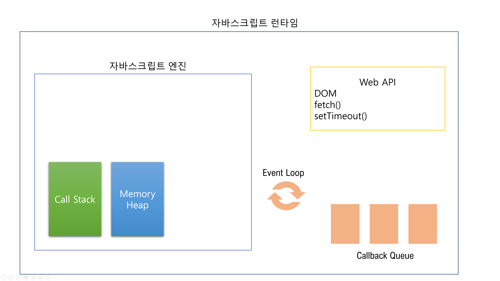
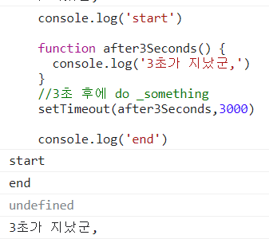
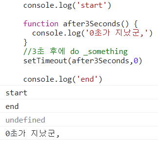

# JavaScript

## Asynchronous JavaScript

### 동기식

- 순차적, 직렬적 Task 수행
- 요청을 보낸 후 응답을 받아야만 다음 동작이 이루어짐 (blocking)

```html
<button>버튼</button>
<script>
    const btn = document.querySelector('button')
btn.addEventListener('click',function() {
    alert('Click!')
    const pElem = document.createElement('p')
    pElem.innerText = 'sample text'
    document.body.appendChild(pElem)
})
</script>
```

- 버튼 클릭 후 alert 메시지의 확인 버튼을 누를 때까지 문장이 만들어지지 않음
- 즉, alert 이후의 코드는 alert의 처리가 끝날 때까지 실행되지 않음
- 왜 이런 현상이 발생할까?
  - "JavaScript는 Single threaded"

 ### 비동기식

- 병렬적 Task 수행
- 요청을 보낸 후 응답을 기다리지 않고 다음 동작이 이루어짐 (non-blocking)
  - todo는 출력되지 않는다. 

```javascript
request.open('GET', URL)
console.log('start')
request.send()

const todo = request.response
console.log(todo)
console.log('end')
```

- 요청을 보내고 응답을 기다리지 않고 다음 코드가 실행됨
- 결과적으로 변수 todo에는 응답 데이터가 할당되지 않고 빈 문자열이 추력
- 그렇다면 JS는 왜 기다려주지 않는가?
  - "JavaScript는 Single threaded"


`

### 왜 비동기식을 사용할까

#### 사용자 경험

- 매우 큰 데이터를 동반하는 앱이 있다고 가정
- 동기식 코드라면 데이터를 모두 불러온 뒤 앱이 실해됨
  - 즉, 데이터를 모두 불러올 때 까지는 앱이 모두 멈춘 것처럼 보임
  - 코드 실행을 차단하여 화면이 멈추고 응답하지 않는 것 같은 사용자 경험을 제공
- 비동기식 코드라면 데이터를 요청하고 응답 받는 동안, 앱 실행을 함께 진행함
  - 데이터를 불러오는 동안 지속적으로 응답하는 화면을 보여줌으로써 더욱 쾌적한 사용자 경험을 제공
- 때문에 많은 웹 API 기능은 현재 비동기 코드를 사용하여 실행됨 

### Threads

- 프로그램이 작업을 완료하기 위해 사용할 수 있는 단일 프로세스
- 각 thread는 한 번에 하나의 작업만 수행할 수 있음
- Task A -> Task B -> TaskC
  - 다음 작업을 시작하려면 반드시 앞의 작업이 완료되어야 함
  - 컴퓨터 CPU는 여러 코어를 가지고 있기 때문에 한 번에 여러가지 일을 처리할 수 있음 

### "JavaScript는 single threaded이다."

- 컴퓨터가 여러개의 CPU를 가지고 있어도 main thread라 불리는 단일 스레드에서만 작업 수행
- 즉, 이벤트를 처리하는 Call Stack이 하나인 언어라는 의미
- 이 문제를 해결하기 위해 JavaScript는 
  1. 즉시 처리하지 못하는 이벤트들을 다른 곳(Web API)으로 보내서 처리하도록 하고,
  2. 처리된 이벤트들은 처리된 순서대로 대기실(Task Queue)에 줄을 세워놓고
  3. Call Stack이 비면 담당자(Event Loop)가 대기 줄에서 가장 오래된 (제일 앞의) 이벤트를 CallStack으로 보냄 

### Concurrency model

- Event loop를 기반으로 하는 동시성 모델

1. Call Stack
   - 요청이 들어올 때마다 해당 요청을 순차적으로 처리하는 Stack(LIFO) 형태의 자료 구조
2. Web API(Browser API)
   - JavaScript 엔진이 아닌 브라우저 영역에서 제공하는 API
   - setTimeout(), DOM events 그리고 AJAX로 데이터를 가져오는 시간이 소요되는 일들을 처리
3. Task Queue(Event Queue, Message Queue)
   1. 비동기 처리된 callback 함수가 대기하는 Queue(FIFO) 형태의 자료 구조
   2. main thread가 끝난 후 실행되어 후속 JavaScript 코드가 차단되는 것을 방지
4. Event Loop
   - Call Stack이 비어 있는지 확인
   - 비어있는 경우 Task Queue에서 실행 대기중인 callback 함수가 있는지 확인
   - Task Queue에 대기 중인 callback 함수가 있다면 가장 앞에 있는 callback 함수를 Call Stack으로 push

### Runtime



```javascript
console.log('start')

function after3Seconds() {
    console.log('3초가 지났군,')
}
//3초 후에 do _something
setTimeout(after3Seconds,0)

console.log('end')
```

#### 진행 순서

- Call Stack에 console.log('start')가 들어간 후 출력
- Call Stack에 setTimeout()이 들어옴
- 바로 처리할 수 없기 때문에 Web API로 이동(1초)
- Call Stack에 console.log('end')가 들어온 후 출력 (2초)
- 3초가 지난 후 setTimeout이 Task Queue로 이동(3초)
- 밀린 일이 없기 때문에 Call Stack으로 after3Seconds함수가 이동
- Call Stack에 함수 내부 console.log('3초가 지났군') 가 쌓임
- 3초가 지났군 출력 
- after3Seconds 함수 Call Stack에서 소멸 

### Zero delays




- 왜 시간을 0으로 줘도 바로 나오지 end가 먼저 출력될까?

- 해당 입력은 실제로 0ms 후에 callback 함수가 시작된다는 의미가 아님 
- 실행은 Task Queue에 대기 중인 작업 수에 따라 다르며 해당 예시에서는 callback 함수의 메시지가 처리되기 전에 'start'와 'end'가 먼저 출력됨
- 왜냐하면 delay(지연)는 JavaScript가 요청을 처리하는데 필요한 최소 시간이기 때문 (보장된 시간이 아님)
- 기본적으로 setTimeout 함수에 특정 시간제한을 설정했더라도 대기 중인 메시지의 모든 코드가 완료될 때까지 대기해야 함 


### 순차적인 비동기 처리하기

- Web API로 들어오는 순서는 중요하지 않고, 어떤 이벤트가 먼저 처리되느냐가 중요(즉, 실행 순서 불명확)
- 이를 해결하기 위해 순차적인 비동기 처리를 위한 2가지 작성 방식

1. Async callbacks
   - 백그라운드에서 실행을 시작할 함수를 호출할 때 인자로 지정된 함수
   - 예시) addEventListener()의 두번째 인자
2. Promise-style
   - Modern Web APIs에서의 새로운 코드 스타일
   - XMLHttpRequest 객체를 사용하는 구조보다 조금 더 현대적인 버전 
