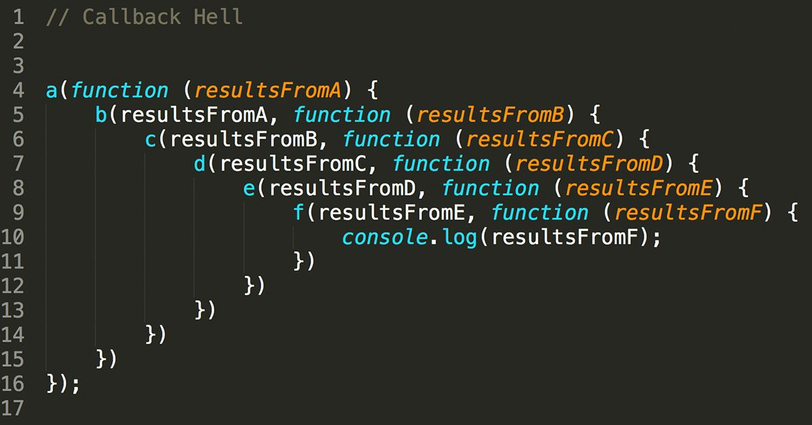

# JavaScript

## Callback Function

 ### 의미

- 다른 함수에 인자로 전달된 함수
- 외부 함수 내에서 호출되어 일종의 루틴 또는 작업을 완료함
- 동기식, 비동기식 모두 사용됨
  - 그러나 비동기 작업이 완료된 후 코드 실행을 계속 하는데 주로 사용됨 
- 비동기 작업이 완료된 후 코드 실행을 계속하는데 사용되는 경우를 비동기 콜백(asynchronous callback)이라고 함 

### JavaScript의 함수는 '일급 객체'이다.

- 일급객체
  - 다른 객체들에 적용할 수 있는 연산을 모두 지원하는 객체 (함수)
- 일급 객체의 조건
  - 인자로 넘길 수 있어야 함
  - 함수의 반환값으로 사용할 수 있어야 함
  - 변수에 할당할 수 있어야 함 

```javascript
// 변수에 할당
cosnt a = function() {}
// 인자로 넘김 
function asdf(x){
    //함수의 반환값으로 사용 
    return x
}
asdf(a)
```

### Async callback

- 백그라운드에서 코드 실행을 시작할 함수를 호출할 때 인자로 지정된 함수
- 백그라운드 코드 실행이 끝나면 callback 함수를 호출하여 작업이 완료되었음을 알리거나, 다음 작업을 실행하게 할 수 있음
  - ex) addEventListener()의 두번째 매개변수
- callback 함수를 다른 함수의 인수로 전달할 때, 함수의 참조를 인수로 전달할 뿐이지 즉시 실행되지 않고, 함수의 body에서 "called back" 됨 
  - 정의된 함수는 때가 되면 callback 함수를 실행하는 역할을 함 

### Why use callback ? 

- callback 함수는 명시적인 호출이 아닌 특정 루틴 혹은 action에 의해 호출되는 함수
- Django의 경우 "요청이 들어오면", event의 경우 "특정 이벤트가 발생하면" 이라는 조건으로 함수를 호출할 수 있었던 건 'Callback function' 개념 때문에 가능
- 비동기 로직을 수행할 때 callback 함수는 필수
  - 명시적 호출이 아니라 달느 함수의 매개변수로 전달하여 해당 함수 내에서 특정 시점에 호출 

### Callback Hell

- 순차적인 연쇄 비동기 작업을 처리하기 위해 "callback" 함수를 초훌하고, 그 다음 callback 함수를 호출하고, 또 그 함수의 callback 함수를 호출하고.."의 패턴이 반복됨
- 즉, 여러 개의 연쇄 비동기 작업을 할 때 마주하는 상황
- 이를 callback Hell(콜백 지옥) 혹은 pyramid of domm(파멸의 피라미드)이라 함
- 위와 같은 상황이 벌어질 경우 아래 사항들을 통제하기 어려움
  - 디버깅
  - 코드 가독성 



### Callback Hell 해결하기

- Keep your code shallow (코드의 깊이를 얕게 유지)
- Modularize (모듈화)
- Handle every single error (모든 단일 오류 처리)
- **Promise callbacks (Promise 콜백 방식 사용 ) **
