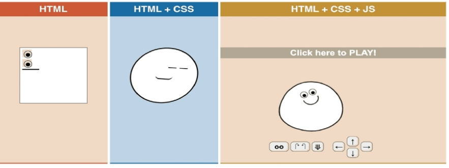
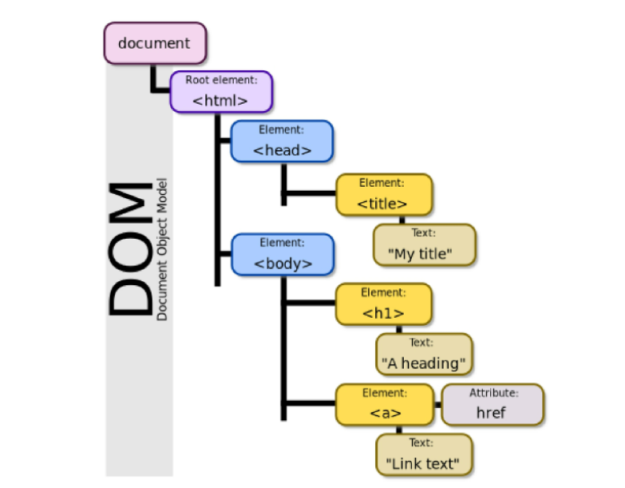
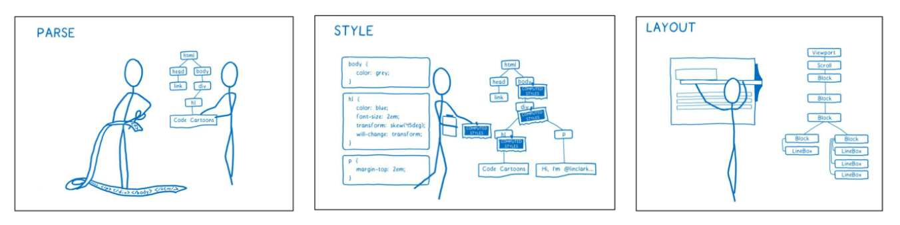

# JavaScript 기초

## JavaScript Intro

### 동작 방식

### 브라우저(browser)

- URL로 웹(WWW)을 탐색하며 서버와 통신하고, HTML 문서나 파일을 출력하는 GUI 기반의 소프트웨어
- 인터넷의 컨텐츠를 검색 및 열람하도록 함
- '웹 브라우저'라고도 함
- 주요 브라우저
  - Google, Chrome, Mozilla Firefox, Microsoft Edge, Opera, Safari

### JavaScript의 필요성

- 브라우저 화면을 '동적'으로 만들기 위함
- 브라우저를 조작할 수 있는 유일한 언어

## Browser

### 브라우저에서 할 수 있는 일

- DOM 조작(Document Object Model)
  - 문서(HTML) 조작
- BOM 조작(Browser Object Model)
  - navigator, screen, location, frames, history, XHR
- JavsScript Core (ECMAScript)
  - Data Structure(Object,Array), Conditional Expression, Iteration

### DOM이란 ?

- HTML, XML과 같은 문서를 다루기 위한 프로그래밍 인터페이스
- 문서를 구조화하고, 구조화된 구성 요소를 하나의 객체로 취급하여 다루는 논리적 트리 모델
- 문서가 객체(object)로 구조화되어 있으며 key로 접근 가능
- 단순한 속성 접근, 메서드 활용뿐만 아니라 프로그래밍 언어적 특성을 활용한 조작 가능
- 주요 객체
  - window : DOM을 표현하는 창(브라우저 탭). 최상위 객체(작성시 생략 가능)
  - document : 페이지 컨텐츠의 Entry Point 역할을 하며, `<head>`, `<body>` 등과 같은 수많은 다른 요소들을 포함
  - navigator, location, history, screen

### DOM - 해석

- 파싱
  - 구문 분석, 해석
  - 브라우저가 문자열을 해석하여 DOM Tree로 만드는 과정

