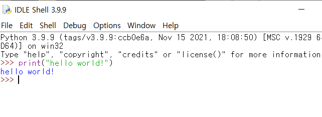

# 파이썬 및 IDLE 설치

### 파이썬을 다운로드하고 설치하기

https://www.python.org/downloads/release/python-399/


### 파이썬 실행하기(터미널)

- CMD 실행

```
python
```


```python
print("Hello Python")
```


### 파이썬 실행하기(IDLE)

```python
print("hello world!")
```



#### 한 번에 실행을 하고 싶다면?

- File -> New File


- 출력하고 싶은 구문 작성


- 저장 후 실행
  - Run Module or F5


- 결과 확인 


### VS Code

#### VS 코드 설치

https://code.visualstudio.com/download

- VS code 실행 


#### root 폴더 설정

- 내가 작업할 폴더 열기


- 폴더 선택


- 폴더 선택 결과


#### Python extension 설치


- 소스코드 실행


