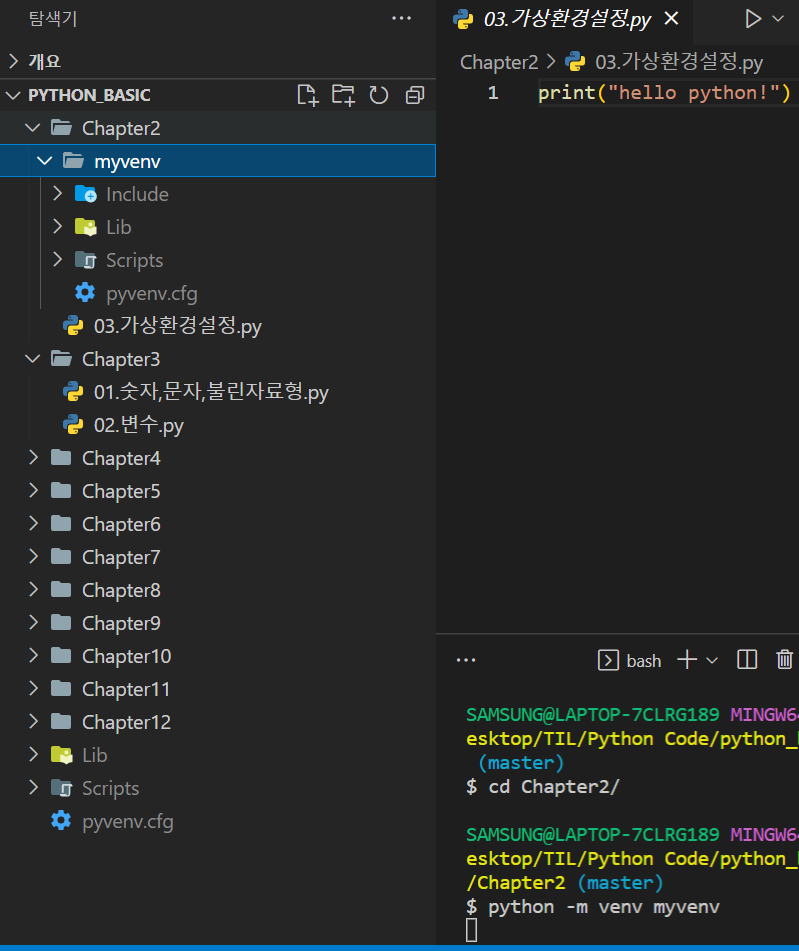
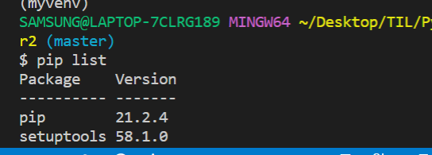

# 파이썬 가상환경 사용법

### 가상환경을 사용하는 이유

- A프로젝트에서는 requests 패키지 1.0이 필요하고 B 프로젝트에서는 reqeusts 패키지 2.0이 필요할 때 컴퓨터 상에서는 하나의 패키지만 존재할 수 있기 때문에, 환경을 분리할 필요가 있다.
- 패키지
  - 파이썬 소스 파일을 모아놓은 것 


#### Venv

```python
python -m venv myvenv
```

- 실행 결과



#### activate

- Scripts 폴더 내 activate 폴더가 있다.
- activate는 가상환경 실행
- deactivate는 가상환경 종료

```python
source myvenv/Scripts/activate
```

```python
pip list
```


