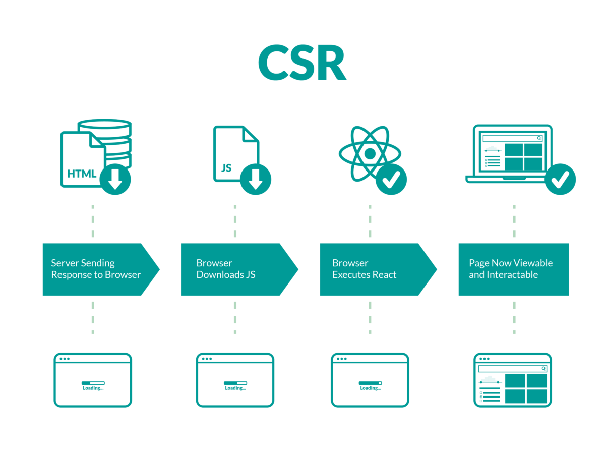

## Intro

### Front-End Development

- HTML, CSS 그리고 JavaScript를 활용해서 데이터를 볼 수 있게 만들어 줌 
  - 이 작업을 통해 사용자(User)는 데이터와 상호작용(Interaction) 할 수 있음
- 대표적인 프론트엔드 프레임워크
  - Vue.js, React, Angular

### Vue.js

- 사용자 인터페이스를 만들기 위한 진보적인 자바스크립트 프레임워크
- 현대적인 tool과 다양한 라이브러리를 통해 SPA(Single Page Application)을 완벽하게 지원
- Evan You에 의해 발표
  - 구글의 Angular 개발자 출신
  - 학사 미술, 미술사 전공/ 석사 디자인 & 테크놀로지 전공
  - 구글 Angular보다 더 가볍고, 간편하게 사용할 수 있는 프레임워크를 만들기 위해 개발

### SPA

- Single Page Application (단일 페이지 애플리케이션)
- 현재 페이지를 동적으로 렌더링함으로써 사용자와 소통한느 웹 애플리케이션
- 단일 페이지로 구성되며 서버로부터 최초에만 페이지를 다운로드하고, 이후에는 동적으로 DOM을 구성
  - 처음 페이지를 받은 이후부터는 서버로부터 새로운 전체 페이지를 불러오는 것이 아닌, 현재 페이지 중 필요한 부분만 동적으로 다시 작성함
- 연속되는 페이지 간의 사용자 경험(UX)을 향상
  - 모바일 사용량이 증가하고 있는 현재 트래픽의 감소와 속도, 사용성 반응성의 향상은 매우 중요하기 때문
- 동작 원리의 일부가 CSR(Client Side Rendering)의 구조를 따름

#### SPA 등장 배경

- 과거 웹 사이트들은 요청에 따라 매번 새로운 페이지를 응답하는 방식이었음
  - MPA ( Multi Page Application)
- 스마트폰이 등장하면서 모바일 최적화의 필요성이 대두됨 
  - 모바일 네이티브 앱과 같은 형태의 웹페이지가 필요해짐
- 이러한 문제를 해결하기 위해 Vue.js와 같은 프론트엔드(Front-End) 프레임워크가 등장
  - CSR(Client Side Rendering), SPA(Single Page Application)의 등장
- 1개의 웹 페이지에서 여러 동작이 이루어지며 모바일 앱과 비슷한 형태의 사용자 경험을 제공 

### CSR

- Client Side Rendering
- 서버에서 화면을 구성하는 SSR(Server Side Rendering) 방식과 달리 클라이언트에서 화면을 구성
- 최초 요청 시 HTML, CSS, JS 등 데이터를 제외한 각종 리소스를 응답받고 이후 클라이언트에서는 필요한 데이터만 요청해 JS로 DOM을 렌더링하는 방식 
- 즉, 처음엔 뼈대만 받고 브라우저에서 동적으로 DOM을 그림
- SPA가 사용하는 렌더링 방식 

#### CSR의 장점 

#### SSR

- 사용자가 요청을 보낸다.
- 서버는 렌더링할 준비가 된 HTML을 브라우저에 보낸다.
- 브라우저에러 페이지를 렌더링하고 사용자는 페이지를 볼 수 있다. JS를 다운로드한다.
- 브라우저가 반응을 실행한다.
- 화면이 만들어진다

#### CSR

- 서버에서 HTML을 준다. 그 안에는 JS코드가 있다
- 그 후 브라우저가 JS를 실행한다
- 그러면 화면이 만들어지게 된다.
