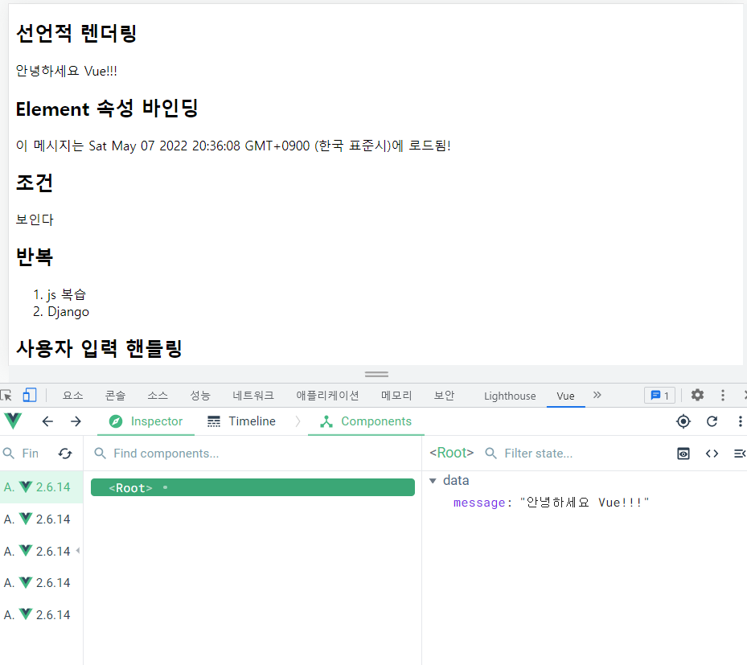

# Vue Quick Start

https://kr.vuejs.org/v2/guide/index.html

### django & Vue.js 코드 작성 순서

#### Django

- 데이터의 흐름
- url - > views - > template

#### vue.js

- Data가 변화하면 DOM이 변경
- Data 로직 작성 -> DOM 작성 


#### CDN 작성

```html
<!-- 개발버전, 도움되는 콘솔 경고를 포함. -->
<script src="https://cdn.jsdelivr.net/npm/vue/dist/vue.js"></script>
```

### 선언적 렌더링

```html
  <!-- 2. 선언적 렌더링 -->
<!-- dom은 view--> 
  <h2>선언적 렌더링</h2>
  <div id="app1">
    {{ message }}
  </div>

<script>
    // 2. 선언적 렌더링
    const app1 = new Vue({
        //el은 element, Vue instance, VM, 어떤 View와 상호작용 할 것인지 정해줌 
      el : '#app1',
        //data는 Model
      data :{
        message : '안녕하세요 Vue'

      }
    })
</script>
```



- 개발자 도구 내부의 Vue탭에서 데이터를 바꾸면 HTML상에서 Data가 자동으로 바뀜

#### 선언형 프로그래밍

- Data를 선언해주면 연결되어 있는 화면이 알아서 바뀜 

 ### Element 속성 바인딩

```html
<!-- 3. 엘리멘트 속성 바인딩 -->
  <h2>Element 속성 바인딩</h2>
  <div id="app2">
    {{message}}
  </div>

<script>
    const app2 = new Vue({
        el : '#app2',
        data :{
            message : `이 메시지는 ${new Date()}에 로드됨!`
        }
    })
</script>
```

### 조건

```html
<!-- 4. 조건 -->
<h2>조건</h2>
<div id="app3">
<!-- data가 true이면 보이게하기 -->
<p v-if="seen">보인다</p>
</div>

// 4. 조건
<script>
const app3 = new Vue({
el : '#app3',
data :{
	seen : true,
	}
})
</script>
```

### 반복

```html
<!-- 5. 반복 -->
  <h2>반복</h2>
  <div id="app4">
    <ol>
      <li v-for="todo in todos">
        {{ todo.text }}
      </li>
    </ol>
  </div>
<script>
// 5. 반복
    const app4 = new Vue({
      el : '#app4',
      data  : { 
        todos : [
          {text : 'js 복습'},
          {text : 'Django'}
        ]
      }
    })
</script>
```

### 사용자 입력 핸들링

```html
<!-- 6. 사용자 입력 핸들링 -->
  <h2>사용자 입력 핸들링</h2>
  <div id="app5">
    <p>{{message}}</p>
      <!-- input 태그와 데이터가 동기화됨 -->
    <input v-model="message" type="text">
      <!-- 버튼을 누르면 메소드 실행  -->
    <button v-on:click="reversedMessage">로꾸꺼</button>
  </div>

<script>
   // 6. 사용자 입력 핸들링
    // vue instance 만들기 
  const app5 = new Vue({
    el : '#app5',
    data : {
      message : '안녕하세요'

    },
      //함수
    methods : {
        //this는 내부적으로 정렬되어 있을 때, 메서드가 속한 객체를의미 data를 의미  
      reversedMessage : function() {
          //message를 나눈 후 배열을 만들고, 뒤집어서, join하면 글씨가 반대로 됨 
        this.message = this.message.split('').reverse().join('')
      }
    }
  })
</script>
```

