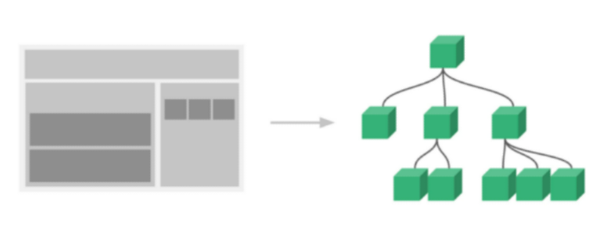

## Single File Component

### Component

- 기본 HTML 앨리먼트를 확장하여 재사용 가능한 코드를 캡슐화 하는데 도움을 줌
- CS에서는 다시 사용할 수 있는 범용성을 위해 개발한 소프트웨어 구성 요소를 의미
- 즉, 컴포넌트는 유지보수를 쉽게 만들어 줄 뿐만 아니라, 재사용성의 측변에서도 매우 강력한 기능을 제공

#### 단일 파일에서의 개발

- 처음 개발을 시작 할 때는 크게 신경쓸 것이 없기 때문에 쉽게 개발 가능
- 하지만 코드의 양이 많아지면 변수 관리가 힘들어지고 유지보수에 많은 비용 발생 

### SFC

- Vue의 컴포넌트 기반 개발의 핵심 특징
- 하나의 컴포넌트는 .vue 확장자를 가진 하나의 파일 안에서 작성되는 코드의 결과물
- 화면의 특정 영역에 대한 HTML, CSS, JavaScript 코드를 하나의 파일(.vue)에서 관리
- 즉, .vue 확장자를 가진 싱글 파일 컴포넌트를 통해 개발하는 방식

Vue 컴포넌트 === Vue 인스턴스

### Vue Component 구조 예시

- 한 화면 안에서도 기능 별로 각기 다른 컴포넌트가 존재
  - 하나의 컴포넌트는 여러 개의 하위 컴포넌트를 가질 수 있음
  - Vue 컴포넌트 기반의 개발 환경 제공
- Vue 컴포넌트는 const app = new Vue({...})의 app을 의미하며 이는 Vue 인스턴스 
  - 여기서 오해하면 안되는 것은 컴포넌트 기반의 개발이 반드시 파일 단위로 구분되어야 하는 것은 아님
  - 단일 .html 파일 안에서도 여러 개의 컴포넌트를 만들어 개발 가능                                                                                                                                                                                                                                                    

### 정리

- Vue 컴포넌트는 Vue 인스턴스 (new Vue({}))이기도 함
- Vue 인스턴스는 .vue 파일 안에 작성된 코드의 집합
- HTML, CSS, 그리고 JavaScript를 .vue라는 확장자를 가진 파일 안에서 관리하며 개발 
